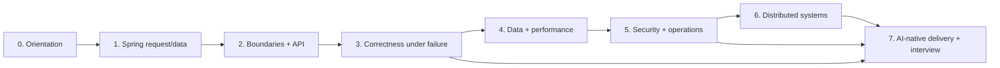

# Learning Hub — Flash Sale Engineering

Đây là trang chọn bài học. Không cần đọc mọi file theo thứ tự tên. Hãy chọn một chặng, làm bài thực hành, tạo evidence rồi mới đi tiếp.

## Cách học mỗi chặng

```text
Đọc mental model
→ mở code reference
→ chạy lab
→ cố ý làm hỏng
→ sửa bằng test
→ ghi metric
→ trả lời phỏng vấn 60 giây
```

Một chặng chỉ được xem là hoàn thành khi bạn có đủ: một failure đã tái hiện, một test bảo vệ, một kết quả chạy và một trade-off có thể giải thích.

## Chọn đường đi

| Bạn muốn đạt điều gì? | Bắt đầu từ | Đi tiếp đến |
|---|---|---|
| Mới học Spring Boot/backend | Chặng 0 → 1 | Chặng 2 → 3 |
| Muốn hiểu transaction/concurrency | Chặng 2 | Chặng 3 → 4 |
| Muốn học Spring Security | Chặng 5 | Chặng 6 |
| Muốn hiểu microservices | Chặng 2 → 4 | Chặng 6 |
| Muốn học cách Tech Lead phân tích và thiết kế hệ thống | [Tech Lead system design guide](../visual-guides/tech_lead_system_design_process_guide.md) | Scenario workbook + capstone |
| Muốn học React/frontend qua product thật | [Frontend track](frontend-track.md) | Chặng 2 → 3 |
| Muốn luyện phỏng vấn senior | Tất cả chặng | Chặng 7 + workbook |
| Muốn dùng Claude Code hiệu quả | Chặng 0 | Chặng 7 |



## Chặng 0 — Hiểu sản phẩm trước khi hiểu framework

**Mục tiêu:** biết Product, Inventory, Available Quantity, Order, Customer và Order Created nghĩa là gì; biết MVP làm gì và không làm gì.

**Đọc:**

- [`CONTEXT.md`](../../CONTEXT.md)
- [`MVP interview record`](../product/mvp-interview.md)
- [`README.md`](../../README.md)

**Làm:**

1. Vẽ request `POST /api/v1/orders` từ client đến database.
2. Viết ba invariant: no-oversell, idempotency, price snapshot.
3. Gọi API local và đọc response/error contract.

**Hoàn thành khi:** bạn giải thích được vì sao rejected purchase attempt không phải là Order.

## Chặng 1 — Spring Boot: request, bean và persistence

**Mục tiêu:** hiểu request vào controller nào, bean được tạo/inject ra sao và dữ liệu đi qua transaction/database thế nào.

**Đọc/làm:**

- [Senior practical track](senior-practical-track.md), Bài 00–01
- [Request → thread → connection → database](../visual-guides/request_thread_connection_memory_playbook.md)
- [JPA/JDBC decision](../visual-guides/jpa_jdbc_native_sql_playbook.md)
- [N+1 lab](n-plus-one-query-lab.md)

**Bài thực hành:**

- tạo API ping và debug bằng IntelliJ;
- chạy list Product, kiểm tra DTO/projection;
- cố ý tạo N+1 rồi đo query count;
- giảm connection pool và quan sát timeout/p95.

**Hoàn thành khi:** bạn không còn nói “Spring tự xử lý”; bạn chỉ ra được thread, connection, query và test evidence.

## Chặng 2 — Boundary: Clean Architecture và API contract

**Mục tiêu:** biết code nào là adapter, use case, port và infrastructure; biết contract trước controller.

**Đọc:**

- [Clean Architecture/SOLID](../visual-guides/clean_architecture_solid_patterns_playbook.md)
- [API/FE contract](../visual-guides/api_frontend_contract_playbook.md)
- [Clean Architecture và Microservices guide](../visual-guides/microservices-clean-architecture-interview_guide.md), phần 2–3

**Bài thực hành:**

1. Trace `OrderController → PlaceOrder → OrderPlacementStore → JdbcOrderPlacementStore`.
2. Viết fake store để test use case không khởi động Spring.
3. Chạy ArchUnit và giải thích rule dependency direction.
4. Thay đổi lỗi validation mà không serialize JPA entity ra API.

**Hoàn thành khi:** bạn giải thích được vì sao use case không được biết JDBC/Kafka và khi nào interface là thừa.

### Nhánh frontend song song

Frontend không phải chặng backend bắt buộc; nó là consumer thật của API và lab trực quan. Đọc [Frontend track](frontend-track.md) song song với Chặng 2–3 để học request state, Problem Details, idempotency replay và concurrency bằng UI.

## Chặng 3 — Correctness: transaction, idempotency và concurrency

**Mục tiêu:** chứng minh hệ thống đúng khi retry, cạnh tranh và failure, không chỉ khi happy path.

**Đọc:**

- [Atomic Order/Inventory](../visual-guides/atomic_order_inventory_playbook.md)
- [Idempotency replay](../visual-guides/idempotency_replay_playbook.md)
- [Inventory locking strategies](../visual-guides/inventory_locking_strategies_playbook.md)
- [Transaction taxonomy](../visual-guides/transaction_taxonomy_and_scenarios_playbook.md)

**Bài thực hành:**

- chạy 100 request đồng thời với Inventory=10;
- cố ý làm stock âm bằng read-then-write;
- sửa bằng conditional update;
- retry cùng idempotency key;
- mô phỏng DB commit xong nhưng HTTP response mất;
- ghi accepted quantity, final inventory và p95.

**Hoàn thành khi:** bạn chứng minh được exactly 10 accepted Orders trong test, không chỉ nói “đã dùng transaction”.

## Chặng 4 — Data, performance và failure handling

**Mục tiêu:** hiểu query plan, pool pressure, cache, synchronous/asynchronous failure và delivery semantics.

**Đọc:**

- [PostgreSQL index/pagination/EXPLAIN](../visual-guides/postgresql_index_pagination_explain_playbook.md)
- [Redis trong Spring Boot cho người mới](../visual-guides/redis_spring_boot_beginner_guide.md)
- [Redis đúng mục đích](../visual-guides/redis_cache_rate_limit_lock_playbook.md)
- [Monitoring và ELK cho Spring Boot](../visual-guides/monitoring-logging-elk_guide.md)
- [Failure handling](../visual-guides/failure_handling_sync_async_playbook.md)
- [Transactional outbox/Kafka](../visual-guides/transactional_outbox_kafka_playbook.md)
- [Consumer idempotency/retry/DLQ](../visual-guides/consumer_idempotency_retry_dlq_playbook.md)

**Bài thực hành:**

- đo query count và EXPLAIN;
- dừng Kafka và quan sát outbox pending;
- gửi duplicate event;
- tạo poison message vào DLQ;
- phân loại lỗi: fail fast, retry, fallback, compensation, manual repair.

**Hoàn thành khi:** bạn trả lời được Kafka down thì Order có rollback không và vì sao.

## Chặng 5 — Security và production operations

**Mục tiêu:** bảo vệ identity, permission, resource ownership, secret và runtime health.

**Đọc:**

- [Spring Security cho người mới](../visual-guides/spring_security_beginner_guide.md)
- [Spring Security và hệ sinh thái Spring](spring-security-and-ecosystem.md)
- [Backend security/PII](../visual-guides/backend_security_pii_playbook.md)
- [Spring internals/security](../visual-guides/spring_internals_security_playbook.md)
- [Docker/observability](../visual-guides/docker_observability_runbook_playbook.md)
- [Kubernetes delivery/scaling](../visual-guides/kubernetes_delivery_scaling_playbook.md)

**Bài thực hành:**

1. Vẽ authorization matrix cho Customer/Admin.
2. Viết test IDOR: Customer A không đọc Order B.
3. Giải thích session/JWT/OIDC, `401/403`, CSRF/CORS.
4. Kiểm tra secret không nằm trong Git/log/image.
5. Chạy readiness/liveness và mô phỏng rollout lỗi.

**Hoàn thành khi:** bạn không nói “thêm Spring Security là xong”; bạn chỉ ra identity source, policy, ownership test, audit và rollback.

## Chặng 6 — Microservices và distributed systems

**Mục tiêu:** biết khi nào tách service và xử lý network failure, contract, data ownership và eventual consistency.

**Đọc:**

- [Clean Architecture và Microservices guide](../visual-guides/microservices-clean-architecture-interview_guide.md)
- [Spring Cloud microservices](../visual-guides/spring_cloud_microservices_playbook.md)
- [Microservice resilience/contract](../visual-guides/microservice_resilience_contract_playbook.md)
- [Microservice request lab](../../playbooks/09-microservice-request-lab/README.md)
- [Senior backend to tech lead roadmap](../visual-guides/senior_backend_to_tech_lead_roadmap.md)

**Bài thực hành:**

- chạy Catalog–Order lab;
- timeout Catalog ở 500ms;
- thêm retry sai để thấy request amplification;
- sửa bằng timeout budget/circuit breaker/bulkhead;
- propagate trace ID;
- viết contract test;
- đề xuất tách Catalog nhưng giữ Order+Inventory cùng boundary.

**Hoàn thành khi:** bạn giải thích được vì sao microservices không chỉ là tách package thành nhiều project.

## Nhánh Tech Lead — system design và delivery

Đây là nhánh dành cho người đã qua correctness cơ bản và muốn học cách dẫn dắt một feature từ ambiguity đến production. Đọc [Tech Lead system design process](../visual-guides/tech_lead_system_design_process_guide.md).

```text
Problem brief
→ question tree
→ scope/non-goals
→ invariants/workload
→ context/container/sequence/state/ERD
→ alternatives + ADR
→ tickets + acceptance
→ test/security/observability
→ rollout/rollback
→ incident/metrics/learning loop
```

**Bài phải làm:** viết một problem brief cho no-oversell, vẽ 4 diagram, tạo ADR modular monolith vs service split, chia 5–10 tickets và trả lời capstone trong 3 phút.

## Chặng 7 — AI-native engineering và phỏng vấn

**Mục tiêu:** dùng Claude Code/Codex để tăng tốc nhưng vẫn giữ architecture, correctness, security và human approval.

**Đọc:**

- [Claude Code AI-native SDLC cho người mới](../visual-guides/claude_code_ai_native_sdlc_beginner_guide.md)
- [AI agent trong SDLC](ai-agent-sdlc-playbook.md)
- [Clean Architecture và Microservices guide](../visual-guides/microservices-clean-architecture-interview_guide.md), phần 7–10
- [AI agent interview workbook](ai-agent-interview-workbook.md)
- [Primary sources](ai-agent-primary-sources.md)

**Bài thực hành:**

1. Cho agent audit architecture ở plan/read-only mode.
2. Viết `intent.md`, `spec.md`, `plan.md` cho no-oversell.
3. Cho agent implement một vertical slice.
4. Yêu cầu agent review theo Clean Architecture, microservice failure và security.
5. Ghi lại một lỗi agent mắc phải và test đã bắt lỗi.
6. Trả lời phỏng vấn 60 giây và 3 phút bằng evidence thật.

**Hoàn thành khi:** bạn nói được AI làm phần nào, human giữ quyết định nào, evidence nào chứng minh kết quả và metric nào đo năng suất.

## Bản đồ chọn nhanh

| Nếu bạn đang mắc ở đây | Mở bài nào |
|---|---|
| Không hiểu request chạy qua đâu | [Request/thread/connection](../visual-guides/request_thread_connection_memory_playbook.md) |
| Không hiểu interface/port để làm gì | [Clean Architecture](../visual-guides/clean_architecture_solid_patterns_playbook.md) |
| Bán vượt Inventory | [Atomic Order/Inventory](../visual-guides/atomic_order_inventory_playbook.md) |
| Retry tạo Order trùng | [Idempotency replay](../visual-guides/idempotency_replay_playbook.md) |
| Kafka/event bị lặp | [Consumer idempotency/DLQ](../visual-guides/consumer_idempotency_retry_dlq_playbook.md) |
| Không biết test security | [Spring Security beginner](../visual-guides/spring_security_beginner_guide.md) |
| Không biết có nên tách service | [Microservices guide](../visual-guides/microservices-clean-architecture-interview_guide.md) |
| Không biết dùng Claude Code thế nào | [AI-native SDLC beginner](../visual-guides/claude_code_ai_native_sdlc_beginner_guide.md) |
| Sắp phỏng vấn | [Senior situation workbook](senior-situation-workbook.md) + [AI agent interview workbook](ai-agent-interview-workbook.md) |

## Definition of done cho cả track

- [ ] Có một feature hoặc lab chạy được.
- [ ] Có một failure cố ý tái hiện.
- [ ] Có test bảo vệ failure đó.
- [ ] Có metric trước/sau hoặc output kiểm chứng.
- [ ] Có một quyết định trade-off viết bằng 5–10 dòng.
- [ ] Có câu trả lời phỏng vấn 60 giây.
- [ ] Có thể chỉ vào file/code/test thay vì nói khái niệm chung chung.

## Những thứ chưa cần học ngay

Không cần học mọi Spring Cloud component, CQRS, service mesh, Kubernetes operator, mọi design pattern hay mọi MCP server cùng lúc. Chỉ mở chặng tiếp theo khi chặng hiện tại có evidence. Độ sâu của một invariant được chứng minh có giá trị hơn việc biết tên của hai mươi framework.
