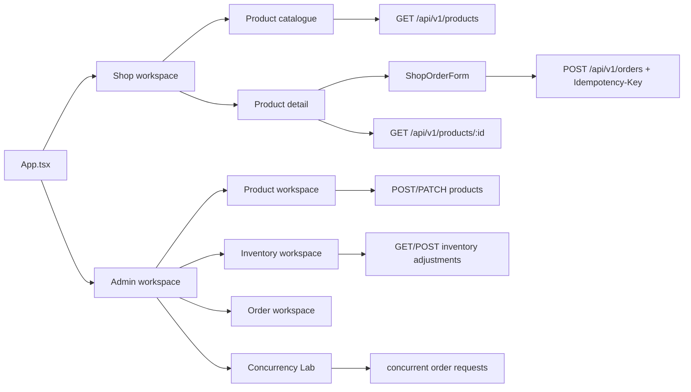
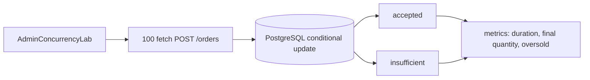

# Frontend track — học qua Shop, Admin và Concurrency Lab

## Frontend dùng để làm gì?

`frontend/` là phần React chạy thật của Flash Sale Platform. Nó có hai vai trò:

1. **Product UI:** người dùng xem Product, chọn quantity và tạo Order; administrator quản lý Product, Inventory và Order.
2. **Learning surface:** mỗi màn hình làm lộ ra một backend behavior để bạn quan sát HTTP contract, loading/error state, retry, idempotency và concurrency.

Nó chưa phải một khóa React độc lập. Nó cố ý dùng React hooks, TypeScript và `fetch` khá trực tiếp để bạn nhìn thấy request/response trước khi học thêm state framework hoặc UI library.

## Bản đồ giao diện



## Các màn hình và bài học

| Màn hình/file | Nó làm gì | Bài học backend liên quan |
|---|---|---|
| [`App.tsx`](../../frontend/src/App.tsx) | chọn Shop/Admin, health check, load Product, loading/error state | API lifecycle, stale response, state boundary |
| [`ShopOrderForm.tsx`](../../frontend/src/ShopOrderForm.tsx) | tạo Order, giữ Customer ID và Idempotency-Key, replay request | idempotency, status `201/200/409`, error contract |
| [`AdminProductWorkspace.tsx`](../../frontend/src/AdminProductWorkspace.tsx) | tạo/sửa Product, pagination, validation | DTO, Problem Details, optimistic UI boundary |
| [`AdminInventoryWorkspace.tsx`](../../frontend/src/AdminInventoryWorkspace.tsx) | điều chỉnh Inventory có reason | business validation, audit intent, source of truth |
| [`AdminOrderWorkspace.tsx`](../../frontend/src/AdminOrderWorkspace.tsx) | xem danh sách Order | pagination, stable sort, projection |
| [`AdminConcurrencyLab.tsx`](../../frontend/src/AdminConcurrencyLab.tsx) | gửi nhiều request đồng thời và hiển thị kết quả | no-oversell, accepted/insufficient/replayed, p95 |
| [`api-types.ts`](../../frontend/src/api-types.ts) | type của response/request frontend | API contract và drift |
| [`App.test.tsx`](../../frontend/src/App.test.tsx) | test UI/request/error/race behavior | frontend regression và async correctness |

## Chặng 1 — Đọc một request từ UI đến backend

Mở `App.tsx` và tìm `loadProducts`:

```text
useEffect khi App mount
→ fetch GET /api/v1/products
→ loading
→ response JSON
→ setProducts
→ render product-list
```

Hãy thử trả lời:

- Nếu API chậm, UI hiển thị gì?
- Nếu API trả 500, người dùng retry ở đâu?
- Nếu component unmount khi request đang chạy, response có còn được set state không?
- `VITE_API_BASE_URL` giúp dev/prod khác nhau thế nào?

## Chặng 2 — Học idempotency qua ShopOrderForm

Khi form mount, nó tạo một `customerId` và `idempotencyKey`. Khi submit:

```http
POST /api/v1/orders
Idempotency-Key: 7f...
Content-Type: application/json
```

Nếu người dùng bấm “Replay same request”, frontend gửi lại cùng key. Backend phải trả lại Order cũ thay vì trừ Inventory lần nữa.

### Bài thực hành

1. Mở DevTools Network.
2. Tạo một Order.
3. Bấm replay.
4. So sánh HTTP status `201` lần đầu và `200` khi replay.
5. Kiểm tra Order ID và Available Quantity.
6. Đổi quantity; quan sát frontend tạo key mới để tránh nhầm payload cũ.

Đây là nơi tốt nhất để liên kết UI với [`idempotency_replay_playbook.md`](../visual-guides/idempotency_replay_playbook.md).

## Chặng 3 — Học error contract

Frontend không nên chỉ hiển thị “Something went wrong”. Backend dùng `application/problem+json` với `code`, `detail` và `fieldErrors`.

Ví dụ:

```json
{
  "code": "INSUFFICIENT_STOCK",
  "detail": "Available Quantity is not enough"
}
```

Hoặc lỗi validation:

```json
{
  "code": "VALIDATION_FAILED",
  "fieldErrors": [
    { "field": "reason", "message": "size must be between 3 and 200" }
  ]
}
```

### Bài thực hành

- gửi quantity lớn hơn giới hạn;
- tạo Product có name rỗng;
- điều chỉnh Inventory với reason quá ngắn;
- tắt backend rồi bấm retry;
- kiểm tra alert, `aria-invalid`, button disabled và error message.

Đọc [`rest_validation_problem_details_playbook.md`](../visual-guides/rest_validation_problem_details_playbook.md) sau bài này.

## Chặng 4 — Admin và source of truth

Admin UI không phải nơi quyết định business correctness. Nó gọi API:

```text
Admin form
→ POST/PATCH API
→ backend validation/transaction
→ response committed state
→ frontend refresh/update view
```

Khi điều chỉnh Inventory, frontend phải hiển thị quantity backend đã commit, không tự đoán rằng request chắc chắn thành công. Nếu hai request về sai thứ tự, code phải tránh response cũ ghi đè state mới.

### Bài thực hành

1. Mở `AdminInventoryWorkspace.tsx`.
2. Tạo adjustment `+7` với reason.
3. Kiểm tra request body và response.
4. Làm request chậm giả lập trong test.
5. Kiểm tra response cũ không ghi đè update mới.

## Chặng 5 — Concurrency Lab là màn hình học quan trọng nhất

`AdminConcurrencyLab.tsx` cho phép bạn quan sát trực tiếp invariant:

```text
initial inventory = 10
concurrent requests = 100
quantity mỗi request = 1

Expected:
accepted = 10
insufficient = 90
final inventory = 0
oversold = false
```



Nếu UI báo `oversold=true`, hãy chuyển sang backend lab:

- [Atomic Order/Inventory](../visual-guides/atomic_order_inventory_playbook.md)
- [Inventory locking strategies](../visual-guides/inventory_locking_strategies_playbook.md)
- [Concurrency lab](../../playbooks/01-atomic-inventory-lab/README.md)

Frontend ở đây là kính hiển vi để nhìn thấy database invariant; nó không thay thế concurrency test trong backend.

## Chặng 6 — Test frontend để bảo vệ behavior

Frontend test hiện dùng Vitest và Testing Library. Hãy đọc `App.test.tsx` theo tình huống, không đọc theo thứ tự file:

| Tình huống | Cần chứng minh |
|---|---|
| API offline | UI báo lỗi và cho retry |
| API trả Problem Details | field error hiện đúng form |
| Product detail response cũ về sau | không ghi đè update mới |
| Product list có nhiều page | Admin vẫn chọn được record ở page sau |
| Inventory adjustment thành công | hiển thị committed quantity |
| Submit đang chạy | form/button bị khóa, không duplicate click |
| Order replay | UI phân biệt accepted và replayed |

Các lệnh:

```powershell
cd frontend
npm test
npm run typecheck
npm run build
```

## Chặng 7 — Những gì frontend chưa dạy

Frontend hiện chưa phải bài học chuyên sâu về:

- React state management lớn;
- authentication/OIDC thật;
- accessibility audit đầy đủ;
- design system/component library;
- WebSocket/realtime;
- frontend performance profiling;
- E2E browser automation bằng Playwright;
- production CDN/cache strategy.

Những phần này chỉ nên thêm sau khi hiểu API contract, async state, error state, idempotency và concurrency lab.

## Câu trả lời phỏng vấn về frontend

> “Frontend trong project không chỉ để demo UI. ShopOrderForm cho thấy client phải gửi Idempotency-Key và phân biệt Order mới với replay. AdminConcurrencyLab tạo concurrent requests để quan sát accepted count, insufficient count, final Available Quantity và p95. Admin screens kiểm tra Problem Details, pagination và stale response. Tôi dùng frontend như một consumer thật của OpenAPI contract, nhưng correctness vẫn được chứng minh ở backend bằng PostgreSQL integration/concurrency tests.”

## Checklist hoàn thành frontend track

- [ ] Hiểu `App.tsx` load health và Product.
- [ ] Tạo được Order từ Shop UI.
- [ ] Replay cùng Idempotency-Key và kiểm tra không trừ Inventory lần hai.
- [ ] Hiểu `201` lần đầu và `200` khi replay.
- [ ] Thử lỗi validation/insufficient stock/API offline.
- [ ] Điều chỉnh Inventory qua Admin.
- [ ] Chạy Concurrency Lab và giải thích từng metric.
- [ ] Đọc được một frontend test cho race/stale response.
- [ ] Chạy `npm test`, `npm run typecheck`, `npm run build`.
