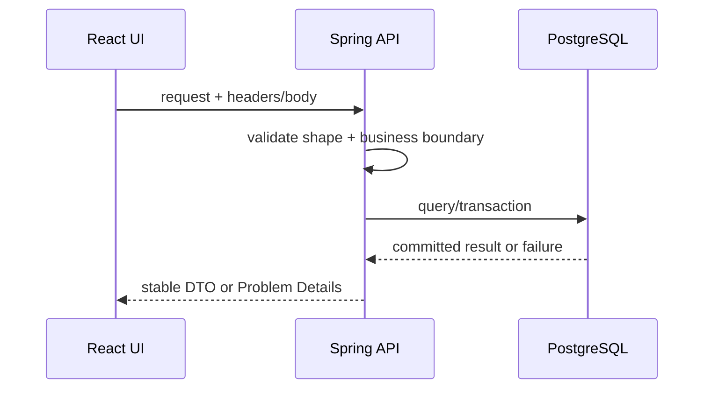

# Playbook: REST JSON và frontend không bị lệch contract

## Flow chuẩn



Frontend không đoán database entity. Contract phải nói rõ field, status, error code, pagination và retry behavior.

```text
OpenAPI/schema → backend DTO + validation → integration contract test
→ frontend generated type/schema → mapping loading/success/error
```

REST JSON phù hợp resource CRUD và query/read API. Tối ưu nằm ở contract ổn định, payload vừa đủ, pagination, cache headers, idempotency và error model.

## Bài thực hành

1. Mở [OpenAPI](../../openapi/openapi.yaml), chọn một endpoint.
2. Viết request/response/error table trước code.
3. FE xử lý `201`, `200 replay`, `409`, `429`, `5xx`; không tự đoán business từ message text.
4. Gửi cùng Idempotency-Key hai lần từ DevTools/curl; xác nhận FE không tạo card/order thứ hai.
5. Đổi field response trong branch thử nghiệm và chạy contract/typecheck để thấy breaking change.

## Rule

FE double-click guard là UX; backend dedup mới là correctness. Error có `code`, `type`, `traceId`, field errors; DTO public không phải JPA entity. Với upload/stream/real-time, REST JSON có thể không phải transport phù hợp; chọn theo interaction.
