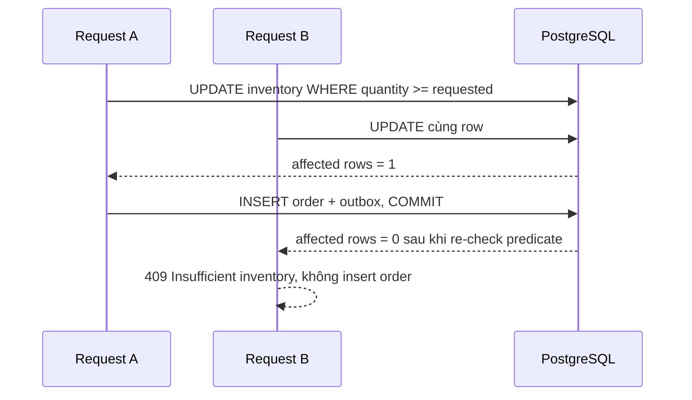

# Playbook: chống oversell bằng PostgreSQL atomic update

## Khi dùng

Dùng cho quota, coupon, flash sale, số ghế còn lại, phòng khách sạn còn lại — khi một request tiêu thụ một số lượng hữu hạn và hệ thống cần bảo vệ invariant:

> Tổng số lượng đã accept không được vượt `available_quantity` ban đầu.

Không bắt đầu bằng Redis lock hay `synchronized`. PostgreSQL đang giữ inventory là source of truth, nên database phải đưa ra quyết định cạnh tranh.



## Công thức triển khai

```sql
UPDATE inventories
SET available_quantity = available_quantity - :quantity,
    updated_at = CURRENT_TIMESTAMP
WHERE product_id = :productId
  AND available_quantity >= :quantity;
```

| Giá trị affected rows | Ý nghĩa business | Hành động |
|---:|---|---|
| `1` | Đã reserve thành công | Tạo order và outbox trong cùng transaction |
| `0` | Không đủ hàng hoặc product không tồn tại | Không tạo order; trả lỗi domain phù hợp |

Đây là atomic vì condition và write là **một statement**. Cách sai là tách thành `SELECT → if → UPDATE`: hai transaction có thể cùng đọc số stock cũ rồi cùng accept.

## Code production trong repo này

| Vai trò | Code cần đọc | Lý do tồn tại |
|---|---|---|
| HTTP adapter | [OrderController](../../backend/src/main/java/com/ngoctri/flashsale/order/api/OrderController.java) | Dịch header/body HTTP sang command và status response; không chứa business transaction. |
| Use case | [PlaceOrder](../../backend/src/main/java/com/ngoctri/flashsale/order/application/PlaceOrder.java) | Là transaction boundary: idempotency → product → decrement → order → outbox. |
| Port | [OrderPlacementStore](../../backend/src/main/java/com/ngoctri/flashsale/order/application/OrderPlacementStore.java) | Application không biết JDBC/SQL; dễ test và đổi adapter. |
| SQL adapter | [JdbcOrderPlacementStore](../../backend/src/main/java/com/ngoctri/flashsale/order/infrastructure/persistence/JdbcOrderPlacementStore.java) | Chứa conditional update và chuyển row count thành `boolean`. |
| Evidence | [Concurrency integration test](../../backend/src/test/java/com/ngoctri/flashsale/inventory/infrastructure/persistence/InventoryConcurrencyStrategyLabIntegrationTest.java) | Chứng minh invariant dưới cạnh tranh, không tin vào suy luận suông. |

## Làm ngay: lab 20 phút

Chạy [Atomic Inventory Lab](../../playbooks/01-atomic-inventory-lab/README.md). Lab dùng hai `psql` session để bạn tự tạo oversell, sau đó sửa bằng đúng atomic statement. Đừng đọc implementation production trước phần 2.

## Checklist khi nhận task thật

- [ ] Invariant viết được trong một câu và có thể kiểm tra bằng query/test.
- [ ] Source of truth là database nào; nhiều app replica có cùng đọc/ghi nó không?
- [ ] Check business condition nằm trong write atomic hoặc lock strategy có chủ đích.
- [ ] Order/hold và inventory change commit/rollback cùng boundary.
- [ ] Có integration test concurrent, không chỉ unit test mock repository.
- [ ] Đã nêu hot-row contention, timeout và retry behavior.

## Chọn giải pháp nào?

| Giải pháp | Chọn khi | Không phù hợp khi |
|---|---|---|
| Conditional atomic update | Một row/quota và rule kiểm tra gói gọn trong SQL | Rule cần nhiều row/aggregate phức tạp |
| Pessimistic lock | Cần đọc rồi quyết định nhiều bước với lock rõ ràng | Hot key lớn, transaction dài, gọi network khi giữ lock |
| Optimistic lock | Conflict hiếm, retry rẻ | Hot SKU; retry storm làm latency xấu |

`@Transactional` chỉ nói commit/rollback thế nào. Nó không biến read-then-write thành atomic. `synchronized` chỉ bảo vệ memory của một JVM; hai pod/replica vẫn race với nhau.

## Câu trả lời phỏng vấn (45 giây)

“Tôi bắt đầu từ invariant: tổng quantity được accept không vượt stock. Vì PostgreSQL là source of truth, tôi dùng conditional update `WHERE available_quantity >= requested`; affected row 1 là reserve thành công, 0 là hết hàng. Việc giảm tồn kho, tạo order và outbox nằm trong một transaction để lỗi ở giữa rollback toàn bộ. Tôi không dùng Java synchronized vì nhiều instance không chia sẻ memory. Tôi chứng minh bằng integration test chạy concurrent requests và theo dõi stock cuối cùng cùng số order accepted. Với hot key rất cao, tôi đo lock wait/p95 trước khi cân nhắc reservation queue hay partitioning.”

## Repo tham khảo: đọc có mục đích

- [Spring PetClinic](https://github.com/spring-projects/spring-petclinic): đọc cấu trúc Spring Boot, controller/service/repository và cách chạy test; **không** phải mẫu concurrency/inventory.
- [Spring Modulith](https://github.com/spring-projects/spring-modulith): tham khảo cách kiểm chứng module boundary và module integration test; phù hợp khi project lớn dần nhưng chưa cần microservice.
- [Debezium examples](https://github.com/debezium/debezium-examples): xem Docker Compose/CDC khi muốn tìm hiểu biến thể outbox bằng CDC; không cần đưa Debezium vào MVP hiện tại.

## Bằng chứng hoàn thành

Gửi mentor ba thứ: ảnh/kết quả `verify.sql` của phần sai và phần đúng, câu trả lời 5 câu trong lab, và diff test hoặc pseudo-code bạn tự viết. Mentor sẽ review reasoning rồi mới sang idempotency.
