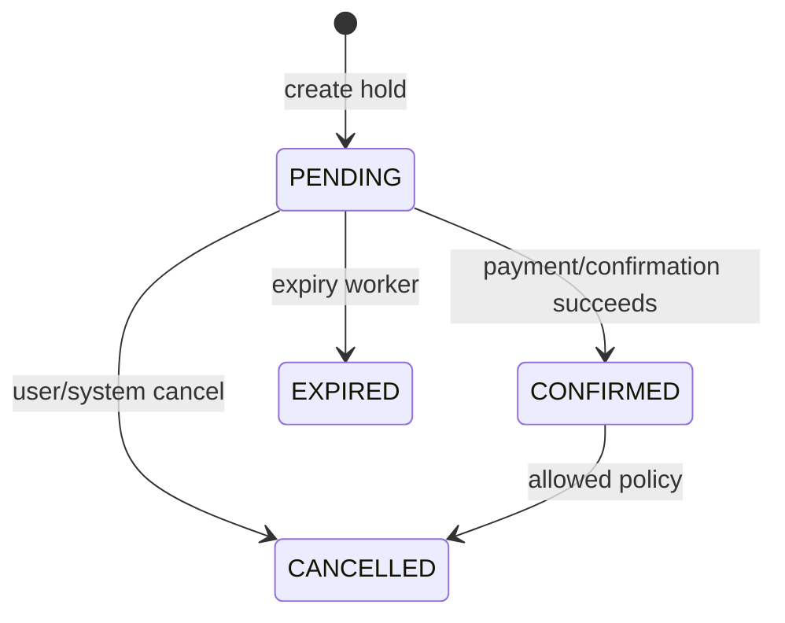

# Playbook 17: Hotel/flight booking reservation state machine

## Vì sao không copy Order

Booking có **hold theo thời gian**, expiry/cancel, nhiều resource (room-night/seat segment) và price snapshot. Stock giảm vĩnh viễn của Flash Sale không mô hình đủ lifecycle này.

## Capstone spec trước code

1. Entities: Availability, Reservation, ReservationItem, PriceSnapshot, ExpiryJob/Audit.
2. Invariants: no confirmed/held units beyond capacity; one hold expires/releases exactly once; transitions hợp lệ.
3. API: create hold with idempotency key, confirm, cancel, read reservation; error contracts.
4. Transaction: reserve capacity + PENDING reservation + expiry event/outbox commit cùng nhau.
5. Worker: claim due PENDING reservation, conditional transition to EXPIRED, release exactly once.

## Bài thực hành

Tạo GitHub issue/spec; viết tests trước: last room two concurrent holds, duplicate create, expiry vs confirm race, cancellation replay. Chọn atomic SQL/lock sau khi xác định aggregate scope, không chọn lock trước.

## Interview

“Tôi dùng explicit state machine và conditional transition để expiry/confirm race không double-release. Hold có TTL, idempotency và audit; inventory policy khác booking segment nên model không phải Order copy.”
