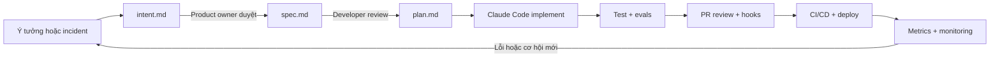

# Claude Code và AI-native SDLC: bài học cho người mới

## Bạn sẽ học được gì?

Sau bài này, bạn phải trả lời được bằng ví dụ:

- Claude Code tham gia ở bước nào trong một feature?
- Vì sao cần `intent.md`, `spec.md` và `plan.md`?
- `CLAUDE.md`, skill, hook và eval khác nhau như thế nào?
- Vì sao agent viết code nhanh nhưng chưa chắc team giao hàng nhanh?
- Con người kiểm soát ở đâu để AI không tự ý sửa sai hoặc deploy nhầm?

Bài học dùng một câu chuyện xuyên suốt: **thêm chức năng tạo Order cho hệ thống flash-sale nhưng không được oversell**.

## 1. Hãy quên câu “AI viết code thay tôi”

Một người mới thường bắt đầu như sau:

```text
“Claude, hãy viết API đặt hàng cho tôi.”
```

Agent có thể tạo controller, service và test, nhưng chưa biết:

- Inventory có được âm không?
- Retry HTTP có tạo Order thứ hai không?
- Giá được lấy lúc nào?
- Kafka có nằm trong transaction không?
- Customer được xem Order của ai?
- Test nào chứng minh không oversell dưới concurrency?

AI-native SDLC bắt đầu bằng một cách nghĩ khác:

```text
Con người xác định vấn đề và giới hạn.
Agent đọc context, lập kế hoạch và thực thi.
Test/CI/hook kiểm tra kết quả.
Con người duyệt quyết định có rủi ro.
Production tạo feedback cho vòng kế tiếp.
```

Anthropic gọi đây là chuyển từ SDLC tuyến tính sang một vòng lặp liên tục: plan → design → build → test → deploy → maintain → quay lại plan. [Introduction của Claude Academy](https://academy.claude.com/courses/ai-native-sdlc-playbook/introduction)

## 2. Bức tranh lớn bằng một ví dụ



Mỗi mũi tên có một file hoặc bằng chứng. Vì vậy người khác có thể trả lời:

```text
Vì sao làm thay đổi này?    → intent.md
Đã quyết định thiết kế gì?  → spec.md
Sẽ sửa file nào, kiểm tra gì? → plan.md
Code có đúng không?          → tests/evals
Ai duyệt và rủi ro gì?       → PR/CI/approval
Chạy production ra sao?      → deployment/metrics
```

## 3. Bước 1 — Từ vấn đề thành `intent.md`

### `intent.md` là gì?

Nó là bản ghi ngắn về **muốn giải quyết vấn đề gì và vì sao**. Nó chưa phải thiết kế kỹ thuật.

### Ví dụ không tốt

```text
Build a reservation API.
```

### Ví dụ tốt

```markdown
# Intent: tạo Order không oversell

## Problem
Khi nhiều Customer đặt cùng một Product gần như đồng thời,
code hiện tại có nguy cơ chấp nhận nhiều Order hơn Available Quantity.

## Desired outcome
Nếu Available Quantity là 10 và có 100 request quantity=1,
chỉ đúng 10 Order được chấp nhận; Inventory cuối bằng 0.

## Constraints
- quantity từ 1 đến 5
- request retry cùng idempotency key không được trừ thêm Inventory
- giá trong Order là giá tại thời điểm chấp nhận
- Order và Inventory deduction phải commit cùng PostgreSQL transaction
- Kafka không nằm trên HTTP critical path

## Out of scope
- payment thật
- multi-product cart
- nhiều warehouse

## Open questions
- kiểm chứng bằng atomic update hay locking lab?
- metric nào cảnh báo oversell hoặc lock wait?
```

### Ai được sửa?

Người tạo requirement hoặc product owner phải đọc lại file do agent soạn. Claude có thể hỏi thêm “ai bị ảnh hưởng?”, “thế nào là thành công?”, “điều gì không làm?”. Sau đó `intent.md` được commit vào Git để giữ lịch sử. Đây là cách Claude Academy mô tả Stage 1: [Capture as intent.md](https://academy.claude.com/courses/ai-native-sdlc-playbook/capture-intent).

### Prompt dễ dùng

```text
Tôi muốn giải quyết vấn đề sau: nhiều Customer mua cùng một Product trong flash sale.
Hãy hỏi tôi các câu hỏi còn thiếu về người dùng, kết quả mong đợi,
invariant, giới hạn và phần ngoài phạm vi.
Sau khi tôi trả lời, tạo intent.md.
Không đề xuất code hoặc framework ở bước này.
```

### Dấu hiệu bạn làm đúng

- Người không biết code vẫn đọc hiểu được.
- Có kết quả đo được, không chỉ “tốt hơn”.
- Có constraint và out-of-scope.
- Không lẫn implementation detail quá sớm.

## 4. Bước 2 — Từ `intent.md` thành `spec.md`

### `spec.md` trả lời câu hỏi gì?

`intent.md` nói **vì sao**. `spec.md` nói **hệ thống sẽ hành xử thế nào**.

```text
intent.md: Không được oversell.
spec.md: UPDATE inventories SET available_quantity = available_quantity - :q
          WHERE product_id = :id AND available_quantity >= :q.
          affected rows = 0 → INSUFFICIENT_STOCK.
```

### Ví dụ phần spec

```markdown
# Spec: atomic order acceptance

## HTTP contract
POST /api/orders
Headers:
- Idempotency-Key: bắt buộc

## Happy path
1. Validate Customer và quantity.
2. Tìm Product đang active.
3. Conditional decrement Inventory.
4. Nếu thành công, tạo Order và snapshot price.
5. Tạo OrderCreated trong outbox.
6. Commit cùng transaction.

## Failure path
- Product không tồn tại → 404 PRODUCT_NOT_FOUND.
- Product inactive → 409 PRODUCT_NOT_AVAILABLE.
- Affected rows = 0 → 409 INSUFFICIENT_STOCK.
- Idempotency key đã xử lý với cùng payload → trả lại Order cũ.
- Idempotency key dùng lại với payload khác → 409 IDEMPOTENCY_CONFLICT.

## Evidence
- PostgreSQL integration test.
- 100 concurrent requests với Inventory=10.
- Test HTTP retry sau khi DB commit nhưng response bị mất.

## Concerns
- Không dùng mock để kết luận atomicity.
- Không thêm payment hoặc Kafka vào request transaction.
```

Agent có thể dùng skill về security, UX, coding standard và compliance khi tạo spec, nhưng product owner/tech lead vẫn phải xử lý các concern bị gắn cờ. [Requirements and design](https://academy.claude.com/courses/ai-native-sdlc-playbook/requirements-and-design)

## 5. Bước 3 — `CLAUDE.md`: “sổ tay dự án”

### Hiểu bằng ví dụ đời thường

Nếu mỗi ngày bạn thuê một kỹ sư mới, bạn sẽ đưa họ một tờ giấy ghi:

```text
Đây là kiến trúc.
Đây là lệnh chạy test.
Đây là điều tuyệt đối không được phá.
Đây là cách review code.
```

`CLAUDE.md` chính là tờ giấy đó cho Claude Code.

### Mẫu phù hợp repository này

```markdown
# Flash Sale Platform — Claude instructions

## Read first
- CONTEXT.md
- docs/adr/0002-atomic-conditional-inventory-decrement.md
- docs/adr/0003-transactional-outbox-for-order-events.md

## Domain invariants
- Available Quantity không được âm.
- Chỉ Order được chấp nhận mới được persist.
- Order lưu price snapshot.
- Order Created và Inventory deduction commit cùng PostgreSQL transaction.
- Kafka publish là asynchronous outbox relay.

## Architecture
- Modular monolith, package-by-feature.
- API/infrastructure không được làm domain phụ thuộc ngược.
- PostgreSQL là source of truth cho Order và Inventory.

## Commands
- Backend: `cd backend; .\mvnw.cmd test`
- Frontend: `cd frontend; npm test; npm run typecheck; npm run build`
- Contract: `npx --yes @redocly/cli lint openapi/openapi.yaml`

## Working rules
- Đọc code, test và ADR trước khi sửa.
- Plan trước, edit sau.
- Thay đổi correctness-sensitive phải có integration test.
- Không dùng production secrets.
- Không mở rộng scope nếu issue chưa yêu cầu.
```

### Cái gì nên để ở đâu?

| Nội dung | Nơi đặt | Ví dụ |
|---|---|---|
| Quy tắc luôn đúng của repository | `CLAUDE.md` | lệnh test, architecture, invariant |
| Quy trình chuyên biệt | `.claude/skills/.../SKILL.md` | secure API review |
| Việc cụ thể của issue | `intent.md`, `spec.md`, `plan.md` | feature Order |
| Cổng bắt buộc | hook/CI | không đọc `.env`, test phải pass |
| Quyết định kiến trúc | `docs/adr/` | atomic update, outbox |

Đừng nhét cả lịch sử hội thoại vào `CLAUDE.md`. File dài và mâu thuẫn làm agent khó chọn instruction đúng. Claude Academy khuyên dùng `CLAUDE.md` cho working knowledge của repo và skills cho institutional knowledge cần áp dụng lặp lại. [Skills as institutional knowledge](https://academy.claude.com/courses/ai-native-sdlc-playbook/skills-as-institutional-knowledge)

## 6. Bước 4 — Plan mode và `plan.md`

### Vì sao chưa nên cho agent sửa ngay?

Nếu sửa ngay, sai lầm đầu tiên thường lan sang nhiều file. Plan mode cho agent đọc code nhưng chưa chỉnh sửa; developer có cơ hội sửa hướng đi khi chi phí còn thấp.

### Prompt plan mode

```text
Đọc intent.md, spec.md, CONTEXT.md, ADR liên quan và test hiện có.
Không sửa file.

Hãy trả về:
1. current flow từ OrderController đến PostgreSQL/outbox;
2. invariant phải giữ;
3. file cần sửa theo thứ tự;
4. test chứng minh happy path và failure path;
5. rủi ro concurrency, retry, migration và API compatibility;
6. phương án đã cân nhắc nhưng không chọn.
```

### Một plan tốt phải đọc được như thế nào?

Một developer chưa xem hội thoại vẫn phải thực hiện được từ `plan.md`:

```markdown
# Plan: atomic order acceptance

## Change order
1. `JdbcOrderPlacementStore`: thêm conditional inventory update.
2. `PlaceOrder`: gọi store trong transaction hiện hữu.
3. `OrderApiIntegrationTest`: thêm contract cho insufficient stock.
4. `InventoryConcurrencyStrategyLabIntegrationTest`: chạy 100 request.

## Do not change
- OpenAPI response schema.
- Kafka publisher.
- Customer model.

## Proof
- final inventory không âm.
- accepted orders = initial inventory.
- duplicate idempotency request không tạo side effect mới.
```

Claude Academy khuyến nghị plan phải được commit, và khi implementation lệch plan thì cập nhật plan cùng commit. [Plan mode](https://academy.claude.com/courses/ai-native-sdlc-playbook/plan-mode)

## 7. Bước 5 — Build: agent làm việc trong vòng lặp nhỏ

Đừng giao cả epic trong một prompt. Dùng vòng lặp:

```text
Đọc một phần
→ sửa một phần
→ chạy test tập trung
→ đọc diff
→ ghi lại kết quả
```

Ví dụ:

```text
Implement only step 1 of plan.md: conditional inventory update.
Do not change controller or Kafka code.
Run the focused repository test.
Show the SQL, affected-row handling, test output and diff summary.
Stop if the implementation conflicts with ADR-0002.
```

### Khi nào dùng sub-agent?

| Tốt để tách | Không nên tách |
|---|---|
| Agent đọc API contract | Hai agent cùng sửa `PlaceOrder.java` |
| Agent nghiên cứu query plan | Hai agent cùng thay transaction boundary |
| Agent review security | Một task nhỏ sửa một dòng |
| Agent viết test độc lập | Công việc cần giữ state liên tục |

Tách việc không có nghĩa là bỏ review. Lead agent hoặc developer phải kiểm tra artifact: file, test output, report hoặc review findings.

## 8. Bước 6 — Feedback loop: agent phải tự thấy lỗi

Một prompt tốt không nói “hãy cố gắng”. Nó chỉ rõ cách phát hiện sai:

```text
Sau mỗi thay đổi:
1. chạy test focused;
2. nếu fail, đọc stack trace và xác định nguyên nhân trước khi sửa;
3. không sửa test chỉ để làm test pass;
4. chạy lại test cũ và test mới;
5. báo cáo assumption, failure và evidence.
```

Với flash-sale, feedback loop tối thiểu:

```text
Unit validation
→ PostgreSQL integration
→ concurrent requests
→ idempotency replay
→ outbox failure/retry
→ API contract lint
```

“Test pass” chỉ chứng minh những test đã chạy pass. Nó không tự chứng minh rằng test bao phủ concurrency hoặc business invariant.

## 9. Bước 7 — Evals trong CI: kiểm tra chính agent

Đây là phần nhiều người mới bỏ qua. Không chỉ code cần test; `CLAUDE.md`, skills, hooks và prompt cũng có thể làm hành vi agent thay đổi.

Ví dụ một eval:

```json
{
  "name": "no-oversell-plan",
  "prompt": "Đọc issue no-oversell và tạo plan cho repository.",
  "checks": [
    "plan mentions conditional inventory update",
    "plan mentions PostgreSQL concurrency test",
    "plan does not move Kafka into HTTP transaction",
    "plan names changed files"
  ]
}
```

Khi ai đó sửa `CLAUDE.md` hoặc skill security, CI chạy lại 20–50 task đại diện. Nếu pass rate giảm, không merge thay đổi instruction đó. Incident production cũng trở thành một eval để lỗi không lặp lại. [Continuous evals in CI](https://academy.claude.com/courses/ai-native-sdlc-playbook/continuous-evals-in-ci)

## 10. Bước 8 — PR review: AI tìm lỗi, người quyết định rủi ro

Tạo `REVIEW.md` dễ đọc:

```markdown
# Review instructions

## Passes
- Bugs: logic sai, edge case, regression.
- Security: auth, IDOR, injection, PII trong log.
- Domain: oversell, idempotency, transaction/outbox.
- Spec: diff có đúng spec.md và plan.md không?

## Important
Chỉ báo Important nếu có thể làm sai behavior, leak data,
phá invariant hoặc vi phạm policy.

## Skip
- generated files
- lỗi đã được CI deterministic bắt
- nit quá nhỏ; tối đa 5 nit
```

AI review nên trả về:

```text
[P1] Race condition
File: JdbcOrderPlacementStore.java:84
Evidence: read-then-write cho phép hai transaction cùng thấy quantity đủ.
Verification: chạy 100 concurrent requests với inventory=10.
```

AI review không được tự approve PR của chính nó. Human vẫn quyết định intent đúng không, risk chấp nhận được không và có merge không. [AI in the PR review loop](https://academy.claude.com/courses/ai-native-sdlc-playbook/ai-in-the-pr-review-loop)

## 11. Bước 9 — Hooks: khác skill ở chỗ nào?

Hãy nhớ bằng câu này:

```text
Skill = nhắc agent làm đúng.
Hook = chặn agent làm sai.
```

Ví dụ:

```text
Skill: “Không đọc production secret.”
Hook: chặn Read(.env*) và Read(./secrets/**).

Skill: “Mọi migration cần review.”
Hook: block sửa db/migration nếu không có change ticket.

Skill: “Chạy test trước khi báo hoàn thành.”
CI: fail PR nếu test command fail.
```

Hook có thể allow, ask hoặc block. Với deploy production, hook nên dừng nếu không có release approval. Hook team nên được version-control; policy không thể tắt nên do platform/admin quản lý. [Hooks as approval gates](https://academy.claude.com/courses/ai-native-sdlc-playbook/hooks-as-approval-gates)

## 12. Bước 10 — CI/CD và quyền tự động hóa

Bắt đầu từ read-only:

```text
CI fail → Claude đọc build.log → phân loại flaky hay real → ghi summary vào PR.
```

Sau đó mới thêm write action qua PR:

```text
Claude sửa lint/test → push branch → mở/update PR → CI chạy lại.
```

Không cho agent push thẳng `main`. Quyền nên tăng dần theo môi trường:

| Môi trường | Quyền agent |
|---|---|
| Local/dev | Có thể chạy test và deploy sandbox |
| Staging | Deploy qua tool allow-list, cần kiểm tra smoke |
| Production | Chuẩn bị release; release manager phải approve |

Nếu có MCP deploy, expose các tool riêng như `deploy-staging`, `get-status`, `rollback-staging`, thay vì đưa cho agent một shell có production credential. Rollback phải được luyện trước ở staging. [CI/CD integration](https://academy.claude.com/courses/ai-native-sdlc-playbook/ci-cd-integration-and-deployment)

## 13. Bước 11 — Maintain: biến metric thành việc tiếp theo

Ví dụ production phát hiện:

```text
p95 POST /api/orders tăng từ 120ms lên 900ms.
```

Không nên prompt mơ hồ “tối ưu API”. Hãy tạo intent mới:

```markdown
# Intent: giảm p95 order placement

## Evidence
- p95: 900ms trong 15 phút cao điểm
- DB lock wait tăng
- error rate không đổi

## Success
- p95 dưới 200ms trong cùng workload
- concurrency correctness suite vẫn xanh
- không tăng oversell hoặc duplicate Order
```

Agent có thể đọc trace, query plan, logs và benchmark để tạo spec/plan mới. Metrics không chỉ để báo cáo; nó quyết định vòng cải tiến tiếp theo.

## 14. Mapping toàn bộ vào repository này

| Artifact trong playbook | File/điểm tương ứng trong repo |
|---|---|
| `intent.md` | `docs/product/mvp-interview.md` hoặc `docs/intents/` mới |
| `spec.md` | `docs/specs/` hoặc issue/spec được link từ PR |
| `plan.md` | plan của task/PR |
| `CLAUDE.md` | instruction file ở root khi bắt đầu rollout |
| Skill | `.claude/skills/review-flash-sale/SKILL.md` |
| Review policy | `REVIEW.md` |
| Build proof | Maven test, Testcontainers, OpenAPI lint |
| Production feedback | metrics p95, error rate, lock wait, outbox lag |

Một feature hoàn chỉnh nên để lại chuỗi evidence:

```text
intent → spec → plan → diff → test output → review findings → deploy record → metrics
```

## 15. Cách học video để không xem xong rồi quên

### Lần 1 — hiểu câu chuyện

Chỉ trả lời ba câu:

1. Bottleneck cũ nằm ở đâu?
2. Artifact nào truyền context sang bước kế tiếp?
3. Human gate nào vẫn còn?

### Lần 2 — làm trên repository

1. Viết `intent.md` cho no-oversell.
2. Viết `spec.md` từ intent.
3. Cho Claude Code chỉ đọc và tạo `plan.md`.
4. Duyệt plan rồi implement một vertical slice.
5. Chạy integration/concurrency test.
6. Viết `REVIEW.md` và tự review diff.

### Lần 3 — tạo bằng chứng phỏng vấn

Ghi lại:

- plan ban đầu và phần bạn sửa;
- một lỗi agent mắc phải;
- test phát hiện lỗi đó;
- metric trước/sau;
- policy hoặc hook bạn thêm để lỗi ít lặp lại.

## 16. Câu trả lời phỏng vấn dễ hiểu

> “Tôi áp dụng Claude Code theo một vòng lặp có artifact và gate. Trước tiên, tôi ghi vấn đề và invariant vào `intent.md`; sau khi chốt yêu cầu, agent tạo `spec.md`; developer review rồi cho agent chạy plan mode để tạo `plan.md` gồm file cần sửa, thứ tự implementation, test và rủi ro.
>
> Trong repository, `CLAUDE.md` chứa architecture và lệnh kiểm tra; skills chứa policy lặp lại; hook/CI là lớp deterministic để chặn thao tác nguy hiểm. Agent triển khai từng lát cắt nhỏ, chạy test và tự sửa qua feedback loop. PR được AI review theo `REVIEW.md`, nhưng human vẫn duyệt intent, risk và merge. CI có thể chạy eval để bảo vệ chính prompt/skill/CLAUDE.md. Sau deploy, metrics và incident quay lại tạo intent mới.
>
> Với flash-sale, tôi đo accepted orders, final Available Quantity, duplicate retry, p95, lock wait và outbox lag. Vì vậy tôi không nói AI giúp nhanh hơn một cách cảm tính; tôi chứng minh cycle time giảm mà correctness và defect escape vẫn được kiểm soát.”

## 17. Những hiểu nhầm cần tránh

**“`CLAUDE.md` là prompt thần kỳ.”** Không. Nó là context version-control; nội dung sai sẽ làm agent lặp sai.

**“Skill đảm bảo policy.”** Skill hướng dẫn agent; hook/CI mới là lớp bắt buộc.

**“AI review thay được code owner.”** AI tìm và sửa finding; human chịu trách nhiệm approve.

**“Auto mode an toàn vì agent thông minh.”** Auto mode chỉ phù hợp khi scope nhỏ, test tốt, permission rõ và có rollback.

**“Evals là test cho sản phẩm.”** Evals ở đây kiểm tra hành vi của agent khi prompt/model/skill thay đổi; chúng bổ sung, không thay thế test sản phẩm.

## 18. Checklist hoàn thành bài học

- [ ] Tự viết được `intent.md` cho một vấn đề thật.
- [ ] Phân biệt được intent, spec và plan bằng ví dụ.
- [ ] Có `CLAUDE.md` ngắn cho repository.
- [ ] Biết khi nào skill là đủ và khi nào cần hook/CI.
- [ ] Có một feedback loop nhìn thấy failure thật.
- [ ] Có test concurrency cho no-oversell.
- [ ] Có review policy kiểm tra bug, security và domain invariant.
- [ ] Biết quyền agent khác nhau ở dev, staging và production.
- [ ] Có metric trước/sau và biết incident quay lại intent thế nào.
