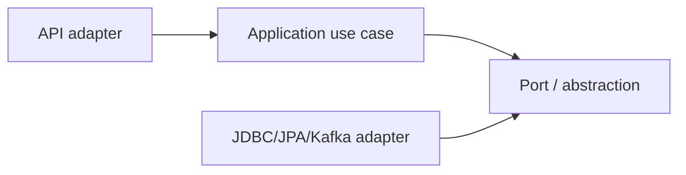

# Playbook 12: Clean Architecture, SOLID và design patterns

## Mục tiêu

Tổ chức code để business rule dễ đọc/test/thay đổi; không phải tạo nhiều interface/layer cho đẹp.

Đọc [PlaceOrder](../../backend/src/main/java/com/ngoctri/flashsale/order/application/PlaceOrder.java), [OrderPlacementStore](../../backend/src/main/java/com/ngoctri/flashsale/order/application/OrderPlacementStore.java), [JDBC adapter](../../backend/src/main/java/com/ngoctri/flashsale/order/infrastructure/persistence/JdbcOrderPlacementStore.java), [architecture test](../../backend/src/test/java/com/ngoctri/flashsale/architecture/ArchitectureRulesTest.java).

## Rule áp dụng

- SRP: controller HTTP, use case orchestration, adapter persistence/messaging.
- DIP: use case phụ thuộc port, không phụ thuộc JDBC/Kafka concrete class.
- Strategy chỉ khi behavior thật sự thay thế được (lab locking), không tạo interface một method vô nghĩa.
- Adapter che framework/protocol; DTO API không là JPA entity/domain command.

## Bài thực hành

Viết fake `OrderPlacementStore` cho unit test `PlaceOrder`, không Spring context. Sau đó nêu testability nào mất nếu `PlaceOrder` new/couple `JdbcOrderPlacementStore`. Refactor một god-method thành policy nhỏ chỉ khi interface làm caller đơn giản hơn.

## Interview

“Tôi dùng boundary để isolate business rule và dependency volatile, nhưng không ép hexagonal ceremony vào CRUD nhỏ. Thước đo là testability và complexity giảm, không phải số package.”
