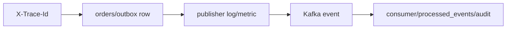

# Playbook 14: Docker, tracing, metrics và runbook

Đọc [Monitoring và ELK cho Spring Boot](monitoring-logging-elk_guide.md) trước để hiểu structured log, data stream và query; file này là runbook ngắn cho failure flow của repository.

## Mục tiêu vận hành

Khi có report “order thành công nhưng audit thiếu”, không SSH đoán mò. Trace request, kiểm tra DB/outbox, publisher, consumer và metric theo thứ tự.

Đọc [RequestTraceFilter](../../backend/src/main/java/com/ngoctri/flashsale/shared/api/RequestTraceFilter.java), [compose.yml](../../compose.yml), [Kubernetes README](../../k8s/README.md).

## Runbook bài thực hành

1. Tạo order local và giữ `X-Trace-Id`.
2. Xác nhận order + outbox row cùng commit.
3. Xem publisher claim/retry/published state.
4. Xem consumer dedup/audit record.
5. Viết incident note: impact, evidence, mitigation, follow-up.

## Rule

- Liveness: process có sống không; readiness: có nhận traffic an toàn không.
- Metric cần cardinality thấp; không dùng user/order ID làm label.
- Log structured có correlation ID; không log token/PII.
- Compose smoke không thay production observability/alerting.

## Interview

“Tôi debug bằng trace/data flow trước, phân biệt readiness và liveness, rồi dùng metric/log để xác định failure boundary thay vì restart mù.”
