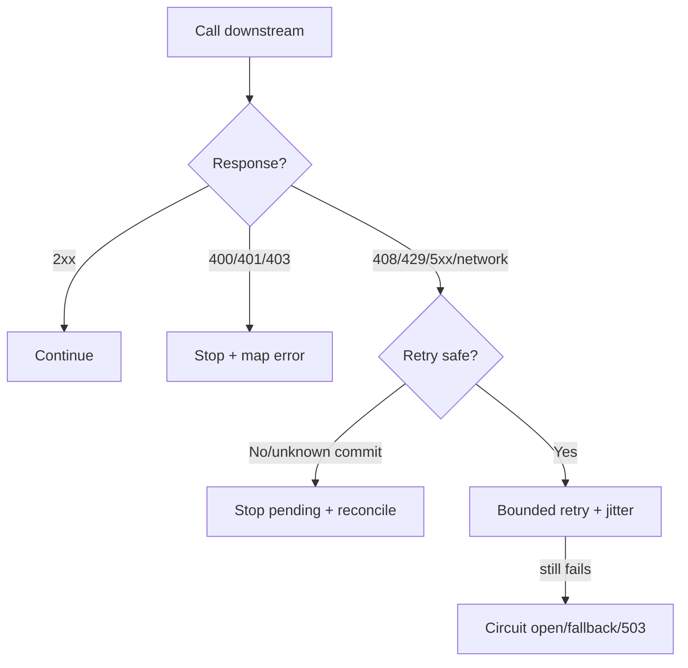
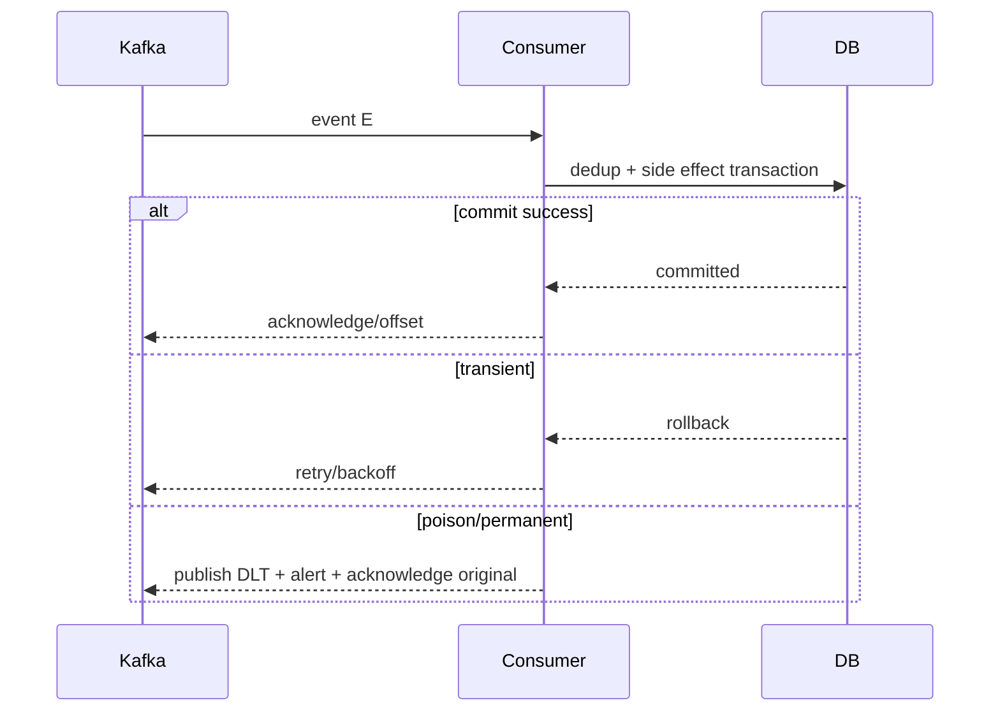

# Playbook: xử lý lỗi đồng bộ và bất đồng bộ

## Không phải lỗi nào cũng xử lý giống nhau

Quyết định đầu tiên không phải “catch exception nào”, mà là side effect có còn an toàn không và caller có cần kết quả ngay không.

| Loại lỗi | Xử lý thường dùng | Có được đi tiếp không? |
|---|---|---|
| Invalid input/schema, unauthorized, invariant violation | Reject ngay, không retry | Dừng request/message |
| Timeout/network/503/429 tạm thời | Timeout + retry bounded + backoff/jitter | Retry có điều kiện |
| Optional notification/analytics | Log/metric rồi tiếp tục business chính | Có, nếu đã định nghĩa best-effort |
| Read dependency lỗi, có cache an toàn | Fallback stale/default rõ ràng | Có, chỉ với read không ảnh hưởng correctness |
| Không biết remote đã commit hay chưa | Không retry mù; dùng idempotency/status query/reconciliation | Dừng hoặc đưa pending |
| Một bước workflow đã commit, bước sau thất bại | Compensation/Saga hoặc manual repair | Không giả vờ success |
| Async poison message | Retry hữu hạn → DLQ → alert/replay | Dừng message, không dừng cả consumer |

## Đồng bộ: timeout không phải failure policy hoàn chỉnh



### Ví dụ

Catalog GET timeout có thể trả `503 CATALOG_UNAVAILABLE` hoặc stale cache. Order POST timeout không được retry mù nếu chưa có idempotency key; remote có thể đã tạo Order. Với payment/booking, trạng thái `PENDING` + status query thường an toàn hơn đoán thất bại.

```java
try {
    return catalogClient.getProduct(productId);
} catch (TimeoutException | ConnectException transientFailure) {
    throw new CatalogUnavailableException(transientFailure);
} catch (RemoteBadRequestException permanentFailure) {
    throw new ProductRequestRejectedException(permanentFailure);
}
```

Đừng `catch (Exception) { log.warn(...); return success; }` cho payment, inventory, authorization hay Order. “Log rồi đi tiếp” chỉ hợp với side effect đã được business tuyên bố là optional.

## Bất đồng bộ: ack sau durable outcome



### Quy tắc async

- `ack` sau khi side effect durable commit; ack trước commit có thể mất message.
- Duplicate là bình thường; dedup bằng event ID/business idempotency key.
- Retry hữu hạn, backoff và jitter; retry vô hạn làm consumer loop nghẽn.
- Poison message không được làm partition/consumer chết mãi; đưa vào DLT với payload, error, attempts, trace ID, offset.
- Message ordering chỉ có trong phạm vi partition/key; đừng giả định ordering toàn topic.
- Shutdown graceful phải hoàn thành/rollback message đang xử lý trước khi consumer dừng.

## Lab thực hành

1. Chạy [two-service lab](../../playbooks/09-microservice-request-lab/README.md), dừng Catalog rồi gọi Order: phân loại 503, timeout và retry.
2. Thêm delay vào Catalog; đặt timeout 500ms; ghi p95 và số retry.
3. Gửi một event hợp lệ hai lần; kiểm tra audit chỉ một row.
4. Gửi payload sai schema; kiểm tra retry count, DLT decision và alert.
5. Tạo exception sau `processed_events` nhưng trước audit insert; xác nhận transaction rollback để message được retry.

## Rubric

Đạt khi bạn trả lời được cho mỗi failure: (1) client/message thấy gì, (2) state nào đã commit, (3) có retry không và tại sao, (4) metric/log/DLQ nào chứng minh, (5) ai/flow nào repair nếu không tự hồi phục.

## Interview

“Tôi phân loại lỗi theo tính tạm thời, khả năng retry an toàn và mức ảnh hưởng invariant. Lỗi invalid/authorization dừng ngay; timeout chỉ retry khi operation idempotent và có budget; side effect optional mới log rồi đi tiếp. Async ack sau durable commit, duplicate dedup bằng event ID, poison message vào DLQ có replay runbook.”
