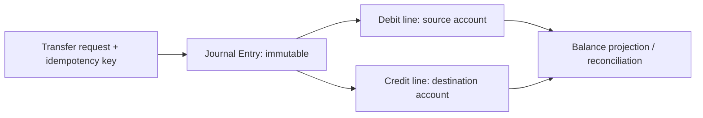

# Playbook 18: Finance double-entry ledger và reconciliation

## Rule không thương lượng

> Mỗi posted transfer phải tạo journal lines immutable; tổng debit bằng tổng credit cho từng currency.

## Capstone design

| Table | Rule |
|---|---|
| `journal_entries` | posted entry không update/delete |
| `journal_lines` | debit/credit amount, currency, account; sum phải cân bằng |
| `transfers` | request lifecycle/idempotency/reference |
| `account_balances` | projection/cache, rebuildable từ journal |

Viết constraints/transaction theo database capability. Transfer cần authorization, limits, fraud/risk policy, audit actor/correlation ID, reconciliation job và dispute/reversal flow. Reversal tạo journal mới, không sửa history.

## Bài thực hành

Trước code, viết ADR trả lời: source of truth là journal hay balance? unique key dedup ở đâu? làm gì khi external payment provider timeout? reconciliation phát hiện mismatch như thế nào? Sau đó viết tests debit=credit, duplicate request, insufficient funds, reversal immutability.

## Interview

“Tôi không update balance rồi hy vọng audit event đủ. Ledger immutable double-entry là source of truth; balance là projection, every request idempotent, reconciliation kiểm chứng DB/external state và reversal là entry mới.”
