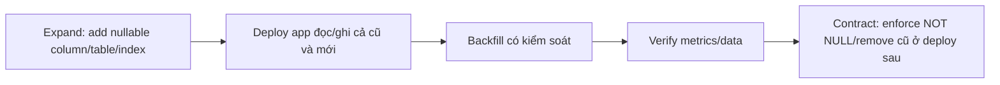

# Playbook 09: Flyway và zero-downtime schema evolution

## Rule

> Deploy app mới và app cũ có thể cùng chạy. Migration phải tương thích với cả hai trước khi xóa behavior cũ.

## Làm trong repo

Đọc [migrations](../../backend/src/main/resources/db/migration), đặc biệt [V3 orders](../../backend/src/main/resources/db/migration/V3__create_orders.sql), [V5 outbox](../../backend/src/main/resources/db/migration/V5__create_outbox_events.sql) và [V7 version](../../backend/src/main/resources/db/migration/V7__add_inventory_version_for_concurrency_lab.sql).

Bài: thêm `reservation_expires_at` cho booking. Viết trước plan 4 bước: add nullable column + index, deploy code ghi giá trị mới, backfill old data, sau khi evidence đủ mới enforce constraint. Không sửa migration đã chạy production; tạo version mới.

## Checklist

- Migration forward-only, review được, có test fresh database và upgrade path.
- Index lớn production có thể cần `CREATE INDEX CONCURRENTLY` (không chạy trong transaction); plan theo engine/tooling thực tế.
- Backfill batch, rate-limit, observable; rollback app khác rollback schema.
- Dữ liệu nhạy cảm/audit có retention và access policy.

## Interview

“Tôi dùng expand-contract migration thay vì add NOT NULL rồi deploy app sau. App version cũ/mới cùng sống được, backfill quan sát được, rồi mới contract ở release sau.”
