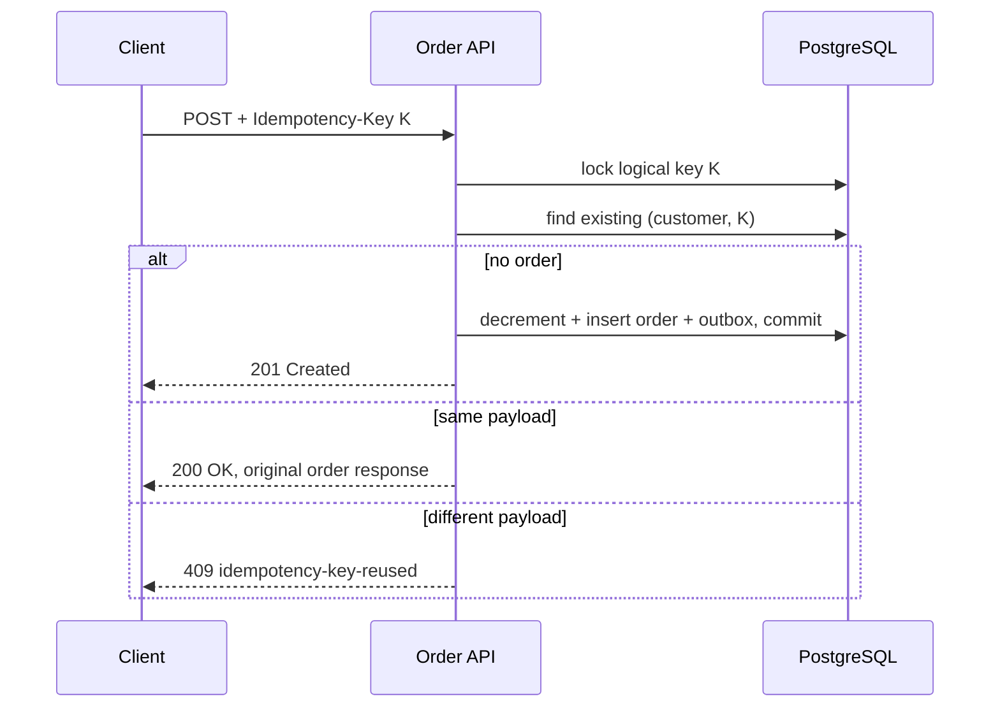

# Playbook: Idempotency và replay an toàn

## Khi dùng

Client/mobile gateway có thể retry vì timeout, mất mạng hoặc user bấm lại. Với endpoint tạo side effect — create order, booking hold, transfer request — request retry phải không thực hiện side effect hai lần.

## Rule áp dụng ngay

> Cùng actor + cùng idempotency key + cùng payload: trả lại kết quả gốc. Cùng actor + cùng key + payload khác: conflict. Khác actor: độc lập.

Đặt idempotency check **trước** inventory decrement/payment/outbox. Key chỉ sống trong scope định nghĩa rõ ràng (ở đây customer), có format/TTL/retention policy tùy business.

## Code production trong repo này

| Vai trò | File | Điều cần quan sát |
|---|---|---|
| HTTP contract | [OrderController](../../backend/src/main/java/com/ngoctri/flashsale/order/api/OrderController.java) | Header bắt buộc; lần đầu 201, replay 200. |
| Use case | [PlaceOrder](../../backend/src/main/java/com/ngoctri/flashsale/order/application/PlaceOrder.java) | Lock và lookup phải xảy ra trước mọi write side effect. |
| Persistence | [JdbcOrderPlacementStore](../../backend/src/main/java/com/ngoctri/flashsale/order/infrastructure/persistence/JdbcOrderPlacementStore.java) | Advisory transaction lock chỉ serialize cùng logical key. |
| Last defense | [V3 migration](../../backend/src/main/resources/db/migration/V3__create_orders.sql) | Unique `(customer_id, idempotency_key)` chống duplicate data ngay cả khi application bug. |

## Lab 20 phút

Làm [Idempotency replay lab](../../playbooks/02-idempotency-replay-lab/README.md). Bạn sẽ thấy unique constraint một mình trả lỗi duplicate, rồi thấy advisory transaction lock giúp request thứ hai chờ và replay row đầu tiên.

## Đừng mắc lỗi này

- Chỉ cache response trong memory: app restart hoặc request vào replica khác sẽ duplicate.
- Key global: hai customer vô tình dùng cùng key bị chặn nhau.
- Chỉ unique constraint nhưng không lookup/replay: UX nhận 500/duplicate-key thay vì kết quả gốc.
- Cùng key với payload khác nhưng vẫn replay: che giấu client bug và có thể trả sai business result.
- Tin idempotency key là authentication: đây là correlation/dedup mechanism, không xác thực identity.

## Checklist task thật

- [ ] Endpoint có side effect chưa và retry source là ai?
- [ ] Scope key gồm actor/tenant nào? Payload nào cần so sánh/hash?
- [ ] Side effect nào phải nằm sau replay check?
- [ ] Database có unique constraint làm final guard không?
- [ ] Replay response/status là gì? Key reuse khác payload trả lỗi gì?
- [ ] Retention/expiry policy có phù hợp dispute/audit window không?

## Câu trả lời phỏng vấn (45 giây)

“Với API tạo order hoặc transfer, client retry là bình thường nên tôi nhận Idempotency-Key được scope theo customer. Trong transaction, tôi serialize cùng logical key, tìm order đã tồn tại trước khi đụng inventory hay tạo event. Nếu payload giống, trả response của order đầu tiên; nếu khác, trả conflict. Tôi vẫn đặt unique constraint ở database vì lock application không phải data-integrity guarantee cuối cùng. Vì transaction rollback toàn bộ, request fail trước commit không để lại order/key thành công. Tôi kiểm tra bằng test retry và concurrent duplicate requests.”

## Bằng chứng hoàn thành

Gửi kết quả ba phần lab, và nói lại tại sao “unique constraint” và “advisory lock + replay” giải quyết hai vấn đề khác nhau.
