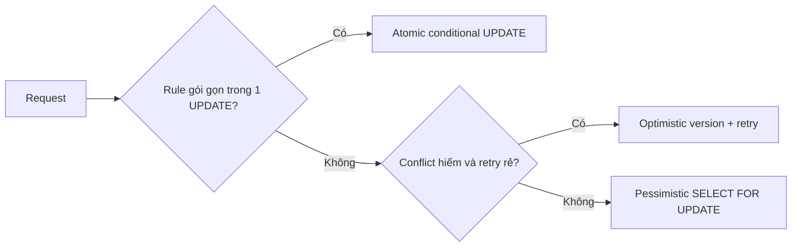

# Playbook: atomic SQL, pessimistic lock và optimistic lock

## Bài toán duy nhất để so sánh công bằng

Stock = 8, có 24 request cùng mua 1 món. Dù chọn cách nào, invariant phải luôn đúng:

> `accepted + rejected = attempts`, `final_quantity >= 0`, và `initial_quantity = accepted_quantity + final_quantity` (lab không có restock/refund).

Không chọn strategy vì “nghe enterprise”. Chọn sau khi biết rule cần bảo vệ, mức conflict và retry/latency có chấp nhận được hay không.



## Ba cách triển khai

### 1. Atomic conditional update — default cho quota/hot inventory

```sql
UPDATE inventories
SET available_quantity = available_quantity - 1
WHERE product_id = :productId
  AND available_quantity >= 1;
```

- `UPDATE 1`: accept.
- `UPDATE 0`: hết hàng/reject.
- Không có read state trong application giữa check và write.
- Một row, rule đơn giản: đây thường là lựa chọn tốt nhất.

### 2. Pessimistic lock — “khóa trước, đọc rồi quyết định”

```sql
BEGIN;
SELECT available_quantity
FROM inventories
WHERE product_id = :productId
FOR UPDATE;
-- đọc rule nhiều bước, update nếu đủ
COMMIT;
```

- PostgreSQL row lock khiến request khác cùng row đợi.
- Hợp lý khi cần đọc/kiểm tra nhiều rule không nhét sạch vào một `UPDATE`.
- Không giữ lock trong lúc gọi HTTP/payment/Kafka: transaction dài tạo queue, timeout và deadlock risk.

### 3. Optimistic locking — “đọc version, update nếu version chưa đổi”

```sql
UPDATE inventories
SET available_quantity = available_quantity - 1,
    version = version + 1
WHERE product_id = :productId
  AND version = :observedVersion
  AND available_quantity >= 1;
```

- `UPDATE 0` có thể là hết hàng **hoặc** conflict; phải re-read/retry có giới hạn.
- Hợp lý khi conflict hiếm và retry rẻ.
- Hot SKU biến conflict thành retry storm; không mặc định dùng chỉ vì JPA có `@Version`.

## Lab chạy thật trong repo

Chạy:

```powershell
cd backend
.\mvnw.cmd -Dtest=InventoryConcurrencyStrategyLabIntegrationTest test
```

Test [InventoryConcurrencyStrategyLabIntegrationTest](../../backend/src/test/java/com/ngoctri/flashsale/inventory/infrastructure/persistence/InventoryConcurrencyStrategyLabIntegrationTest.java) khởi động PostgreSQL thật bằng Testcontainers, tạo 24 virtual-thread attempts đồng thời và in:

```text
strategy=... attempts=24 accepted=8 rejected=16 throughput=... p95=... retries=... lockWaitSamples=...
```

### Cách đọc output

| Field | Nó cho biết gì | Không được kết luận vội |
|---|---|---|
| `accepted/rejected/finalQuantity` | Correctness invariant có giữ không | Nhanh hơn không đồng nghĩa đúng hơn |
| `throughput` | Hoàn thành attempts/giây trong môi trường lab | Không phải production capacity report |
| `p95` | 95% attempts hoàn thành không chậm hơn mức này | Cần nhiều run/load profile mới kết luận chắc |
| `retries` | Chi phí optimistic conflict | `0` không có nghĩa production không conflict |
| `lockWaitSamples` | Có thời điểm PostgreSQL thấy lock wait | Không phải tổng thời gian bị lock |

Trước khi chạy, ghi dự đoán: strategy nào có retries, strategy nào có lock wait, tại sao cả ba vẫn phải accept 8.

## Code map

| Method trong lab | Điều cần học |
|---|---|
| `atomicDecrement()` | Một statement chuyển affected-row count thành outcome. Đây là mechanism production hiện dùng. |
| `pessimisticDecrement()` | Phải tắt auto-commit, `SELECT ... FOR UPDATE`, update và commit trong cùng transaction. |
| `optimisticDecrement()` | Read version → conditional update → retry bounded. Retry không vô hạn. |
| `runWorkload()` | Barrier `ready/start` tạo cạnh tranh thật hơn loop tuần tự; result check tách correctness khỏi performance metric. |

Production path vẫn chọn atomic SQL trong [JdbcOrderPlacementStore](../../backend/src/main/java/com/ngoctri/flashsale/order/infrastructure/persistence/JdbcOrderPlacementStore.java), vì inventory rule hiện tại là một row và một predicate đơn giản.

## Bài tự code, không xem đáp án trước

1. Tạo `InventoryReservationStrategy` interface cho lab với `reserve(productId, quantity)`.
2. Implement atomic strategy trước, viết test stock 1 / 2 concurrent attempts.
3. Implement optimistic strategy bằng `version`, thêm max retry và test conflict.
4. Implement pessimistic strategy, cố ý `Thread.sleep` trong transaction chỉ ở lab để quan sát wait.
5. Không gọi network trong transaction. Giải thích deadlock/timeout risk nếu làm vậy.

Đây là bài để hiểu design pattern **Strategy** có mục đích: cùng contract, thay behavior/benchmark. Không cần đưa Strategy pattern vào production nếu chỉ có một strategy được chọn và không có requirement thay đổi runtime.

## Những nhầm lẫn cần tránh

- `@Transactional` không tự chọn lock strategy.
- `@Version` không loại bỏ conflict; nó phát hiện conflict và đẩy việc retry cho application.
- Pessimistic lock không “an toàn hơn” nếu transaction dài hoặc deadlock.
- Virtual threads trong test làm tạo concurrent attempts rẻ hơn trên Java 21; chúng không thay database locking.
- `synchronized` không thay row lock/atomic SQL khi chạy nhiều JVM/pod.

## Checklist chọn strategy cho task mới

- [ ] Invariant là gì, có thể gói vào một conditional `UPDATE` không?
- [ ] Same row có nóng không? Conflict probability bao nhiêu?
- [ ] Retry có idempotent, bounded và rẻ không?
- [ ] Transaction có giữ lock khi gọi network hoặc code chậm không?
- [ ] Có integration test concurrent với database thật không?
- [ ] Đã đo p95, retry/conflict, lock wait trước khi “tối ưu” chưa?

## Câu trả lời phỏng vấn (60 giây)

“Tôi chọn lock theo invariant và contention. Với một SKU/quota mà điều kiện là stock đủ, conditional atomic update là đơn giản nhất: affected row 1 là success, 0 là reject, không có read-modify-write race. Pessimistic lock phù hợp khi cần đọc và xác thực nhiều bước trong một transaction ngắn, đổi lại request cùng row sẽ chờ và có deadlock risk. Optimistic lock phù hợp conflict hiếm vì cần retry khi version đổi; với hot flash-sale SKU nó có thể retry storm. Tôi không gọi external service khi giữ transaction và tôi xác minh quyết định bằng concurrent PostgreSQL integration test, p95/retry/lock-wait metrics.”
