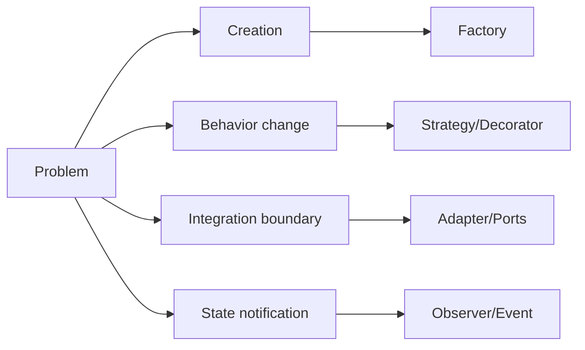
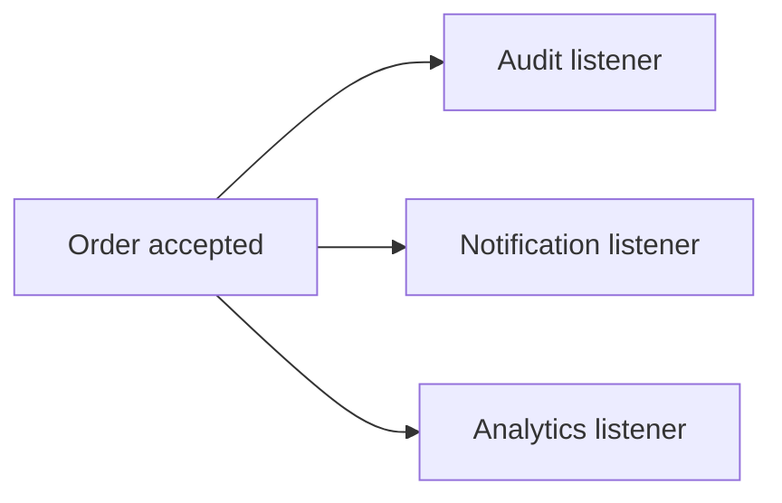
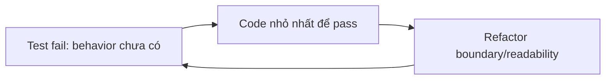

# Design patterns và TDD: chọn pattern vì vấn đề, không vì tên

## 1. Bản đồ pattern trong backend



Một pattern chỉ đáng dùng khi nó làm caller đơn giản hơn, test dễ hơn hoặc thay đổi được cô lập hơn.

## 2. Factory

Dùng khi object creation có nhiều policy/implementation:

```java
interface PricingPolicy { Money price(Product product); }

final class PricingPolicyFactory {
    PricingPolicy forCampaign(CampaignType type) {
        return switch (type) {
            case STANDARD -> new StandardPricing();
            case FLASH -> new FlashPricing();
        };
    }
}
```

Không tạo Factory cho một `new Product()` đơn giản. Nếu Spring container đã quản lý bean và không có lựa chọn runtime, factory riêng có thể là ceremony thừa.

## 3. Decorator

Decorator thêm behavior mà không sửa object lõi:

```text
OrderService
→ MetricsOrderServiceDecorator
→ TracingOrderServiceDecorator
→ CoreOrderService
```

Ví dụ phù hợp: metrics, authorization check, retry policy cho boundary an toàn. Không dùng Decorator để giấu một transaction boundary hoặc biến flow thành chuỗi khó debug.

## 4. Singleton và Spring bean

Spring mặc định tạo một bean singleton trong `ApplicationContext`, nhưng đó không có nghĩa class nên tự viết:

```java
private static final MyService INSTANCE = new MyService();
```

Spring singleton cần stateless hoặc thread-safe. Mutable field trong singleton có thể gây race giữa request. Hãy inject dependency và giữ state request/local trong method.

## 5. Observer và event

Trong một process:



Trong distributed system, Kafka event là observer bất đồng bộ. Nó thêm duplicate, ordering, retry và DLQ. Vì vậy `OrderCreated` phải có eventId/version và consumer idempotent.

## 6. Strategy, Adapter và State

- **Strategy:** nhiều thuật toán thay thế được, như atomic/pessimistic/optimistic locking trong lab.
- **Adapter:** bọc JDBC/Kafka/HTTP để application không phụ thuộc protocol.
- **State machine:** lifecycle có transition rõ, như booking `PENDING → CONFIRMED/EXPIRED`.

Trong project hiện tại, Ports/Adapters và Strategy có giá trị thật; Factory/Decorator/Singleton nên được học qua ví dụ nhỏ, không ép vào mọi module.

## 7. TDD là vòng lặp thiết kế



TDD không có nghĩa viết test cho mọi getter trước. Dùng TDD mạnh nhất cho:

- business invariant;
- state transition;
- idempotency;
- retry/failure policy;
- value object;
- authorization policy.

## 8. TDD cho atomic inventory

### Red

```java
@Test
void acceptsOnlyQuantityAvailable() {
    var result = policy.accept(availableQuantity(10), quantity(3));
    assertThat(result).isTrue();
}
```

### Green

Viết implementation tối thiểu. Sau đó thêm test quantity 0, quantity 6, stock 2/request 3.

### Integration red thật

Mock không chứng minh race. Dùng PostgreSQL Testcontainers:

```text
Inventory=10
100 concurrent POST quantity=1
Expected accepted=10, final=0
```

## 9. TDD cho idempotency

```text
Test 1: cùng key + cùng payload → replay cùng Order
Test 2: cùng key + payload khác → conflict
Test 3: hai request duplicate cùng lúc → một side effect
Test 4: DB fail giữa flow → retry không bị kẹt sai state
```

## 10. TDD cho consumer

```text
Test 1: event mới → side effect + processed_events
Test 2: event trùng → no-op
Test 3: DB timeout → retry
Test 4: schema sai → DLQ
```

Test phải nói rõ state commit trước khi acknowledge.

## 11. Câu hỏi chọn pattern

Trước khi thêm pattern, hỏi:

1. Problem cụ thể là gì?
2. Có hai implementation/behavior thật không?
3. Caller có đơn giản hơn không?
4. Test boundary có tốt hơn không?
5. Pattern thêm lifecycle/thread/failure nào?
6. Có thể giải quyết bằng function/class đơn giản hơn không?

## Câu trả lời phỏng vấn

> “Tôi không chọn pattern theo danh sách cần thuộc. Tôi chọn theo failure hoặc variation thật. Ports/Adapters giúp cô lập JDBC/Kafka; Strategy phù hợp khi có locking policy thay thế; Observer trong hệ thống phân tán trở thành event và phải xử lý duplicate; Decorator phù hợp cross-cutting behavior nhưng không nên che transaction boundary. Singleton mutable có rủi ro trong Spring vì bean sống lâu và được nhiều request dùng chung. TDD của tôi bắt đầu từ invariant, đi qua red-green-refactor rồi dùng integration/concurrency test khi correctness phụ thuộc database.”

## Definition of done

- [ ] Giải thích Factory/Decorator/Singleton/Observer bằng use case thật.
- [ ] Phân biệt Spring singleton bean với GoF Singleton.
- [ ] Biết khi nào pattern là overengineering.
- [ ] Viết được unit TDD cho policy/value object.
- [ ] Viết được integration test cho transaction/concurrency.
- [ ] Consumer test có duplicate/retry/DLQ.
- [ ] Review pattern bằng trade-off và failure mode.
