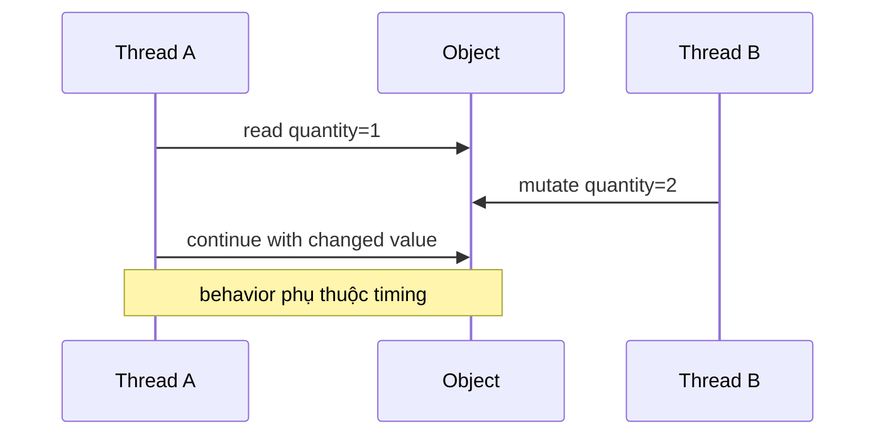
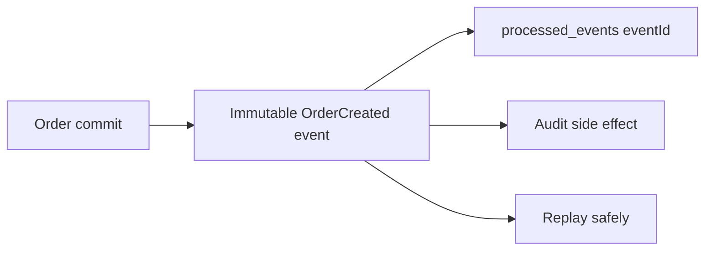

# Java immutability và value objects: dữ liệu ổn định để code dễ reasoning

## Vì sao backend cần immutability?

Một object mutable có thể bị đổi sau khi đã được đọc, truyền qua thread hoặc đưa vào event. Khi đó người debug phải hỏi “ai đã sửa object này?” thay vì chỉ đọc luồng dữ liệu.


Trong Flash Sale, `Order` phải giữ giá tại thời điểm chấp nhận. Nếu Product price thay đổi sau đó, Order snapshot không được đổi theo.

## 1. `final`, record và immutable không giống nhau

```java
final class PriceSnapshot {
    private final BigDecimal amount;
    private final String currency;

    PriceSnapshot(BigDecimal amount, String currency) {
        this.amount = amount;
        this.currency = currency;
    }

    public BigDecimal amount() { return amount; }
    public String currency() { return currency; }
}
```

`final` ngăn thay reference, không đảm bảo object mà reference trỏ tới immutable.

```java
record PriceSnapshotRecord(BigDecimal amount, String currency) {}
```

`record` giúp value object ngắn và rõ, nhưng `BigDecimal`/field collection vẫn phải có policy. Với `List`, không trả list mutable trực tiếp:

```java
public List<String> tags() {
    return List.copyOf(tags);
}
```

## 2. Mutable và immutable khác nhau ở đâu?



Với immutable object:

```text
A đọc snapshot V1
B muốn thay đổi → tạo V2
A vẫn làm việc với V1
```

Immutability không tự giải quyết database race condition. Nó giúp state trong memory dễ reasoning; PostgreSQL vẫn phải bảo vệ Inventory.

## 3. Value object trong domain

Một value object nên:

- có validation ngay khi tạo;
- không có identity database riêng nếu không cần;
- so sánh theo value;
- không cho state invalid tồn tại.

```java
public record OrderQuantity(int value) {
    public OrderQuantity {
        if (value < 1 || value > 5) {
            throw new IllegalArgumentException("quantity must be between 1 and 5");
        }
    }
}
```

Các candidate trong domain:

```text
OrderQuantity
CustomerId
IdempotencyKey
PriceSnapshot
Money
ProductId
TraceId
```

Không biến mọi `String` thành class nếu boundary chưa tạo giá trị. Hãy ưu tiên field có invariant hoặc format cần bảo vệ.

## 4. Immutability và event/message

Event nên là snapshot bất biến:

```java
public record OrderCreatedEvent(
        UUID eventId,
        long orderId,
        long productId,
        int quantity,
        BigDecimal unitPriceSnapshot,
        Instant occurredAt) {}
```

Consumer không được sửa event để “đánh dấu đã xử lý”. Trạng thái xử lý nằm ở `processed_events`, còn event giữ nguyên để replay/audit.



## 5. Immutability và concurrency

Immutability giúp:

- giảm shared mutable state;
- giảm race trong object graph;
- dễ cache và replay;
- event an toàn hơn khi chạy async;
- test deterministic hơn.

Nó không thay thế:

- transaction;
- lock database;
- idempotency;
- authorization;
- atomic update.

## 6. Bài lab

1. Tạo `OrderQuantity` immutable, viết test valid/invalid.
2. Tạo mutable `Price` rồi cố ý cho Order giữ reference; đổi Product price và quan sát lỗi.
3. Đổi sang `PriceSnapshot` và test price Order không đổi.
4. Gửi cùng `OrderCreatedEvent` hai lần; event object không bị consumer mutate.
5. Chạy concurrency test và giải thích phần nào được bảo vệ bởi immutability, phần nào phải nhờ PostgreSQL.

## Câu trả lời phỏng vấn

> “Tôi dùng immutability cho value object, command snapshot và event để state không bị đổi ngầm giữa các layer/thread. `final` chỉ khóa reference; record giúp biểu diễn value object nhưng vẫn phải xử lý mutable collection/deep immutability. Với Flash Sale, PriceSnapshot giữ giá tại thời điểm Order được chấp nhận. Immutability làm code dễ reasoning và replay hơn, nhưng không thay transaction, idempotency hay database atomicity.”

## Checklist

- [ ] Phân biệt `final`, record và deep immutability.
- [ ] Biết khi nào tạo value object.
- [ ] Không để event/DTO trả collection mutable.
- [ ] Biết snapshot price thay vì giữ reference Product.
- [ ] Biết immutability không thay database concurrency control.
- [ ] Có test cho state không đổi sau update bên ngoài.
