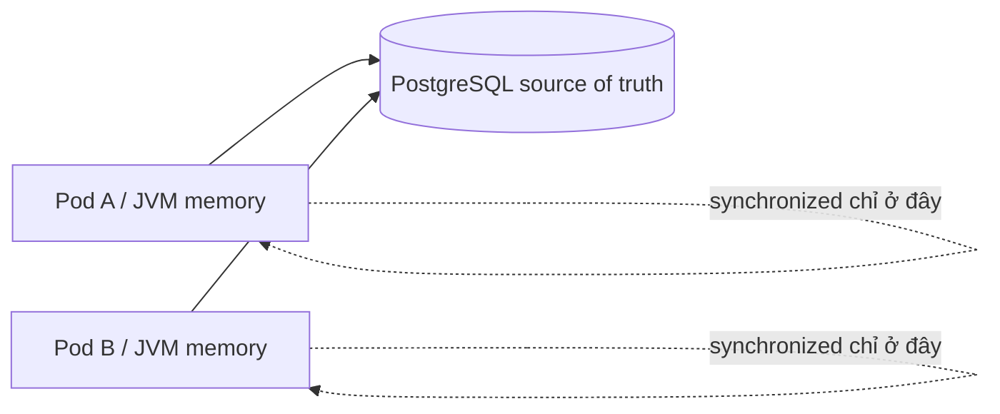

# Playbook: Java threads, race condition và virtual threads (Java 21)

## Mental model ngắn

| Khái niệm | Nghĩa thực dụng |
|---|---|
| Process | Một JVM/backend instance có memory riêng. |
| Thread | Đơn vị thực thi bên trong process. Nhiều request có thể chạy đồng thời. |
| Race condition | Kết quả phụ thuộc timing khi nhiều thread truy cập shared mutable state. |
| Atomicity | Operation xảy ra “trọn vẹn” với observer cạnh tranh. |
| Visibility | Thread A ghi thì thread B có nhìn thấy không. |
| Virtual thread | Thread nhẹ Java 21, phù hợp nhiều blocking I/O task; không thay đổi correctness rule. |



## Lab 15 phút

Chạy [RaceConditionLab](../../playbooks/05-java-concurrency-lab/README.md). Không xem phần code sửa trước: chạy, ghi kết quả unsafe, rồi mở class và lần lượt giải thích `CountDownLatch`, executor, `Future.get`, unsafe counter, synchronized counter, `AtomicInteger`.

## Dùng gì khi nào?

| Nhu cầu | Công cụ | Ghi chú |
|---|---|---|
| Counter/state nhỏ trong một JVM | `AtomicInteger`, `AtomicLong` | Atomic cho operation đơn giản; không thay database. |
| Critical section nhỏ, nhiều field cần nhất quán trong một JVM | `synchronized`/`Lock` | Giữ ngắn; tránh blocking I/O bên trong. |
| Run async tasks với giới hạn tài nguyên | Bounded `ExecutorService` | Chọn pool/queue/backpressure, đừng tạo platform thread vô hạn. |
| Nhiều blocking request I/O Java 21 | Virtual threads | Dễ scale concurrency; watch DB connection pool/external dependency. |
| Shared state giữa instances | DB transaction/lock, queue, distributed coordination có chủ đích | `synchronized` không có scope qua process. |

## Java 8 và Java 21

Java 8 có `ExecutorService`, `synchronized`, `volatile`, atomic classes, `CompletableFuture`: vẫn giải quyết đúng concurrency cơ bản. Java 21 thêm virtual threads (`Executors.newVirtualThreadPerTaskExecutor()`), giúp mô hình one-thread-per-blocking-task rẻ hơn.

Virtual thread không làm database nhanh hơn, không loại N+1, không giảm hot-row lock contention và không biến code không thread-safe thành thread-safe. Nếu mỗi task đều chờ PostgreSQL connection pool 20 connections, 10,000 virtual threads vẫn chỉ có tối đa 20 query chạy cùng lúc; phần còn lại chờ. Đó là backpressure/capacity issue, không phải lý do quay lại platform thread.

## Anti-pattern

```java
@Service
class InventoryService {
    private int stock = 10;
    synchronized boolean reserve() {
        if (stock == 0) return false;
        stock--;
        return true;
    }
}
```

Nó chỉ đúng trong demo một JVM, mất stock khi restart và oversell nếu có nhiều replica. Với Flash Sale, xem [JdbcOrderPlacementStore](../../backend/src/main/java/com/ngoctri/flashsale/order/infrastructure/persistence/JdbcOrderPlacementStore.java): PostgreSQL conditional update mới bảo vệ source of truth.

## Checklist review task async/concurrent

- [ ] State mutable này scope trong method, JVM hay nhiều replica?
- [ ] Operation là single atomic action hay read-modify-write?
- [ ] Có cancellation, timeout, bounded retry, backpressure không?
- [ ] Có blocking I/O trong `synchronized`/lock không?
- [ ] Executor/thread model có hợp với DB connection pool và dependency capacity không?
- [ ] Có concurrent test hoặc deterministic synchronization như latch/barrier không?

## Câu trả lời phỏng vấn (45 giây)

“Tôi phân biệt concurrency trong JVM và concurrency giữa instances. Với shared mutable counter trong một JVM, `AtomicInteger` xử lý increment atomic; `volatile` chỉ visibility nên không đủ cho read-modify-write. Với nhiều request, tôi dùng executor phù hợp và tránh giữ lock khi gọi I/O. Java 21 virtual threads giúp xử lý nhiều blocking task rẻ hơn, nhưng không thay database transaction hay capacity planning. Với inventory chạy nhiều pod, tôi bảo vệ invariant ở PostgreSQL bằng conditional update/locking, và dùng concurrent integration test để chứng minh.”
