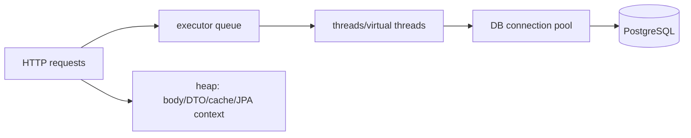

# Playbook: Java thread, JVM memory và backpressure

## Nỗi đau production

CPU chỉ 30% nhưng request timeout, heap tăng và GC pause dài. Nguyên nhân thường là queue request, thread chờ I/O, connection pool cạn hoặc object/response giữ quá lâu.

## Cơ chế cần nhớ

- Thread và database connection là hai resource khác nhau.
- `value++` là read → add → write; `AtomicInteger` mới làm increment atomic trong một JVM.
- `volatile` bảo vệ visibility, không bảo vệ read-modify-write.
- Virtual thread làm blocking task rẻ hơn, nhưng không tăng số connection DB hay capacity downstream.
- Queue không bounded có thể biến traffic burst thành heap pressure.

## Lab

Chạy [Java concurrency lab](../../playbooks/05-java-concurrency-lab/README.md) với `virtual` và `fixed`. Sau đó:

1. Chạy một service local, ghi PID.
2. Dùng `jcmd <pid> Thread.print` khi request đang chờ.
3. Dùng `jcmd <pid> GC.heap_info` trước/sau burst.
4. Dùng `jcmd <pid> GC.class_histogram` để nhìn object giữ heap.
5. Dùng JFR 30 giây cho một burst; ghi thread states, allocation và GC pause.

Các lệnh là bằng chứng quan sát; đừng kết luận memory “do thread” chỉ từ heap tăng.

## Bài build

Viết endpoint tạo 10.000 object response, thêm queue bounded, đặt timeout downstream và so sánh p95/heap trước-sau. Ghi rõ request rate, concurrency, pool size, heap max, GC pause và error rate.

## Interview

“Tôi phân tích request theo chuỗi executor → connection pool → DB/downstream và heap object/queue. Virtual threads không chữa connection pool hoặc hot row. Tôi dùng thread dump, heap histogram, JFR và metrics để tìm bottleneck trước khi tăng thread/pod.”
