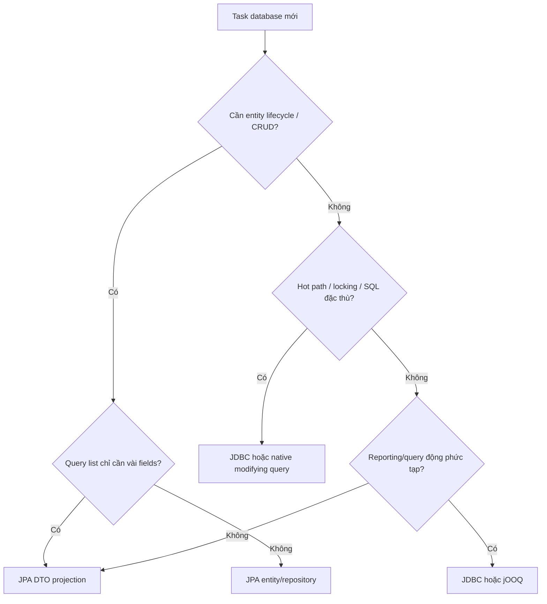

# Playbook: chọn JPA, JDBC hay native SQL trong Spring Boot

## Rule ngắn

> Không chọn một tool cho cả hệ thống. Chọn theo **access pattern**, correctness requirement và khả năng quan sát SQL.



## Đây không phải cuộc chiến JPA vs JDBC

| Access pattern | Lựa chọn mặc định | Lý do |
|---|---|---|
| Product CRUD/entity lifecycle | Spring Data JPA | Ít boilerplate, mapping object/relationship, paging có sẵn. |
| Product list chỉ cần response fields | JPA DTO projection | Tránh tải full entity/association không cần thiết. |
| Order browse/filter/sort do user chọn | JDBC | SQL, projection, parameter và `ORDER BY` allow-list được thấy rõ. |
| Inventory decrement chống oversell | JDBC hoặc JPA `@Modifying @Query` | Cần đúng một conditional write và affected-row count rõ ràng. |
| Reporting nhiều join/window/CTE | JDBC hoặc jOOQ | SQL là ngôn ngữ tự nhiên của query này; map DTO trực tiếp. |

## Code trong repo này

| File | Tool | Vì sao phù hợp |
|---|---|---|
| [ProductJpaRepository](../../backend/src/main/java/com/ngoctri/flashsale/product/infrastructure/persistence/ProductJpaRepository.java) | Spring Data JPA + DTO projection | Product list là query đọc, trả đúng fields API cần và có `Pageable`. |
| [JdbcOrderQuery](../../backend/src/main/java/com/ngoctri/flashsale/order/infrastructure/persistence/JdbcOrderQuery.java) | `JdbcClient` | Browse có filter/sort/pagination; SQL, mapping `OrderView`, allow-list sort đều explicit. |
| [JdbcOrderPlacementStore](../../backend/src/main/java/com/ngoctri/flashsale/order/infrastructure/persistence/JdbcOrderPlacementStore.java) | `JdbcClient` | Atomic decrement, advisory lock và `RETURNING` là correctness-sensitive SQL. |
| [N+1 lab](../../backend/src/test/java/com/ngoctri/flashsale/product/infrastructure/persistence/NPlusOneQueryLabIntegrationTest.java) | Hibernate/JPA evidence | So sánh lazy, fetch join, EntityGraph, batch fetch và DTO projection bằng query count. |

## Cùng business rule, hai cách đúng

### JDBC: trực tiếp nhìn affected rows

```java
boolean reserved = jdbcClient.sql("""
    UPDATE inventories
    SET available_quantity = available_quantity - :quantity
    WHERE product_id = :productId
      AND available_quantity >= :quantity
    """)
    .param("productId", productId)
    .param("quantity", quantity)
    .update() == 1;
```

### Spring Data JPA: vẫn được nếu query explicit

```java
@Modifying
@Query("""
    UPDATE InventoryEntity i
    SET i.availableQuantity = i.availableQuantity - :quantity
    WHERE i.productId = :productId
      AND i.availableQuantity >= :quantity
    """)
int reserve(long productId, int quantity);
```

Hai cách đều có thể đúng. Chọn JDBC trong repo hiện tại vì SQL locking/advisory lock/`RETURNING` tập trung một adapter, còn use case nhận `boolean` thay vì biết persistence detail.

## Cách sai cần nhận diện

```java
var inventory = repository.findByProductId(productId);
if (inventory.getAvailableQuantity() >= quantity) {
    inventory.decrease(quantity);
    repository.save(inventory);
}
```

Đây là read → decide → write. Hai transaction có thể cùng đọc stock cũ. `@Transactional` chỉ đảm bảo commit/rollback; nó không làm đoạn code này thành conditional atomic write. Xem [atomic inventory playbook](atomic_order_inventory_playbook.md) và lab 01.

## JPA checklist thực chiến

- [ ] Mặc định dùng `LAZY`; fetch plan theo từng use case, không bật `EAGER` toàn cục.
- [ ] List API ưu tiên projection; đo query count khi response chạm association.
- [ ] Không trả JPA entity trực tiếp qua API.
- [ ] Pagination có sort ổn định; index theo filter + order thực tế.
- [ ] Bulk update JPQL/JDBC bỏ qua persistence context: không giữ entity cũ trong cùng context rồi tin nó còn mới.
- [ ] Với SQL đặc thù PostgreSQL, lock hoặc hot path, ưu tiên explicit query và integration test với PostgreSQL thật.

## Java 8 và Java 21

Quyết định JPA/JDBC **không đổi** theo Java version: transaction, isolation và PostgreSQL locking chạy ở database. Java 21 giúp code DTO/command gọn hơn với `record` và phục vụ blocking request tốt hơn với virtual threads, nhưng virtual thread không sửa được N+1 hay hot-row contention. Java 8 vẫn triển khai đúng các pattern này; chỉ viết DTO/boilerplate nhiều hơn.

## Bài thực hành 25 phút

1. Chạy `cd backend; .\mvnw.cmd -Dtest=NPlusOneQueryLabIntegrationTest test`.
2. Mở `ProductJpaRepository`; nói vì sao đây là DTO projection chứ không phải entity list.
3. Mở `JdbcOrderQuery`; chỉ ra vì sao `ORDER BY` không nhận raw string từ client.
4. Viết lại `decrementAvailableQuantity` bằng JPA `@Modifying @Query` trong một scratch branch. Giữ cùng integration test concurrent.
5. So sánh hai implementation: SQL visibility, affected rows, persistence context và testability. Không có đáp án tuyệt đối nếu invariant vẫn được chứng minh.

## Câu trả lời phỏng vấn (30 giây)

“Tôi không áp JPA hoặc JDBC cho toàn bộ project. JPA phù hợp CRUD và entity relationship; list API thường dùng projection để tránh N+1. Với inventory quota hoặc SQL có locking/affected-row semantics, tôi dùng explicit JDBC hoặc `@Modifying` query để condition và write nằm trong một statement. Tôi chọn dựa trên access pattern và chứng minh bằng integration test/query plan, không dựa trên sở thích framework.”
