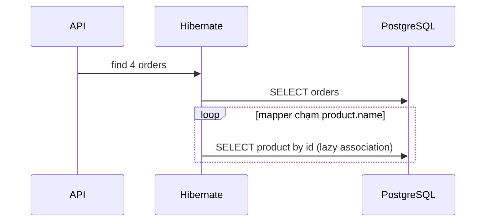

# Playbook: JPA N+1, fetch plan và DTO projection

## Nhìn đúng con số 1 + N

Giả sử list query load **4 Order** bằng một query. `product` là `LAZY` — Hibernate chưa load Product ngay. Vòng lặp Java chạy 4 lần trong memory; mỗi lần đụng `order.getProduct().getName()` có thể phát một query Product.

```text
1 query: SELECT orders ...             ← lấy danh sách 4 order
4 query: SELECT products WHERE id = ?  ← lazy load từng product khác nhau
-------------------------------------
5 queries tổng = 1 + N, không phải 8
```

Loop không phải query. Query tăng vì code chạm **association** (mối quan hệ entity `Order → Product`) lazy theo từng row. Nếu nhiều order cùng product, Hibernate first-level cache có thể giảm query thực tế; vì vậy phải đo, không đoán.



## Khi nào nó trở thành vấn đề

Page size 20: tối đa khoảng 21 statements. Page 100: tối đa khoảng 101. Mỗi statement có network round trip, DB parse/plan/execute, result mapping và connection-pool pressure. N+1 thường làm API chậm dần theo page size/data shape thay vì chậm cố định.

## Chọn fetch plan theo use case

| Use case | Cách ưu tiên | Lý do | Cẩn thận |
|---|---|---|---|
| List API chỉ cần vài cột | DTO projection | Select đúng response, thường 1 content query (+ count query nếu page) | Không dùng DTO read model để update aggregate |
| Detail screen có vài `to-one` | `JOIN FETCH` hoặc `EntityGraph` | Load graph bounded trong một query | Đừng join-fetch collection lớn với offset pagination |
| Legacy graph, không dễ sửa query | Batch fetching | Giảm N query thành vài batch query | Giảm, không luôn triệt tiêu N+1 |
| Mapping global | `LAZY` default | Fetch theo use case | `EAGER` không phải thuốc chữa N+1 |

## Code lab trong repo

Chạy trước khi đọc assertions:

```powershell
cd backend
.\mvnw.cmd -Dtest=NPlusOneQueryLabIntegrationTest test
```

[NPlusOneQueryLabIntegrationTest](../../backend/src/test/java/com/ngoctri/flashsale/product/infrastructure/persistence/NPlusOneQueryLabIntegrationTest.java) dùng PostgreSQL Testcontainers và Hibernate Statistics để đo prepared-statement count.

| Test | Dự đoán | Điều chứng minh |
|---|---|---|
| `lazyAssociationLoopReproducesNPlusOne` | > 2 | `LAZY` + loop chạm association tạo additional statements |
| `fetchJoinLoadsTheBoundedDetailGraphInOneStatement` | 1 | Join fetch phù hợp graph bounded |
| `entityGraphLoadsTheBoundedDetailGraphInOneStatement` | 1 | EntityGraph thay fetch plan cho query đó |
| `batchFetchingBoundsLazyAssociationStatements` | ≤ 2 | Batch fetch gom lazy loads |
| `dtoProjectionSelectsOnlyListFieldsInOneStatement` | 1 | DTO projection lấy đúng fields |
| `productionProductListHasABoundedStatementBudget` | ≤ 2 | Regression guard cho list production; content + count là hợp lệ |

## Hai code pattern cần phân biệt

### Sai khi mapper list entity chạm lazy association không chủ đích

```java
var orders = orderRepository.findAll(pageable);
return orders.stream()
    .map(order -> new OrderRow(order.getId(), order.getProduct().getName()))
    .toList();
```

### Đúng cho list response: projection ngay trong query

```java
@Query("""
  SELECT new com.example.OrderRow(order.id, product.name)
  FROM Order order JOIN order.product product
  ORDER BY order.id
  """)
Page<OrderRow> findOrderRows(Pageable pageable);
```

Repo hiện áp dụng tư duy này trong [ProductJpaRepository](../../backend/src/main/java/com/ngoctri/flashsale/product/infrastructure/persistence/ProductJpaRepository.java): `findProductList` trả `ProductListProjection`, không trả full entity graph. Order browse dùng [JdbcOrderQuery](../../backend/src/main/java/com/ngoctri/flashsale/order/infrastructure/persistence/JdbcOrderQuery.java) vì projection/filter/sort explicit.

## Bài thực hành 30 phút

1. Trước khi chạy test, viết số query dự đoán cho sáu test.
2. Đọc `observe()`: vì sao phải `entityManager.clear()` và `statistics.clear()` trước mỗi phép đo?
3. Đổi test lazy để không gọi `getProduct()`: dự đoán query count. Khôi phục lại sau thử nghiệm.
4. Tạo một list projection khác cho `Product` chỉ gồm `id`, `name`, `price`; viết query budget test.
5. Thử thiết kế Order detail có `to-many` adjustments. Giải thích vì sao fetch join collection + offset pagination có thể tạo duplicate rows/page sai; đề xuất two-step query hoặc projection.

## Checklist review list API

- [ ] Response mapper có chạm association LAZY trong loop không?
- [ ] Endpoint là list, detail hay command — fetch plan có theo use case không?
- [ ] Có page size max và sort ổn định không?
- [ ] Count query là expected hay hidden extra query?
- [ ] Có query count/trace/`EXPLAIN` evidence với data shape gần production không?
- [ ] Có dùng `EAGER` để “sửa” symptom thay vì thiết kế fetch plan không?

## Câu trả lời phỏng vấn (45 giây)

“N+1 là một query lấy N parent records rồi lazy load association trong loop, nên với 4 order và 4 product khác nhau là 1 + 4 = 5 statements, không phải 8 vì vòng lặp Java không tự query. Tôi phát hiện bằng SQL log hoặc Hibernate Statistics, rồi chọn fetch plan theo use case: list API ưu tiên DTO projection, detail graph nhỏ dùng fetch join/EntityGraph, batch fetch là fallback. Tôi không bật EAGER global vì nó làm data access khó đoán. Tôi giữ regression test có query budget để tránh N+1 quay lại.”
