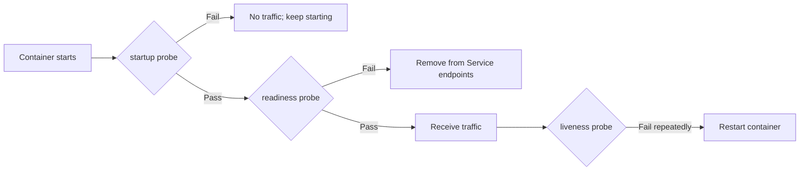

# Playbook 15: Kubernetes delivery, probes và scaling



Readiness bảo vệ traffic; liveness quyết định restart; startup cho JVM/dependency thời gian khởi động.

## Học từ repo

Đọc [backend manifest](../../k8s/backend.yaml), [concurrency smoke job](../../k8s/concurrency-smoke.yaml), [kustomization](../../k8s/kustomization.yaml) và [Kind guide](../../k8s/README.md).

## Quy trình release

```text
CI test/build image → deploy migration-compatible version → rollout → readiness → smoke → observe → rollback app nếu cần
```

## Bài

1. Giải thích startup/readiness/liveness probe của backend.
2. Deploy Kind, xem rollout status, chạy concurrency smoke job.
3. Cố ý cấu hình readiness endpoint sai trong local manifest và quan sát pod không receive traffic; khôi phục ngay.
4. Viết rollout plan cho migration expand-contract.

## Rule

- HPA không chữa hot database row/connection pool exhaustion.
- Replica nhiều hơn làm `synchronized` càng không đủ cho shared state.
- Resource request/limit, graceful shutdown, probe timeouts phải dựa workload đo được.
- Rollback code không tự rollback destructive data migration.

## Interview

“Tôi coi deploy là phần của feature: readiness bảo vệ traffic, smoke xác minh behavior, metric quyết định scale, và migration có rollout/rollback plan riêng.”
