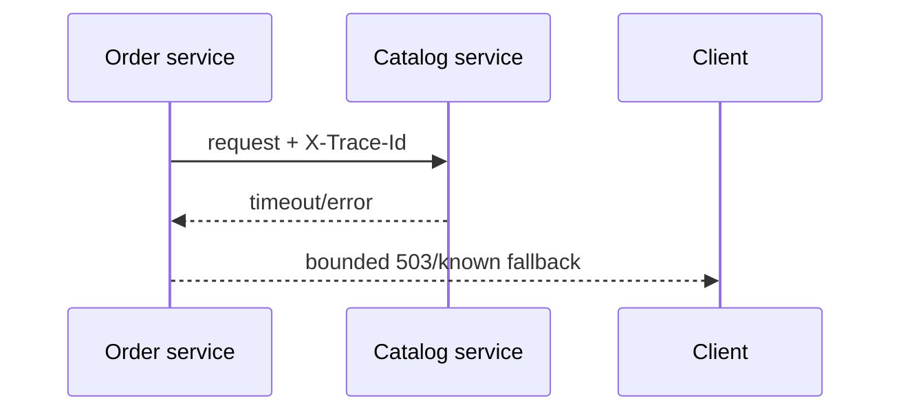

# Playbook: microservice resilience, Spring Cloud và contract

## Nỗi đau

Order gọi Catalog. Catalog chậm 5 giây; Order giữ thread/connection, retry nhân lưu lượng, cả hệ thống cạn pool.

## Lab nền tảng

Chạy [two-service lab](../../playbooks/09-microservice-request-lab/README.md), rồi nâng dần:

1. URL catalog chuyển vào profile/config, không hard-code.
2. Timeout 500ms; test Catalog down/slow.
3. Retry chỉ cho operation idempotent; POST order cần idempotency key.
4. Circuit breaker mở khi failure threshold vượt ngưỡng; test half-open recovery.
5. Bulkhead giới hạn concurrent downstream calls; metric rejected calls.
6. Propagate trace ID và contract version.

## Spring Cloud map

| Need | Component | Bài chứng minh |
|---|---|---|
| Central config | Config Server/platform config | đổi endpoint không rebuild image |
| Routing | Gateway | route/auth/header propagation |
| Discovery | Kubernetes DNS/Eureka | restart service không hard-code IP |
| Resilience | Resilience4j | timeout/retry/circuit/bulkhead failure test |
| Contract | OpenAPI/consumer contract | provider đổi field vẫn bảo vệ client |

## Interview

“Tôi thiết kế boundary/data ownership trước Spring Cloud. Mọi call có timeout; retry có budget/jitter và chỉ retry operation an toàn; circuit breaker không sửa dữ liệu. Tôi kiểm chứng partial failure, trace propagation, contract compatibility và pool pressure.”
