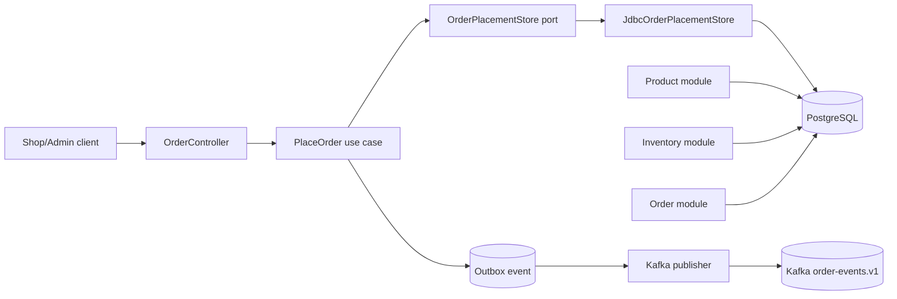
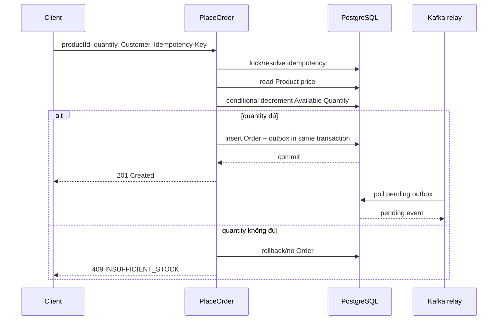
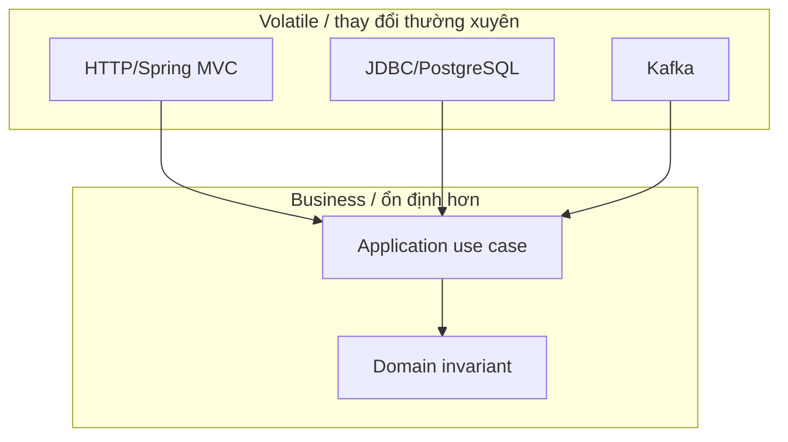
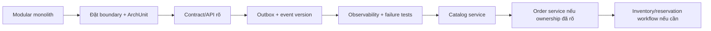
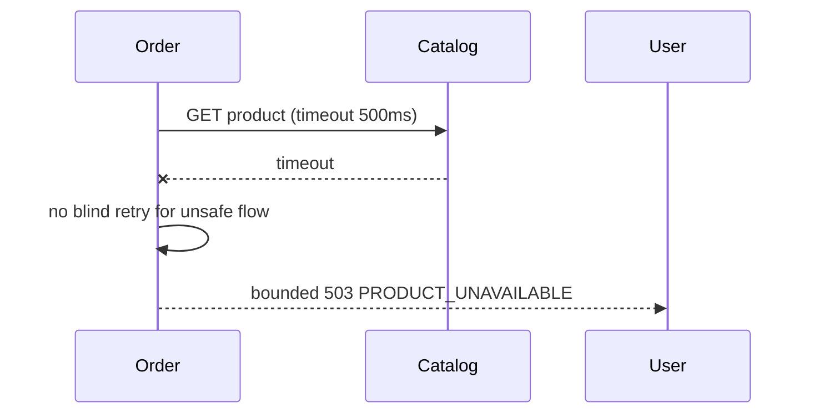

# Clean Architecture và Microservices: học bằng flash-sale, trả lời phỏng vấn bằng evidence

## Mục tiêu

Sau guide này, bạn có thể:

- giải thích Clean Architecture bằng code thật thay vì chỉ đọc định nghĩa;
- biết khi nào nên giữ modular monolith và khi nào tách microservice;
- thiết kế boundary, data ownership, synchronous/asynchronous flow;
- xử lý timeout, retry, duplicate event, partial failure và rollback;
- trả lời phỏng vấn theo cấu trúc có decision, trade-off, test và metric;
- dùng Claude Code/Codex để tạo plan, implementation và review có kiểm soát.

Guide này dùng đúng domain trong [`CONTEXT.md`](../../CONTEXT.md): Product, Inventory, Available Quantity, Order, Customer và Inventory Adjustment.

## 1. Câu chuyện dễ nhớ: nhà hàng và hệ thống flash-sale

Hãy tưởng tượng một nhà hàng:

- **Customer** gọi món.
- **Order service** tiếp nhận đơn.
- **Inventory** kiểm tra còn nguyên liệu không.
- **Kitchen/event worker** xử lý việc sau khi đơn đã được chấp nhận.
- **Database** là sổ chính thức ghi món nào đã bán.

Clean Architecture trả lời: **mỗi phần chịu trách nhiệm gì và phụ thuộc vào ai?**

Microservices trả lời: **phần nào có thể trở thành một đội/service riêng mà không làm mất tính đúng đắn?**

Đừng bắt đầu bằng “dùng Spring Cloud hay Kafka?”. Hãy bắt đầu bằng:

```text
Business invariant nào phải luôn đúng?
Ai sở hữu dữ liệu?
Failure nào có thể xảy ra?
Đội nào cần deploy/scale độc lập?
```

## 2. Kiến trúc hiện tại của repository

Đây là **modular monolith**, chưa phải microservices. Một process Spring Boot chứa nhiều module theo feature nhưng vẫn giữ transaction PostgreSQL cho Order và Inventory.



Luồng tạo Order:



Thiết kế này hợp lý cho MVP vì invariant “Order và Inventory deduction commit cùng PostgreSQL transaction” còn nằm trong một boundary. Tách Order và Inventory quá sớm sẽ biến một transaction đơn giản thành distributed workflow.

Code reference:

| Layer | File | Câu hỏi khi đọc |
|---|---|---|
| API adapter | [`OrderController.java`](../../backend/src/main/java/com/ngoctri/flashsale/order/api/OrderController.java) | HTTP được đổi thành command thế nào? |
| Use case | [`PlaceOrder.java`](../../backend/src/main/java/com/ngoctri/flashsale/order/application/PlaceOrder.java) | Transaction và business order nằm ở đâu? |
| Port | [`OrderPlacementStore.java`](../../backend/src/main/java/com/ngoctri/flashsale/order/application/OrderPlacementStore.java) | Application cần capability gì, không cần biết JDBC ra sao? |
| Adapter | [`JdbcOrderPlacementStore.java`](../../backend/src/main/java/com/ngoctri/flashsale/order/infrastructure/persistence/JdbcOrderPlacementStore.java) | SQL nào bảo vệ no-oversell? |
| Architecture test | [`ArchitectureRulesTest.java`](../../backend/src/test/java/com/ngoctri/flashsale/architecture/ArchitectureRulesTest.java) | Dependency direction được kiểm tra thế nào? |

## 3. Clean Architecture bằng ví dụ, không bằng khẩu hiệu

### 3.1 Dependency rule

Code hướng vào business rule; framework và database hướng vào trong qua adapter.



Ví dụ đơn giản:

```java
public final class PlaceOrder {
    private final OrderPlacementStore store;

    public PlaceOrder(OrderPlacementStore store) {
        this.store = store;
    }

    public OrderView execute(PlaceOrderCommand command) {
        return store.place(command);
    }
}
```

`PlaceOrder` không `new JdbcOrderPlacementStore()`, không biết SQL và không gọi `KafkaTemplate` trực tiếp. Vì vậy unit test có thể dùng fake:

```java
final class InMemoryOrderPlacementStore implements OrderPlacementStore {
    // fake chỉ cho test use case
}
```

### 3.2 Bốn vùng code dễ hiểu

| Vùng | Nhiệm vụ | Ví dụ |
|---|---|---|
| API | HTTP, JSON, status code, header | `OrderController` |
| Application | điều phối use case, transaction boundary | `PlaceOrder` |
| Domain | invariant và policy nghiệp vụ | quantity 1–5, Available Quantity không âm |
| Infrastructure | DB, Kafka, HTTP client, framework | `JdbcOrderPlacementStore` |

### 3.3 SOLID nên dùng để giảm đau

- **SRP**: controller không viết SQL; consumer không quyết định API response.
- **DIP**: use case phụ thuộc port, không phụ thuộc JDBC concrete class.
- **OCP**: thêm locking strategy trong lab mà không sửa caller.
- **ISP**: port chứa capability mà use case cần, không gom cả database API.
- **Liskov**: fake/adapter phải giữ cùng contract; nếu fake cho phép behavior production không cho phép, test sẽ nói dối.

Clean Architecture không có nghĩa là tạo thật nhiều package/interface. Một interface một method chỉ đáng có nếu nó tạo boundary testability, thay adapter hoặc bảo vệ business rule. Nếu CRUD đơn giản, thêm ceremony chỉ làm code khó đọc hơn.

## 4. Khi nào modular monolith, khi nào microservices?

### Giữ modular monolith khi

- Order và Inventory cần cùng transaction/invariant.
- Team còn nhỏ và chưa có năng lực vận hành distributed system.
- Scale chưa khác nhau đáng kể.
- Deploy độc lập chưa tạo giá trị rõ.
- Chưa có data ownership rõ ràng.

### Tách microservice khi có ít nhất một lý do thật

```text
Domain boundary rõ
+ data ownership rõ
+ deploy cadence khác
+ scale pattern khác
+ failure isolation có giá trị
+ team ownership đủ rõ
+ observability/deployment đã sẵn sàng
```

Không tách chỉ vì:

- muốn có nhiều service trong CV;
- package đang dài;
- “microservices là best practice”;
- muốn dùng Kubernetes/Spring Cloud cho hiện đại.

### Lộ trình tách hợp lý cho flash-sale



Catalog thường dễ tách hơn Order/Inventory vì đọc Product có thể có data ownership độc lập. Order và Inventory không nên tách chỉ để tạo hai service; trước hết phải thiết kế reservation/compensation và chứng minh consistency requirement cho phép eventual consistency.

## 5. Nếu tách service, phải trả lời sáu câu hỏi

### Câu 1 — Service sở hữu dữ liệu nào?

```text
Catalog service → Product name, status, current catalog data
Order service   → accepted Order, price snapshot, Customer reference
Inventory       → Available Quantity và adjustment history
```

Không để hai service cùng sửa một bảng `orders` hoặc `inventories`.

### Câu 2 — API/event nào là contract?

REST contract cần version và backward compatibility. Event cần:

```json
{
  "eventId": "...",
  "eventType": "OrderCreated",
  "eventVersion": 1,
  "occurredAt": "...",
  "orderId": 123,
  "productId": 10,
  "quantity": 1,
  "priceSnapshot": 99000
}
```

Consumer phải chịu duplicate và schema evolution. Không gửi cả JPA entity hoặc object nội bộ qua event.

### Câu 3 — Đồng bộ hay bất đồng bộ?

| Tình huống | Lựa chọn thường hợp lý | Lý do |
|---|---|---|
| Client cần biết Order được chấp nhận ngay | synchronous API | caller cần kết quả |
| Gửi email/analytics sau Order | event async | side effect có thể eventual |
| Decrement Inventory là invariant của Order | cùng transaction hoặc workflow consistency rõ | không được đoán thành công |
| Catalog read chậm | timeout + bounded fallback/cache | không giữ thread vô hạn |

### Câu 4 — Nếu downstream down thì sao?



Timeout không sửa dữ liệu. Retry không phải mặc định; retry phải có budget, backoff, jitter và chỉ áp dụng cho operation an toàn/idempotent.

### Câu 5 — Distributed transaction giải quyết thế nào?

Không hứa “rollback toàn hệ thống” nếu đã commit qua nhiều service. Chọn một trong:

- outbox cho DB → event;
- saga với state transition rõ;
- compensation/refund;
- pending state + status query;
- reconciliation job.

### Câu 6 — Làm sao debug request đi qua nhiều service?

Mỗi request/event cần correlation/trace ID. Mỗi service phải có metric riêng:

```text
request latency/error rate
downstream latency/timeout
thread/connection pool pressure
Kafka consumer lag/retry/DLQ
outbox pending age
```

## 6. Failure matrix phải có trước code

| Failure | Không nên làm | Cách an toàn hơn |
|---|---|---|
| Catalog chậm | giữ thread 5 giây | timeout, fallback/cache, bounded 503 |
| HTTP response mất sau DB commit | tạo Order mới khi retry mù | idempotency key + query existing result |
| Kafka down | rollback Order hoặc bỏ event | outbox pending + retry |
| Event duplicate | chạy side effect lần hai | processed event/eventId dedup |
| Consumer parse lỗi | retry vô hạn | DLQ + alert + repair |
| Schema provider đổi field | deploy cùng lúc toàn hệ thống | versioned contract + compatibility test |
| Service deploy lỗi | rollback bằng tay dưới áp lực | rehearsed rollback command |
| DB migration lock lâu | chạy migration bất ngờ trên peak | expand/contract + backward compatibility |

## 7. Dùng Claude Code/Codex đúng cách cho kiến trúc này

### Trước khi agent sửa code

```text
Đọc CONTEXT.md, ADR, API contract, module map và test hiện có.
Xác định đây là modular monolith hay microservice.
Không đề xuất tách service chỉ vì package lớn.
Tạo architecture report gồm boundary, data ownership, sync/async flow,
failure mode và evidence hiện có.
Không sửa file.
```

### Khi agent lập plan

```text
Lập plan cho feature theo thứ tự:
1. business invariant;
2. boundary thay đổi;
3. API/event contract;
4. transaction/consistency;
5. failure path;
6. tests và benchmark;
7. observability;
8. rollback.

Nếu plan cần distributed transaction hoặc service split,
hãy nêu rõ lý do, phương án modular monolith đơn giản hơn,
và trade-off vận hành.
```

### Khi agent review PR

```text
Review diff theo bốn pass:
1. Clean Architecture: dependency direction, framework leakage, boundary.
2. Microservice: ownership, contract, timeout, retry, duplicate, consistency.
3. Correctness: invariant, transaction, concurrency, failure path.
4. Operations: metrics, trace, deploy, rollback và cost.

Chỉ báo finding có evidence file:line, severity, impact và verification step.
Không khen chung chung.
```

## 8. Câu trả lời phỏng vấn 60 giây

> “Tôi không bắt đầu bằng việc tách microservice hoặc thêm Spring Cloud. Tôi bắt đầu bằng domain boundary, invariant và data ownership. Với flash-sale, Order và Inventory cần cùng bảo vệ no-oversell, nên MVP của tôi là modular monolith với lightweight Clean Architecture: controller nhận request, use case điều phối transaction, port tách business khỏi JDBC/Kafka và adapter chứa infrastructure.
>
> Khi có lý do tách, tôi tách một boundary có ownership rõ, contract versioned và database riêng. Mọi synchronous call có timeout; retry có budget và chỉ retry operation an toàn; event dùng outbox, idempotent consumer và DLQ. Tôi kiểm chứng bằng integration/concurrency test, contract test, failure injection, trace và metric. Claude Code hỗ trợ đọc code, lập plan, tạo test và review; human vẫn quyết định architecture, risk và release.”

## 9. Câu trả lời phỏng vấn 3 phút

> “Tôi phân biệt ba lớp. Clean Architecture bảo vệ business rule khỏi framework bằng dependency direction. Modular monolith giúp các module có boundary nhưng vẫn giữ local transaction. Microservices là boundary deploy/runtime/data ownership, đồng thời tạo thêm network failure, versioning, observability và operational cost.
>
> Trong hệ thống flash-sale, invariant là Available Quantity không âm, retry không tạo Order thứ hai, giá được snapshot và Order Created/outbox commit cùng local transaction. Vì vậy tôi giữ Order/Inventory trong cùng boundary lúc đầu. Nếu Catalog cần scale/deploy độc lập, tôi có thể tách Catalog trước qua API contract. Nếu tách Inventory khỏi Order, tôi phải thiết kế reservation hoặc saga, event version, duplicate handling, compensation và reconciliation; không thể chỉ chuyển class sang service khác.
>
> Quy trình triển khai gồm intent/spec/plan, sau đó agent implement trên branch/worktree, chạy focused test và integration test. PR review kiểm tra architecture boundary, security, contract và failure mode. CI kiểm tra test, static rules và contract. Production có timeout, circuit breaker, metric, trace, outbox lag và rollback. Tôi đo lead time, p95, error rate, change failure rate và defect escape thay vì chỉ đếm số dòng code.”

## 10. Câu hỏi đào sâu và cách trả lời

### “Tại sao không tách Order và Inventory thành hai service ngay?”

> “Vì invariant hiện tại yêu cầu decrement Inventory và persist Order trong cùng PostgreSQL transaction. Tách ngay sẽ tạo distributed consistency problem. Tôi chỉ tách khi có requirement về scale/ownership/deploy hoặc chấp nhận reservation workflow. Khi đó tôi sẽ thiết kế state machine, outbox, idempotent consumer, compensation và reconciliation trước.”

### “Clean Architecture có làm code nhiều layer quá không?”

> “Có thể, nếu áp dụng máy móc. Tôi dùng boundary ở nơi business rule hoặc dependency volatile cần được bảo vệ. Với CRUD nhỏ, không tạo interface vô nghĩa. Tôi đánh giá bằng testability, dependency direction và khả năng thay adapter, không bằng số package.”

### “Circuit breaker có đảm bảo hệ thống không lỗi không?”

> “Không. Nó ngăn gọi downstream liên tục khi đã biết downstream lỗi, giúp bảo vệ thread/pool. Nó không sửa dữ liệu, không đảm bảo idempotency và không thay thế timeout, fallback, retry budget hoặc reconciliation.”

### “Nếu event bị gửi hai lần thì sao?”

> “At-least-once delivery có thể duplicate. Consumer lưu processed event theo eventId hoặc dùng unique constraint/idempotent side effect. Tôi test duplicate delivery và crash trước/sau commit, không giả định exactly-once end-to-end.”

### “AI agent có thể tự thiết kế microservice không?”

> “Agent có thể map dependency, đề xuất boundary và tạo prototype, nhưng không nên tự quyết data ownership hoặc distributed consistency. Tôi yêu cầu agent đưa ra ít nhất một phương án modular monolith, một phương án service split, nêu trade-off và cung cấp evidence để con người quyết định.”

### “Bạn đo microservice có hiệu quả không?”

> “Tôi so sánh trước/sau theo deployment frequency, lead time, change failure rate, MTTR, p95, downstream timeout, retry volume, pool pressure, incident count và chi phí vận hành. Nếu tách service nhưng deploy chậm hơn, lỗi khó debug hơn và consistency yếu hơn, đó không phải cải tiến.”

## 11. Bài tập thực hành

### Bài 1 — Đọc code theo boundary

Mở bốn file trong code reference. Vẽ mũi tên dependency và trả lời:

```text
Nếu đổi JDBC sang REST adapter, file nào phải đổi?
Nếu đổi HTTP framework, business rule có đổi không?
Nếu fake store trả accepted quantity sai, test nào phát hiện?
```

### Bài 2 — Mô phỏng service split

Viết một proposal 15 dòng:

```text
Tách Catalog service, giữ Order + Inventory trong modular monolith.
```

Phải có API contract, owner, database, timeout, failure response, trace và rollback.

### Bài 3 — Cố ý làm hỏng resilience

Chạy [microservice request lab](../../playbooks/09-microservice-request-lab/README.md):

1. dừng Catalog;
2. gọi Order;
3. quan sát timeout/503;
4. thêm retry mù;
5. đo request amplification;
6. sửa bằng timeout, budget và circuit breaker.

### Bài 4 — Luyện phỏng vấn

Ghi âm câu trả lời cho:

1. Vì sao modular monolith trước microservices?
2. Clean Architecture giúp gì ngoài việc thêm package?
3. Làm sao xử lý duplicate event?
4. Nếu Catalog chậm, Order làm gì?
5. Claude Code được phép quyết định đến đâu?

## 12. Checklist đánh giá bản thân

- [ ] Giải thích được dependency rule bằng file thật.
- [ ] Phân biệt module boundary với service boundary.
- [ ] Nêu được data owner của từng service.
- [ ] Biết khi nào synchronous và khi nào asynchronous.
- [ ] Có timeout cho mọi downstream call.
- [ ] Không retry mù các operation không idempotent.
- [ ] Hiểu outbox, duplicate event, DLQ và reconciliation.
- [ ] Có contract versioning và backward compatibility.
- [ ] Có trace, metrics, alert và rollback.
- [ ] Có concurrency/failure/contract tests.
- [ ] Biết trả lời trade-off thay vì đọc tên Spring Cloud component.
- [ ] Biết dùng AI agent để tạo evidence, không giao architecture decision mù cho agent.
