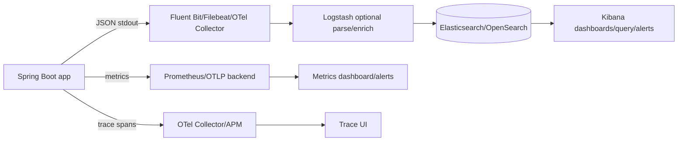
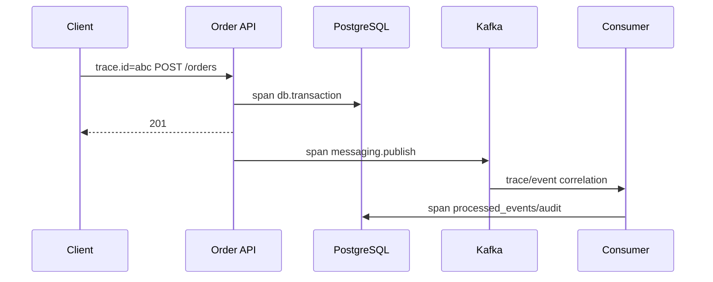
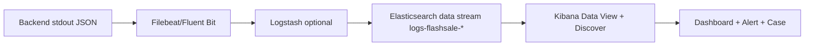
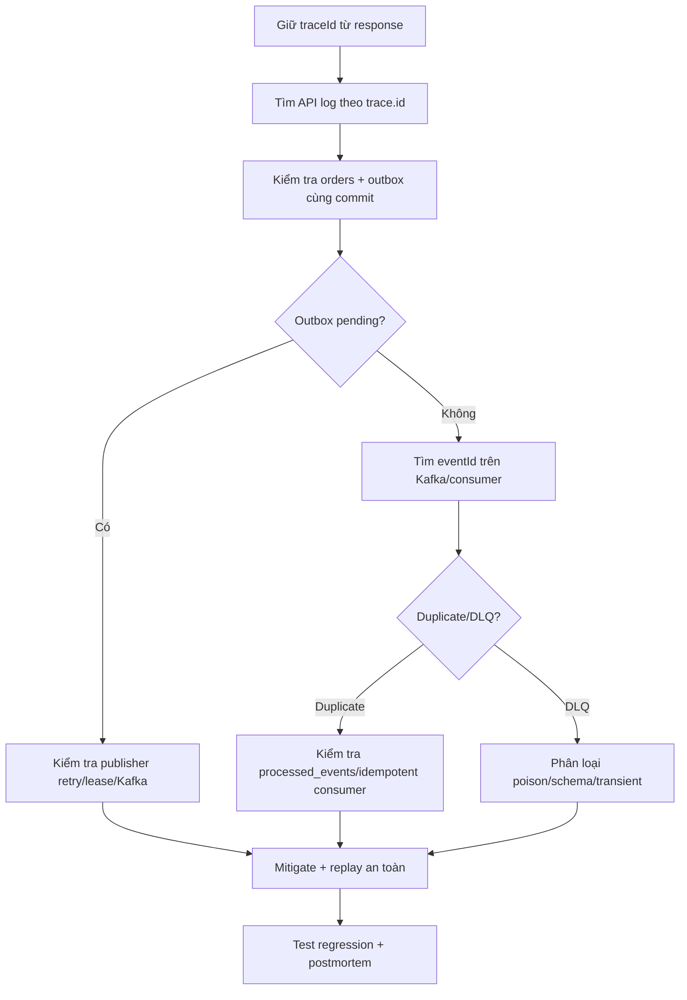

# Monitoring và ELK cho Spring Boot: log, metric, trace và query nhanh

## Mục tiêu

Monitoring tốt không phải là “cài Kibana rồi xem log”. Mục tiêu là trả lời nhanh:

```text
Hệ thống có đang khỏe không?
Ai bị ảnh hưởng?
Request nào hỏng?
Hỏng ở service, database, broker hay code?
Đã commit state gì?
Mitigate và verify recovery thế nào?
```

Spring Boot gọi ba trụ cột là **logs, metrics và traces**. Metrics/traces dùng Micrometer Observation; Spring Boot không tự export logs/metrics/traces ra mọi backend nếu bạn chưa cấu hình exporter/collector. [Spring Boot observability](https://docs.spring.io/spring-boot/reference/actuator/observability.html)

## 1. Repository hiện có gì?

Repository đã có nền tảng observability:

- Actuator expose `health`, `info`, `metrics` trong [`application.yml`](../../backend/src/main/resources/application.yml).
- `RequestTraceFilter` tạo `X-Trace-Id` và đặt `traceId` vào SLF4J MDC.
- Error response có `traceId` để nối client report với log.
- Docker/Kubernetes có readiness/liveness/startup probe.
- Outbox, Kafka publisher, consumer và concurrency lab có các điểm cần quan sát.

Repository **chưa có ELK/Elastic/OpenSearch stack hoàn chỉnh và chưa chuẩn hóa JSON log schema**. Vì vậy bài này là guide thiết kế và rollout, không khẳng định ELK đã chạy trong Compose.

## 2. Bức tranh monitoring đúng



### Vì sao app nên ghi stdout?

Trong container, app ghi JSON ra stdout. Collector ở node/container layer gom log, retry và thêm metadata. App không nên tự mở kết nối Elasticsearch trong request path vì:

- Elasticsearch down sẽ kéo request business vào failure;
- network/backpressure làm đầy thread hoặc buffer;
- credential/index policy bị trộn vào business app;
- deploy app và logging backend bị coupling.

## 3. Logs, metrics, traces khác nhau thế nào?

| Loại | Trả lời | Ví dụ |
|---|---|---|
| Log | Chuyện gì xảy ra ở một event? | `OrderCreated`, exception, retry |
| Metric | Hệ thống đang có xu hướng gì? | p95, error rate, pool pending, Kafka lag |
| Trace | Một request đi qua những bước nào và chậm ở đâu? | API → DB → outbox → Kafka → consumer |



Log giúp biết event; metric giúp biết mức độ; trace giúp biết timeline. Không dùng log để thay metric bằng cách đếm hàng triệu dòng message.

## 4. Log schema chuẩn

Một log production nên là JSON một dòng, có field ổn định:

```json
{
  "@timestamp": "2026-09-26T02:10:20.123Z",
  "log.level": "INFO",
  "message": "order accepted",
  "service.name": "flash-sale-backend",
  "service.version": "0.0.1",
  "deployment.environment": "staging",
  "event.action": "order.accepted",
  "trace.id": "abc-123",
  "span.id": "span-456",
  "http.request.method": "POST",
  "url.path": "/api/v1/orders",
  "http.response.status_code": 201,
  "order.id": 42,
  "product.id": 7,
  "order.quantity": 1,
  "duration.ms": 18
}
```

### Field nên có

- `@timestamp`: thời gian event ở UTC;
- `service.name`, `service.version`, `deployment.environment`;
- `log.level`, `message`, `logger.name`;
- `trace.id`, `span.id`, `correlation.id`;
- `http.request.method`, `url.path`, `http.response.status_code`;
- `event.action`, `event.outcome`, `error.type`, `error.message`;
- `order.id`, `product.id`, `event.id` khi cần điều tra.

### Không được log

- password, access token, refresh token, API key;
- full request body có PII/financial data;
- SQL chứa secret hoặc dữ liệu nhạy cảm;
- stack trace trả cho client;
- Customer ID/email nếu không cần cho điều tra.

Dùng `trace.id` và resource ID đã được policy cho phép thay vì dump toàn bộ object.

## 5. Spring Boot logging: từ text sang structured JSON

### Hiện tại

`RequestTraceFilter` đã đặt `traceId` vào MDC. Bước tiếp theo là để logging backend đọc MDC và output JSON.

### Ví dụ Logback JSON

Một cấu hình minh họa thường dùng `logstash-logback-encoder` hoặc encoder tương đương:

```xml
<configuration>
  <appender name="JSON_CONSOLE"
            class="ch.qos.logback.core.ConsoleAppender">
    <encoder class="net.logstash.logback.encoder.LoggingEventCompositeJsonEncoder">
      <providers>
        <timestamp/>
        <logLevel/>
        <loggerName/>
        <message/>
        <mdc/>
        <arguments/>
        <stackTrace/>
      </providers>
    </encoder>
  </appender>

  <root level="INFO">
    <appender-ref ref="JSON_CONSOLE"/>
  </root>
</configuration>
```

Đây là ví dụ cấu hình, không nên copy mà không pin version, test output và quyết định schema. Khi dùng ECS, map MDC `traceId` sang `trace.id` hoặc để collector transform thống nhất. Elastic khuyến nghị dùng Elastic Common Schema khi tạo mapping cho data stream để tích hợp tốt hơn với hệ sinh thái. [Elastic data streams](https://www.elastic.co/guide/en/elasticsearch/reference/current/set-up-a-data-stream.html)

### Log event nên có event name

```java
LOGGER.info("order accepted traceId={} orderId={} productId={} quantity={}",
        traceId, orderId, productId, quantity);
```

Tốt hơn nữa là structured arguments để field được index riêng, không phải parse từ `message`. Event name nên ổn định như `order.accepted`, `order.rejected`, `outbox.published`, `consumer.deduplicated`.

## 6. Log pipeline ELK



### Thành phần

- **Elasticsearch:** index/search/aggregation.
- **Logstash:** parse/enrich/route; có thể bỏ qua nếu collector đã làm đủ.
- **Kibana:** Discover, dashboards, alerting, saved query.
- **Filebeat/Fluent Bit/OTel Collector:** đọc stdout/file, thêm Kubernetes metadata, buffer/retry.

Không cần dùng cả Filebeat, Fluent Bit và Logstash nếu một collector đã đáp ứng ingestion. Mỗi hop phải có backpressure, retry và dead-letter/error metric.

### Data stream và lifecycle

Logs là append-only time series nên dùng data stream như:

```text
logs-flashsale-default
```

Mỗi document cần `@timestamp`; index template định nghĩa mapping, lifecycle và ECS fields. Data stream có backing indices và lifecycle policy để rollover/retention. [Elastic data streams](https://www.elastic.co/guide/en/elasticsearch/reference/master/data-streams.html)

Ví dụ mapping tối thiểu:

```json
PUT _component_template/flashsale-log-mappings
{
  "template": {
    "mappings": {
      "properties": {
        "@timestamp": { "type": "date" },
        "service.name": { "type": "keyword" },
        "deployment.environment": { "type": "keyword" },
        "log.level": { "type": "keyword" },
        "event.action": { "type": "keyword" },
        "trace.id": { "type": "keyword" },
        "http.response.status_code": { "type": "integer" },
        "duration.ms": { "type": "long" },
        "message": { "type": "text" },
        "error.type": { "type": "keyword" }
      }
    }
  }
}
```

Identifier và exact filter nên là `keyword`; field cần range/aggregation nên dùng numeric/date. Elastic khuyến nghị dựa trên query pattern khi mapping và cảnh báo không coi mọi numeric identifier là range field. [Tune for search speed](https://www.elastic.co/guide/en/elasticsearch/reference/current/tune-for-search-speed.html)

## 7. Kibana query cơ bản

KQL dùng để filter; nó không tự aggregate, transform hoặc sort dữ liệu. [Kibana Query Language](https://www.elastic.co/docs/reference/query-languages/kql)

### Tìm lỗi backend

```kql
service.name: "flash-sale-backend" and log.level: "ERROR"
```

### Tìm theo trace

```kql
trace.id: "abc-123"
```

### Tìm HTTP 5xx

```kql
http.response.status_code >= 500
```

### Tìm Order cụ thể

```kql
event.action: "order.accepted" and order.id: 42
```

### Tìm timeout downstream

```kql
event.action: "downstream.timeout" and service.name: "order-service"
```

### Tìm event có error

```kql
error.type: * and deployment.environment: "production"
```

### Tìm theo thời gian

Luôn giới hạn time range trong Kibana trước khi chạy query. Query `trace.id` trong 15 phút nhanh và ít noise hơn query toàn bộ 30 ngày.

## 8. Elasticsearch DSL cho aggregation

KQL phù hợp filter. Khi cần aggregation, dùng Elasticsearch Query DSL hoặc dashboard aggregation.

### Đếm error theo service

```json
GET logs-flashsale-*/_search
{
  "size": 0,
  "query": {
    "bool": {
      "filter": [
        { "range": { "@timestamp": { "gte": "now-15m" } } },
        { "term": { "log.level": "ERROR" } }
      ]
    }
  },
  "aggs": {
    "by_service": {
      "terms": { "field": "service.name", "size": 20 }
    }
  }
}
```

### P95 duration theo endpoint

```json
GET logs-flashsale-*/_search
{
  "size": 0,
  "query": {
    "range": { "@timestamp": { "gte": "now-15m" } }
  },
  "aggs": {
    "by_path": {
      "terms": { "field": "url.path", "size": 50 },
      "aggs": {
        "p95": { "percentiles": { "field": "duration.ms", "percents": [95, 99] } }
      }
    }
  }
}
```

Dùng `bool.filter` cho điều kiện không cần relevance score; dùng `keyword` cho exact match; trả `size: 0` khi chỉ cần aggregation.

## 9. Làm query nhanh và ít tốn tiền

1. **Luôn giới hạn time range** bằng `@timestamp`.
2. **Filter exact bằng `keyword`**, không tìm text trong `message` nếu có field riêng.
3. Tránh wildcard bắt đầu bằng `*` trên message lớn.
4. Không index mọi field động; mapping sai tạo field explosion.
5. Không đưa `userId`, `orderId`, `traceId` thành metric label cardinality cao; log field thì được, metric label thì phải cân nhắc.
6. Dùng `_source` filtering khi chỉ cần vài field.
7. Dùng data stream/ILM hoặc lifecycle retention để rollover và xóa log cũ.
8. Giới hạn `terms` aggregation size; không bucket hàng triệu giá trị.
9. Tách hot/cold retention theo giá trị điều tra.
10. Chuẩn hóa event field để không phải wildcard parse message.
11. Ghi timestamp UTC và đồng bộ clock.
12. Thử query trên time range nhỏ trước, sau đó xem slow log/query profile nếu cần.

## 10. Metrics trong Spring Boot

Actuator `/actuator/metrics` hữu ích để chẩn đoán metric đang có, nhưng không nên dùng chính endpoint này làm metrics backend production; cần external backend như Prometheus/OTLP. [Spring Boot metrics](https://docs.spring.io/spring-boot/reference/actuator/metrics.html) · [Actuator metrics API](https://docs.spring.io/spring-boot/api/rest/actuator/metrics.html)

### Nhóm metric nên có

```text
HTTP:
- request count, error rate, p50/p95/p99
- status code, endpoint, method

JVM:
- heap used/max, GC pause, threads

Database:
- active/idle/pending connections
- query duration, lock wait, transaction rollback

Kafka/outbox:
- publisher retry
- outbox pending count/age
- consumer lag, retry, DLQ count

Business:
- order accepted/rejected
- insufficient stock
- duplicate replay
- oversold invariant violation (must be zero)
```

Metric label nên có `service`, `endpoint`, `method`, `status`, `outcome`; không gắn raw `orderId`, `customerId` hoặc `traceId` vào label.

### Metric và log bổ trợ nhau

```text
Metric: error rate tăng ở POST /orders
→ Trace: request nào chậm ở DB/outbox?
→ Log: exception/event details với trace.id
→ DB/Kafka: state đã commit gì?
```

## 11. Trace và correlation ID

Repo hiện có `X-Trace-Id` + MDC. Đây là bước correlation tốt cho local. Trong hệ thống nhiều service nên tiến tới OpenTelemetry:

```text
HTTP traceparent
→ server span
→ DB span
→ Kafka producer span
→ consumer span
→ downstream span
```

Truyền trace/correlation qua:

- HTTP header;
- Kafka message header;
- log field `trace.id`;
- error response `traceId`.

Không dùng trace ID làm authentication. Không đưa trace ID thành metric label.

## 12. Dashboard và alert chuẩn

### Dashboard service health

- request rate;
- 4xx/5xx rate;
- p95/p99 latency;
- instance up/readiness;
- JVM heap/GC/thread;
- Hikari active/pending;
- CPU/memory.

### Dashboard Order/Inventory

- accepted/rejected orders;
- insufficient stock;
- idempotency replay/conflict;
- outbox pending age;
- Kafka lag/retry/DLQ;
- oversold invariant — alert nếu khác 0.

### Alert nên có owner và runbook

| Alert | Ý nghĩa | Hành động đầu tiên |
|---|---|---|
| 5xx rate cao | API failure | filter trace, endpoint, release |
| p95 tăng + Hikari pending | DB/pool pressure | query/lock/pool inspection |
| outbox age tăng | publisher/broker issue | kiểm tra Kafka/publisher lease |
| DLQ tăng | consumer/schema/poison message | giữ payload, không retry vô hạn |
| readiness fail | pod chưa nhận traffic an toàn | xem dependency/probe |
| oversold > 0 | correctness incident | stop unsafe path, preserve evidence |

Alert chỉ có giá trị khi có severity, owner, threshold, duration, link dashboard và runbook.

## 13. Runbook: “Order thành công nhưng audit thiếu”



Runbook phải ghi câu lệnh/query, người có quyền replay, điều kiện dừng và cách chứng minh repair thành công. Không restart mù và không xóa log để “dọn dashboard”.

## 14. ELK rollout theo giai đoạn

### Giai đoạn 1 — chuẩn hóa ứng dụng

- JSON stdout;
- `@timestamp`, service/env, level, event.action, trace.id;
- không PII/secret;
- log rate/error sampling policy;
- Actuator health/metrics;
- test trace ID trong error response.

### Giai đoạn 2 — collector và data stream

- collector đọc stdout;
- thêm container/pod metadata;
- data stream + index template + ECS mapping;
- retention/ILM;
- ingest error metric.

### Giai đoạn 3 — dashboard và runbook

- service dashboard;
- order/outbox/Kafka dashboard;
- saved KQL/DSL query;
- alert có owner/runbook;
- test incident.

### Giai đoạn 4 — trace và correlation đầy đủ

- OpenTelemetry instrumentation;
- propagate HTTP/Kafka trace context;
- link trace ↔ logs ↔ metrics;
- sampling theo error/latency.

## 15. Câu trả lời phỏng vấn

### “ELK hoạt động thế nào?”

> “Ứng dụng ghi structured JSON ra stdout. Collector như Fluent Bit/Filebeat hoặc OTel Collector gom log, thêm metadata và chuyển vào Elasticsearch/OpenSearch; Logstash chỉ dùng khi cần parse/enrich phức tạp. Kibana query theo KQL, dashboard và alert. Tôi dùng data stream có `@timestamp`, ECS mapping và lifecycle retention. App không gọi Elasticsearch trực tiếp trên request path vì logging backend không được làm business request fail.”

### “Bạn thiết kế log chuẩn thế nào?”

> “Mỗi log có timestamp UTC, service/version/environment, level, event.action, trace.id, span.id, HTTP fields, outcome và error fields. Resource ID để điều tra được nhưng không log token/password/PII không cần thiết. Tôi dùng structured fields thay vì nhét mọi thứ vào message để query exact bằng keyword.”

### “Query Elasticsearch chậm thì làm gì?”

> “Tôi giới hạn time range, kiểm tra mapping, dùng keyword cho exact filter, tránh wildcard đầu chuỗi và query message lớn, giảm aggregation size, filter bằng `bool.filter`, dùng source filtering và kiểm tra shard/lifecycle. Tôi không tăng cluster trước khi biết query shape và data retention.”

### “Log, metric, trace khác nhau thế nào?”

> “Log nói event cụ thể, metric cho xu hướng/alert, trace cho timeline một request qua nhiều boundary. Ví dụ p95 POST /orders tăng là metric; trace chỉ ra DB lock wait; log có event/error với trace.id để biết state và payload an toàn.”

## 16. Checklist hoàn thành

- [ ] Biết phân biệt log, metric, trace.
- [ ] Có structured JSON log schema.
- [ ] Có trace/correlation ID xuyên HTTP và event.
- [ ] Không log secret/PII/token.
- [ ] Có Actuator health/metrics và external metrics backend.
- [ ] Có data stream/index template/mapping/retention.
- [ ] Biết KQL filter và Elasticsearch aggregation.
- [ ] Query exact dùng keyword, có time range và cardinality control.
- [ ] Có dashboard service, business và messaging.
- [ ] Alert có owner/runbook.
- [ ] Có incident flow từ trace → log → DB/outbox → consumer.
- [ ] Có test/metric cho outbox lag, Kafka lag, DLQ và oversold.

## Tài liệu liên quan

- [Docker, tracing, metrics và runbook](docker_observability_runbook_playbook.md)
- [Failure handling sync/async](failure_handling_sync_async_playbook.md)
- [Transactional outbox/Kafka](transactional_outbox_kafka_playbook.md)
- [Kubernetes delivery/scaling](kubernetes_delivery_scaling_playbook.md)
- [Spring Boot `application.yml`](../../backend/src/main/resources/application.yml)
- [RequestTraceFilter](../../backend/src/main/java/com/ngoctri/flashsale/shared/api/RequestTraceFilter.java)
