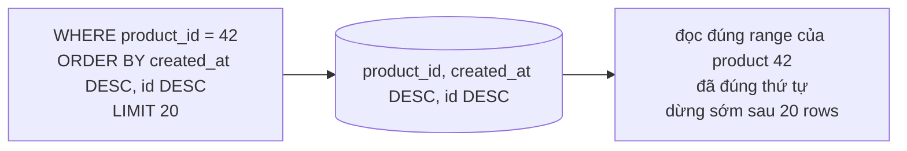

# Playbook: PostgreSQL index, pagination và EXPLAIN ANALYZE

## Rule ngắn

> Index không tối ưu “một cột”; index tối ưu một **query shape**: filter, sort, join và số row cần lấy.

Query browse Order trong project có shape điển hình:

```sql
SELECT ... FROM orders
WHERE product_id = :productId
ORDER BY created_at DESC, id DESC
LIMIT :size OFFSET :offset;
```

Index tương ứng trong [V3 migration](../../backend/src/main/resources/db/migration/V3__create_orders.sql):

```sql
CREATE INDEX ix_orders_product_created
ON orders (product_id, created_at DESC, id DESC);
```



## EXPLAIN ANALYZE đọc gì trước

| Thành phần | Câu hỏi thực dụng |
|---|---|
| Scan node | Seq Scan hay Index Scan/Bitmap Scan? Có hợp data size/selectivity không? |
| `actual rows` vs estimate | Planner có thống kê sai nhiều không? Có cần `ANALYZE`/thiết kế lại query không? |
| Sort | Có sort một lượng row lớn vì index không khớp `ORDER BY` không? |
| `Buffers` | Đọc bao nhiêu block; cache vs disk pressure ở đâu? |
| `Execution Time` | So sánh cùng data/cùng environment; đừng lấy một run làm benchmark production. |

Không ép `SET enable_seqscan = off` để “chứng minh index tốt”. Với table nhỏ hoặc query trả phần lớn data, Seq Scan có thể là plan đúng.

## Lab chạy độc lập

Làm [PostgreSQL Query Plan Lab](../../playbooks/07-postgresql-query-plan-lab/README.md). Bạn sẽ đo query trước index, tạo composite index, đo lại, rồi so offset với keyset cursor pagination.

## Code map project

| Code | Học gì |
|---|---|
| [JdbcOrderQuery](../../backend/src/main/java/com/ngoctri/flashsale/order/infrastructure/persistence/JdbcOrderQuery.java) | Whitelisted sort, filter động parameterized, `LIMIT/OFFSET`, content + count query. |
| [V3 orders migration](../../backend/src/main/resources/db/migration/V3__create_orders.sql) | Index product/customer browse và constraint write correctness. |
| [V4 orders index](../../backend/src/main/resources/db/migration/V4__index_order_browsing.sql) | Index cho browse chỉ sort theo created time. |

## Offset hay keyset?

| | Offset | Keyset/cursor |
|---|---|---|
| UX | Nhảy page N dễ | Next/previous/scroll tốt |
| Page sâu | Database phải walk/skip rows trước | Seek từ cursor, thường ổn định hơn |
| Data thay đổi giữa pages | Có duplicate/missing dễ hơn | Cần sort deterministic + cursor values |
| API complexity | Đơn giản | Cursor opaque, validation/compatibility cần thiết kế |

Không đổi mọi admin table sang keyset. Chọn khi page sâu/large feed là real requirement và đo được cost.

## Checklist nhận task performance

- [ ] Có exact query, parameter distribution và data size không?
- [ ] Index có match `WHERE` + `ORDER BY` theo thứ tự cột hợp lý không?
- [ ] Có `EXPLAIN (ANALYZE, BUFFERS)` trước và sau không?
- [ ] Có tính write amplification/disk/vacuum cost của index không?
- [ ] Pagination có stable sort tie-breaker như `id` không?
- [ ] Query count/N+1 đã được loại trừ trước khi thêm index chưa?

## Câu trả lời phỏng vấn (45 giây)

“Tôi không tạo index theo từng field riêng lẻ. Tôi bắt đầu từ query shape, ví dụ filter product rồi sort mới nhất; composite index bắt đầu bằng equality filter và tiếp theo là sort keys để PostgreSQL có thể đọc theo đúng thứ tự và dừng tại LIMIT. Tôi chứng minh bằng `EXPLAIN ANALYZE BUFFERS`, xem actual rows, sort, buffers và execution time. Với page sâu, tôi cân nhắc keyset pagination trên `(created_at, id)` thay offset. Mỗi index thêm write/disk/vacuum cost nên chỉ giữ index phục vụ access pattern thật.”
