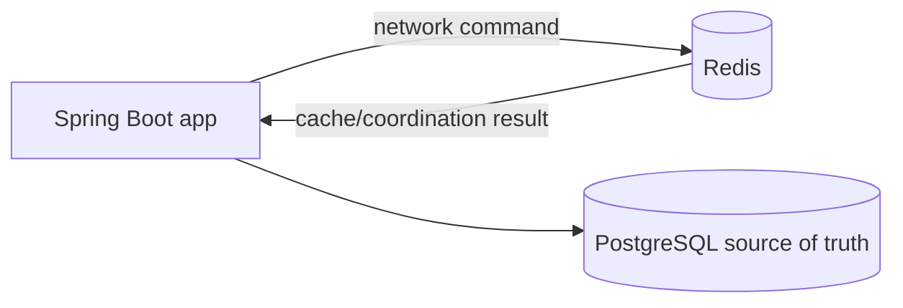
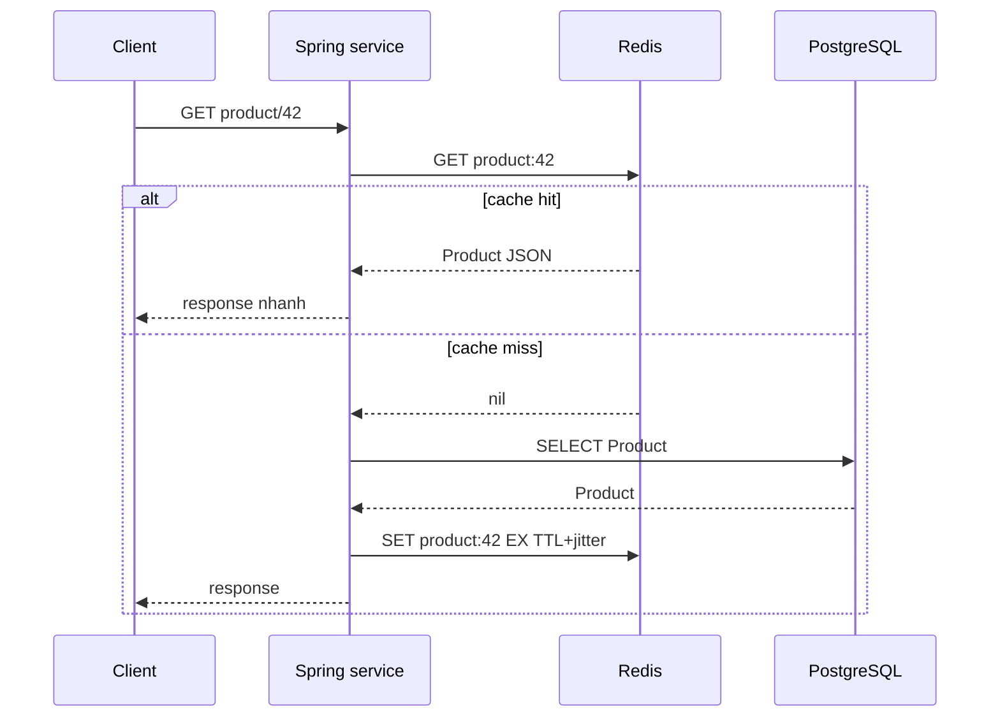
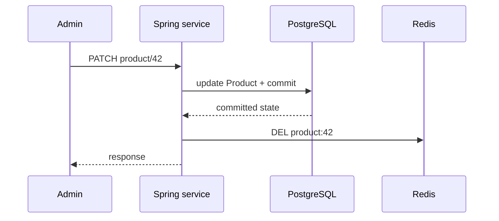
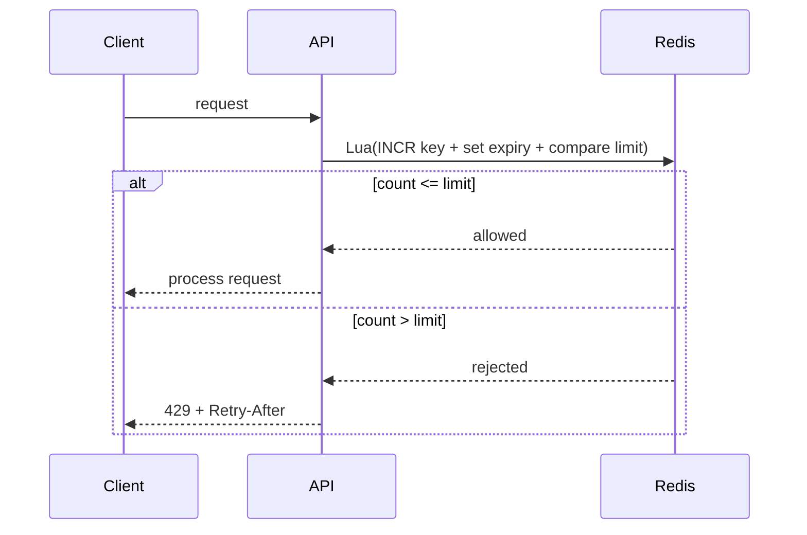
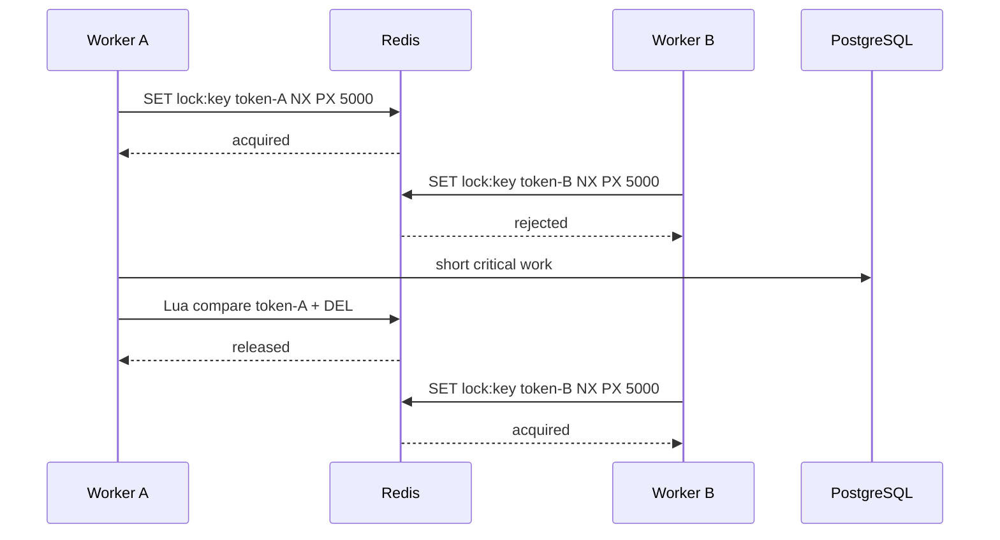

# Redis trong Spring Boot: hiểu cơ chế, chọn đúng pattern và kiểm chứng

## Redis là gì?

Redis là một server in-memory nằm ngoài process của Spring Boot. Ứng dụng gửi command qua network; Redis giữ key/value và một số data structure như string, hash, list, set, sorted set, stream.



Redis rất nhanh vì dữ liệu thường được xử lý trong memory và command đơn giản. Nhưng Redis không tự động trở thành source of truth. Restart, eviction, replication lag, failover, network partition và hết memory đều là failure cần thiết kế.

Trong project này:

```text
Product detail cache       → Redis có thể phù hợp
Rate limit API             → Redis có thể phù hợp
Short-lived coordination   → Redis có thể phù hợp
Order/Inventory truth      → PostgreSQL
Transaction Order+Stock   → PostgreSQL transaction
Kafka delivery             → PostgreSQL outbox + Kafka
```

## 1. Sáu câu hỏi trước khi thêm Redis

1. Dữ liệu này có thể mất hoặc rebuild được không?
2. Dữ liệu có được phép stale không? Stale trong bao lâu?
3. Nếu Redis down, request fail, fallback hay bỏ qua?
4. Nếu có nhiều pod, operation nào phải atomic?
5. Key/TTL/eviction policy là gì?
6. Metric nào chứng minh Redis đang tạo giá trị?

Nếu câu trả lời là “không được mất và không được stale”, Redis thường không nên là nơi quyết định cuối cùng.

## 2. Use case thường gặp

| Use case | Pattern | Redis có phải source of truth không? |
|---|---|---|
| Product/detail cache | cache-aside, TTL, jitter | Không |
| API rate limit | atomic counter/window hoặc token bucket | Là state của limiter, không phải domain truth |
| Short-lived lock | token ownership + TTL + safe release | Không |
| HTTP session | Spring Session Data Redis | Session store, cần policy expiry/availability |
| Counter/leaderboard | `INCR`, sorted set | Chỉ khi mất counter có behavior chấp nhận được |
| Pub/Sub notification | Redis Pub/Sub | Không nếu cần durable delivery |
| Stream/work queue nhỏ | Redis Streams | Cân nhắc Kafka khi cần durable event platform |
| Scheduler coordination | lock + lease | Không thay business transaction |

Redis Pub/Sub không nên dùng làm durable OrderCreated event nếu message phải được replay sau consumer downtime. Với domain này, outbox/Kafka giữ delivery contract rõ hơn.

## 3. Redis hoạt động thế nào?

### 3.1 Key và TTL

```text
product:42 → JSON Product
rate:customer-123:2026-09-26T10:45 → 4
lock:order:abc → random-token
```

TTL là thời gian sống của key. Khi key hết hạn, Redis không còn trả nó như một cache entry. TTL không phải transaction rollback và không tự gia hạn an toàn cho một job đang chạy.

### 3.2 Command atomic khác transaction business

Một command như `INCR` hoặc Lua script được Redis thực thi nguyên vẹn trên một instance. Điều đó giúp các client không chen vào giữa các bước trong script. Nhưng điều đó không làm PostgreSQL write và Redis write thành một distributed transaction.

```text
PostgreSQL commit thành công
→ Redis SET thất bại
→ cache miss là bình thường, rebuild từ DB

Redis SET thành công
→ PostgreSQL rollback
→ cache có thể chứa dữ liệu không hợp lệ nếu write-through thiết kế sai
```

### 3.3 Memory, eviction và replication

Redis cần memory policy. Khi hết memory, key có thể bị reject hoặc evict tùy policy. Replication/failover giúp availability nhưng không biến mọi write thành durable, globally consistent commit. Thiết kế pattern phải nói rõ mất key thì hệ thống làm gì.

## 4. Cache-aside: pattern nên học đầu tiên

### Flow đọc



### Flow ghi



Nếu `DEL` thất bại sau DB commit, entry cũ có thể stale đến TTL. Vì vậy write response nên dựa trên DB committed state; cache invalidation có retry/metric, không dùng cache làm quyết định giá/order.

### Spring Boot annotation hay code riêng?

Với cache đọc đơn giản, annotation giúp giảm boilerplate:

```java
@Cacheable(cacheNames = "products", key = "#productId")
public ProductView findProduct(long productId) {
    return productRepository.findView(productId);
}

@CacheEvict(cacheNames = "products", key = "#productId")
public ProductView updateProduct(long productId, UpdateProductCommand command) {
    return productRepository.update(productId, command);
}
```

Nhưng annotation không tự giải quyết:

- TTL jitter và cache stampede;
- serialization/version compatibility;
- cache invalidation sau transaction commit;
- stale data policy;
- negative caching;
- warm-up/fallback/metrics;
- cache key thay đổi theo tenant/locale/permission.

Khi cache có correctness hoặc invalidation phức tạp, tạo một `ProductCache`/`CacheAsideService` riêng và viết test. Annotation là convenience, không phải architecture.

### Cache stampede

```text
Một key hết hạn
→ 1.000 request cùng miss
→ 1.000 query PostgreSQL
→ DB pool cạn
```

Cách giảm:

- TTL jitter để key không hết hạn cùng lúc;
- single-flight/per-key lock cho rebuild;
- stale-while-revalidate nếu business cho phép;
- giới hạn concurrency và query timeout;
- metric hit/miss/rebuild duration.

Không dùng một distributed lock chung để che mọi cache miss; lock scope phải là key và có owner/TTL rõ.

## 5. Rate limiting: Redis là state của limiter

### Fixed window đơn giản



Không viết:

```java
long count = redis.get(key);
if (count < limit) {
    redis.increment(key);
}
```

vì hai pod có thể cùng đọc count cũ. Kiểm tra + increment + expiry phải atomic bằng Lua hoặc primitive phù hợp.

### Lua script minh họa

```lua
local count = redis.call('INCR', KEYS[1])
if count == 1 then
  redis.call('EXPIRE', KEYS[1], ARGV[1])
end
if count > tonumber(ARGV[2]) then
  return 0
end
return 1
```

### Spring Boot

```java
private static final RedisScript<Long> RATE_LIMIT_SCRIPT =
    RedisScript.of("""
        local count = redis.call('INCR', KEYS[1])
        if count == 1 then redis.call('EXPIRE', KEYS[1], ARGV[1]) end
        if count > tonumber(ARGV[2]) then return 0 end
        return 1
        """, Long.class);

boolean allowed(String key, int windowSeconds, int limit) {
    var result = redisTemplate.execute(
        RATE_LIMIT_SCRIPT,
        List.of(key),
        String.valueOf(windowSeconds),
        String.valueOf(limit));
    return Long.valueOf(1).equals(result);
}
```

Annotation như `@RateLimited` có thể làm API đẹp hơn, nhưng logic atomic, key policy, response `429`, headers và metric vẫn nên nằm trong một component/pattern được test. Đừng chỉ thêm annotation rồi nghĩ đã có distributed rate limit.

## 6. Distributed lock: coordination, không phải source of truth

### Acquire

```text
SET lock:product:42 random-token NX PX 5000
```

- `NX`: chỉ set nếu key chưa tồn tại;
- `PX 5000`: lease tự hết hạn;
- `random-token`: chứng minh owner khi release.

### Release an toàn

Không làm hai round trip:

```text
GET key
nếu value == token
DEL key
```

Owner khác có thể chiếm lock giữa `GET` và `DEL`. Dùng Lua compare/delete trong một execution:

```lua
if redis.call('GET', KEYS[1]) == ARGV[1] then
  return redis.call('DEL', KEYS[1])
end
return 0
```

### Flow



### Khi lock không đủ

Nếu business invariant nằm trong PostgreSQL, Redis lock không thay conditional update/DB constraint. Redis lock có thể hết TTL trong khi worker vẫn chạy; process pause, network delay hoặc GC pause có thể làm lease hết hạn.

Dùng Redis lock cho:

- job không nên chạy đồng thời;
- cache rebuild ngắn;
- coordination best-effort có recovery;
- leader/lease ngắn.

Không dùng Redis lock một mình để bảo vệ:

- Order/Inventory correctness;
- payment charge;
- immutable ledger;
- workflow cần transaction nhiều bước.

## 7. Session, Pub/Sub và Streams

### Spring Session Data Redis

Dùng khi muốn session shared giữa nhiều instance. Cần thiết kế TTL, logout, keyspace, failover và security. Session store không tự giải quyết authorization/resource ownership.

### Pub/Sub

Phù hợp notification ephemeral: subscriber offline thì có thể mất message. Không dùng cho event cần replay/audit.

### Redis Streams

Có consumer group, pending entry và replay tốt hơn Pub/Sub cho workload nhỏ. Nhưng nếu tổ chức đã có Kafka cho durable event platform, đừng thêm Streams chỉ vì Redis đang có sẵn. So sánh retention, partitioning, replay, observability và operational ownership.

## 8. Cấu hình Spring Boot nên hiểu

Dependency phổ biến:

```xml
<dependency>
  <groupId>org.springframework.boot</groupId>
  <artifactId>spring-boot-starter-data-redis</artifactId>
</dependency>
```

Spring Boot thường auto-configure connection factory và template khi có starter/config. Nhưng bạn vẫn phải quyết định:

- serializer: string/JSON/hash;
- key prefix và version;
- timeout/pool;
- TLS/authentication;
- TTL và eviction policy;
- database index/namespace;
- fallback khi Redis down;
- metrics và tracing.

Ví dụ config nên có namespace rõ:

```yaml
spring:
  data:
    redis:
      timeout: 500ms
      connect-timeout: 300ms
      repositories:
        enabled: false
```

Tên property phụ thuộc Spring Boot major version; hãy kiểm tra version/BOM và tài liệu chính thức trước khi copy config.

### Template hay annotation?

| Tình huống | Lựa chọn |
|---|---|
| Cache detail đơn giản | `@Cacheable`/`@CacheEvict` |
| Cache cần jitter/fallback/stampede control | service/pattern riêng dùng `RedisTemplate` |
| Rate limit atomic | `RedisScript` Lua/component riêng |
| Lock ownership/lease | component riêng hoặc thư viện đã audit; test token/TTL |
| Session | Spring Session Data Redis |
| Durable business event | Kafka/outbox, không annotation Redis |

Spring annotation là API convenience. Pattern riêng là nơi đặt key policy, TTL, fallback, metrics, serialization và failure behavior. Correctness-sensitive logic không nên bị giấu sau một annotation không có test tương ứng.

## 9. Failure matrix phải viết trước khi dùng Redis

| Failure | Cache | Rate limit | Lock |
|---|---|---|---|
| Redis timeout | đọc DB/fallback hoặc fail read rõ ràng | fail-open hay fail-closed theo risk | không acquire, không tự bỏ qua nếu lock bắt buộc |
| Redis restart | rebuild cache | counter reset; chấp nhận hay chuyển durable store? | lease mất; worker phải kiểm tra lại |
| Eviction | miss và query DB | limit state mất có thể cho vượt limit | lock key mất có thể tạo overlap |
| Network partition | stale/miss | policy rõ, không đoán count | không hứa lock còn hiệu lực |
| Serialization mismatch | version key/decoder fallback | script/key format migration | token format compatibility |
| Hot key | stampede/latency | concentrated limit | contention/lease expiry |

Không có câu trả lời chung “Redis down thì retry”. Câu trả lời phải dựa trên business impact và consistency requirement.

## 10. Use case review cho project này

### Product detail cache

Có thể thêm sau khi đo Product read latency. PostgreSQL vẫn trả giá/current state; cache chỉ accelerator. Khi Admin update Product, invalidate sau DB commit và có TTL fallback.

### Rate limit Order API

Có thể giới hạn theo Customer/IP/API key để bảo vệ hệ thống. Rate limit không thay idempotency và không chống oversell; nó chỉ giảm lưu lượng.

### Redis lock cho oversell

Không chọn làm production mechanism hiện tại. ADR đã chọn PostgreSQL atomic conditional update vì Inventory là source of truth và invariant nằm trong một row/transaction. Redis lock chỉ thêm failure mode.

### Inventory cache

Không cache Available Quantity để quyết định accept Order. Một cache cũ có thể làm UI hiển thị sai; quyết định accept/reject vẫn phải ở PostgreSQL.

### Outbox/Kafka thay Redis Pub/Sub

OrderCreated cần durable intent, retry, DLQ và consumer dedup. Redis Pub/Sub không phù hợp nếu cần replay sau downtime.

## 11. Bài lab

Chạy [Redis production lab](../../playbooks/08-redis-production-lab/README.md), sau đó làm:

1. Cache Product detail bằng cache-aside với TTL jitter.
2. Đổi DB price và quan sát stale cache; thêm invalidate.
3. Dừng Redis và chứng minh fallback/error policy.
4. Viết Lua rate limit 5 request/60 giây.
5. Chạy 100 task đồng thời và assert accepted không vượt limit.
6. Tạo lock token A, thử release bằng token B.
7. Kill owner giữ lock, đợi TTL rồi chạy owner mới.
8. Viết metric hit/miss, stale, limiter rejection, lock wait và Redis error.

## 12. Câu trả lời phỏng vấn

### “Redis dùng để làm gì?”

> “Tôi dùng Redis cho state nhanh hoặc coordination có failure policy rõ: cache-aside, rate limit, short-lived lock, session hoặc counter. Tôi không dùng Redis làm source of truth cho Order/Inventory nếu PostgreSQL đang giữ invariant. Cache có thể stale/rebuild; rate limit cần operation atomic; lock cần token ownership, TTL và safe release.”

### “Trong Spring Boot chỉ dùng annotation có đủ không?”

> “Annotation phù hợp cho cache đơn giản vì giảm boilerplate. Nhưng rate limit và lock là correctness/coordination pattern nên tôi đặt trong component riêng với Lua, key policy, TTL, fallback, metric và test concurrency. Annotation không tự giải quyết stampede, invalidation, serializer, failure hoặc transaction boundary.”

### “Redis down thì hệ thống làm gì?”

> “Tôi phân loại theo use case. Cache có thể fallback DB hoặc trả lỗi bounded; rate limit chọn fail-open/closed theo security/cost; lock bắt buộc thì không tự bỏ qua; session cần policy availability rõ. Tôi không retry mù, tôi có timeout, metric, alert và runbook.”

### “Tại sao không dùng Redis lock chống oversell?”

> “Vì PostgreSQL là source of truth và invariant là conditional decrement + Order transaction. Redis lock thêm network/lease/failover risk, nhưng không làm Redis và PostgreSQL thành một transaction. Tôi chỉ dùng lock cho coordination ngắn; correctness vẫn do database constraint/atomic write chứng minh.”

## 13. Checklist hoàn thành

- [ ] Giải thích Redis là server ngoài process, không phải annotation trong Spring.
- [ ] Phân biệt cache, rate limit, lock, session, Pub/Sub và Streams.
- [ ] Vẽ được cache hit/miss/invalidation flow.
- [ ] Biết cache stampede và TTL jitter.
- [ ] Viết được Lua atomic rate limit.
- [ ] Hiểu `SET NX PX` và token-safe release.
- [ ] Biết khi nào annotation đủ và khi nào cần component/pattern riêng.
- [ ] Có fallback/error policy khi Redis down.
- [ ] Không dùng Redis làm source of truth sai chỗ.
- [ ] Có test concurrent, TTL/eviction/restart và metric evidence.
- [ ] Trả lời được Redis trade-off trong phỏng vấn.

## Tài liệu liên quan

- [Redis cache/rate-limit/lock playbook](redis_cache_rate_limit_lock_playbook.md)
- [Redis Java implementation](redis_java_implementation_playbook.md)
- [Atomic Order/Inventory](atomic_order_inventory_playbook.md)
- [Transactional outbox/Kafka](transactional_outbox_kafka_playbook.md)
- [Redis lab](../../playbooks/08-redis-production-lab/README.md)
