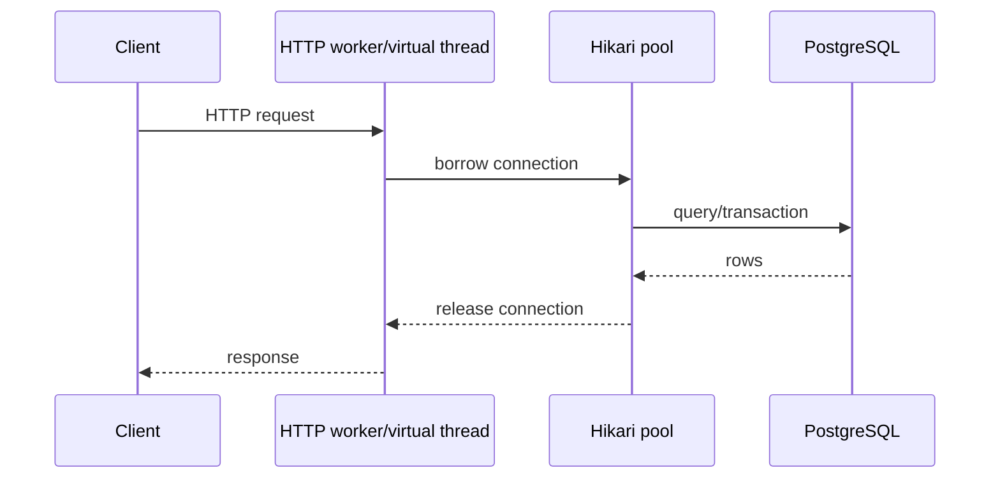

# Playbook: request, thread, connection và memory

## Một request đi qua đâu?

Thread và DB connection là hai resource khác nhau. Một thread có thể chờ connection; một connection có thể bị giữ bởi query/lock. Hãy tìm bottleneck bằng metric, không nhân số thread theo cảm giác.

## Lab quan sát

1. Chạy `docker compose up --build`.
2. Gọi API đồng thời từ PowerShell, mở `/actuator/metrics`.
3. Quan sát `jvm.threads.live`, `hikaricp.connections.active`, `hikaricp.connections.pending`, request p95 và PostgreSQL lock waits.
4. Giảm connection pool xuống 5; chạy lại và ghi p95/error rate.

## Memory đến từ đâu?

Request body/response, object graph của JPA persistence context, queue chờ executor, cache, thread stack và buffers đều dùng memory. Virtual thread giảm chi phí thread stack tương đối; nó không xóa object/queue/DB wait. Một queue không bounded có thể làm heap tăng dù CPU thấp.

## Checklist performance

- Tách latency DB, external call và serialization.
- Đặt timeout, pool size và queue bound theo capacity dependency.
- Đo p50/p95/p99, error rate, active/pending connections, GC pause và heap.
- Kiểm tra N+1/query plan trước khi tăng pod.
