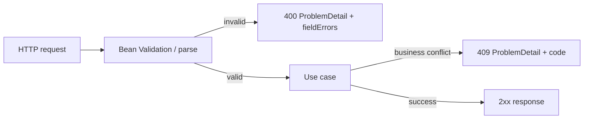

# Playbook 08: REST validation và Problem Details

## Contract

API tốt có lỗi dự đoán được: invalid input là `400`, rule business conflict là `409`, resource không có là `404`, lỗi không mong đợi là `500`. Không trả stack trace hay mỗi endpoint một JSON lỗi khác nhau.

## Code map và bài làm

Đọc [OrderController](../../backend/src/main/java/com/ngoctri/flashsale/order/api/OrderController.java), [CreateOrderRequest](../../backend/src/main/java/com/ngoctri/flashsale/order/api/CreateOrderRequest.java), [ApiExceptionHandler](../../backend/src/main/java/com/ngoctri/flashsale/shared/api/ApiExceptionHandler.java) và [OrderApiIntegrationTest](../../backend/src/test/java/com/ngoctri/flashsale/order/api/OrderApiIntegrationTest.java).

1. Gửi body quantity `0`, header key thiếu, product không tồn tại, stock không đủ.
2. Ghi status, `type`, `code`, `traceId`, `fieldErrors` mong đợi trước khi đọc test.
3. Thêm một validation field mới; viết HTTP integration test cho error contract.

## Rule review

- Validation format/range ở API boundary; invariant business vẫn được bảo vệ trong use case/database.
- Không dùng exception message tùy ý làm public contract; dùng stable `code`/`type`.
- Không leak SQL, stack trace, token/PII ra response/log.
- `traceId` giúp nối client report với log/metric, không phải authentication.

## Interview

“Tôi tách malformed request khỏi business conflict, chuẩn hóa response bằng Problem Details, giữ error code ổn định và test HTTP contract. Validation không thay database constraint hay concurrency rule; đó là các lớp bảo vệ khác nhau.”
