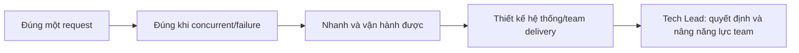
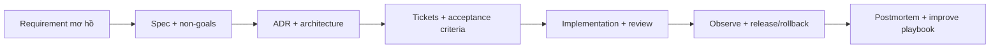

# Roadmap thực hành: Senior Java Backend → Tech Lead

## Mục tiêu thực tế

Không có tài liệu nào làm một người “nắm vững” chỉ sau khi đọc. Roadmap này biến kiến thức thành năng lực có thể chứng minh qua code, test, design document, review và incident simulation.

Mỗi module chỉ hoàn thành khi có **evidence**: code/test, query plan, ADR/spec, review comment, runbook hoặc bản giải thích 2–3 phút. Không đánh dấu hoàn thành chỉ vì đã đọc.

## Phase 1 — Senior backend core: correctness trước framework

| Module | Làm trong repo | Evidence cần gửi mentor | Câu phỏng vấn phải trả lời |
|---|---|---|---|
| Transaction & atomic inventory | [Playbook 01](atomic_order_inventory_playbook.md) + lab 01 | Concurrent test chứng minh stock không âm và accepted quantity đúng | Vì sao `@Transactional` chưa đủ chống oversell? |
| Idempotency & rollback | [Playbook 02](idempotency_replay_playbook.md) + lab 02 | Retry cùng key không có side effect thứ hai; key reuse khác payload là 409 | Unique constraint và replay lock khác nhau thế nào? |
| Locking strategy | Mở `InventoryConcurrencyStrategyLabIntegrationTest` | Bảng atomic/pessimistic/optimistic: throughput, conflict/retry, trade-off | Hot SKU nên dùng optimistic lock không? Vì sao? |
| Java concurrency | Viết lab `ExecutorService` race rồi sửa `AtomicInteger`; liên hệ hai pod | Giải thích visibility, critical section, database source of truth | Vì sao `synchronized` không bảo vệ hai replica? |
| OOP/SOLID | Trace `OrderController → PlaceOrder → OrderPlacementStore` | Vẽ dependency direction, fake adapter unit test | Vì sao use case phụ thuộc port thay vì JDBC class? |

**Gate Phase 1:** tự giải thích được `POST /orders` từ HTTP đến commit/outbox mà không mở code; tự tạo race condition rồi sửa bằng test.

## Phase 2 — Senior persistence & performance

| Module | Làm trong repo | Evidence cần gửi mentor | Câu phỏng vấn phải trả lời |
|---|---|---|---|
| JPA fetch plan/N+1 | Chạy `NPlusOneQueryLabIntegrationTest` | Dự đoán rồi ghi query count lazy/fetch join/projection | Vì sao 4 orders thường là 1 + N queries chứ không phải 8? |
| JPA/JDBC decision | [Playbook 03](jpa_jdbc_native_sql_playbook.md) | Viết `@Modifying` alternative, giữ concurrent test xanh | Khi nào explicit SQL tốt hơn JPA entity update? |
| SQL indexing/pagination | Seed data; chạy `EXPLAIN (ANALYZE, BUFFERS)` | Before/after plan và lý do giữ/bỏ index | Index nào phục vụ `WHERE + ORDER BY` này, giá phải trả là gì? |
| Caching | Thêm cache read-only product detail, test invalidation | Cache-aside contract, TTL, stale/read/write failure | Cache làm correctness issue gì với stock/price? |
| Data migration | Viết Flyway migration có forward-safe rollout | Migration, rollback/compatibility note, test data | Làm sao deploy app + migration không downtime? |

**Gate Phase 2:** không tối ưu bằng cảm giác; mọi claim “nhanh hơn” phải có query count, `EXPLAIN`, p95 hoặc load-test evidence.

## Phase 3 — Distributed reliability & operations

| Module | Làm trong repo | Evidence cần gửi mentor | Câu phỏng vấn phải trả lời |
|---|---|---|---|
| Transactional outbox | Đọc/chạy outbox publisher + consumer integration test | Failure timeline Kafka down sau DB commit | Outbox đảm bảo gì và không đảm bảo gì? |
| Consumer idempotency/DLQ | Tạo duplicate event, poison event scenario | Dedup table, retry/backoff/DLQ decision | At-least-once có nghĩa gì cho side effect? |
| Observability | Trace ID, metrics, logs trong Compose/Kind | Runbook “order created but audit missing” | Bạn debug từ đâu, theo thứ tự nào? |
| Resilience/security | Timeout, retry budget, circuit breaker; authn/authz, secrets, PII | Threat/failure matrix và test một failure | Retry vô điều kiện gây hại thế nào? |
| Delivery | GitHub Actions, image/version, health probe, canary/rollback | CI workflow và rollback plan | Readiness khác liveness ra sao? |

**Gate Phase 3:** mô phỏng một incident, điều tra bằng evidence và viết postmortem không đổ lỗi.

## Phase 4 — Domain expansion: booking và finance

| Domain | Bài build | Invariant cần bảo vệ | Khái niệm mới |
|---|---|---|---|
| Hotel/flight booking | Reservation `PENDING → CONFIRMED/EXPIRED/CANCELLED` | Hold không vượt capacity; expiry chỉ release một lần | State machine, scheduled worker, multi-resource hold, cancellation |
| Finance/payment | Transfer request + immutable journal lines | Tổng debit = credit theo currency; posted journal không sửa/xóa | Double-entry ledger, reconciliation, audit, authorization, dispute window |
| Insurance | Claim lifecycle + policy rule evaluation | Transition state hợp lệ, audit decision | State machine, rules, document/PII, human workflow |

Không copy `Order` sang banking. Flash Sale luyện consistency/concurrency; ledger có requirement audit và reconciliation mạnh hơn hẳn.

## Phase 5 — Tech Lead practice: biến kỹ thuật thành delivery

| Module | Artifact bắt buộc | Tiêu chí tốt |
|---|---|---|
| Requirement discovery | One-page problem statement: users, scope, non-goals, risks, success metric | Nêu câu hỏi chưa biết; không nhảy vào solution quá sớm |
| Solution design | C4/context diagram + sequence + data/invariants + alternatives | Quyết định có trade-off, failure mode, non-functional requirement |
| ADR | 1 ADR: context, decision, alternatives, consequences | Ghi tại sao, không chỉ ghi đã chọn gì |
| Planning | Epic chia 5–10 tickets độc lập, acceptance criteria, dependency, rollout | Ticket có thể review/test, không phải “build backend” |
| Code review | Review một PR theo correctness, security, maintainability, test gap | Comment có severity, explanation và proposed direction |
| Estimation & scope | Best/likely/worst, assumptions, risk register | Giao tiếp uncertainty rõ ràng, không hứa ngày vô căn cứ |
| Incident leadership | Incident timeline, roles, customer impact, mitigation, postmortem actions | Mitigate trước, blame-free, follow-up có owner/date |
| Mentoring | Hướng dẫn một junior qua question-first review | Giúp họ tự reasoning thay vì đưa đáp án ngay |

## Interview drills theo level

### Senior backend

Trả lời mỗi câu bằng: invariant → mechanism → failure mode → test/metric evidence → trade-off.

1. Thiết kế booking cho một phòng cuối cùng còn trống.
2. Vì sao order commit nhưng Kafka event chưa có vẫn chấp nhận được?
3. Một API list đột ngột chậm khi page size tăng: bạn đo gì trước?
4. Làm sao migrate schema khi app version cũ/cũ mới cùng chạy?

### Tech Lead

1. Product yêu cầu microservice ngay; bạn hỏi và đánh giá điều gì trước?
2. Một feature cần payment, inventory và notification; chia boundary/ticket/release thế nào?
3. On-call báo duplicate charge; 30 phút đầu làm gì, ai quyết định gì, evidence nào cần giữ?
4. Junior đề xuất Redis lock cho oversell; bạn review/mentor thế nào?

## Nhịp học cùng mentor

1. Chọn **một** module.
2. Bạn gửi proposal 5–10 dòng trước khi code: invariant, approach, test plan, unknowns.
3. Mentor phản biện assumptions; bạn code/test.
4. Mentor review diff như production PR.
5. Bạn sửa và trình bày 2 phút như interview.
6. Ghi learning record: điều biết, lỗi đã gặp, checklist tái sử dụng.

## Thước đo tiến bộ

- **Junior-to-mid:** chạy/sửa code khi có hướng dẫn.
- **Senior-ready:** tự nhận diện invariant, chọn mechanism, viết evidence test và nêu trade-off.
- **Tech Lead-ready:** biến requirement mơ hồ thành design/delivery plan; phát hiện risk sớm; giúp người khác làm đúng; chịu trách nhiệm outcome vận hành.

Đi theo track này với nhiều feature thật và feedback thật là cách đạt Tech Lead. Không có số playbook cố định thay thế trải nghiệm ownership, nhưng các artifacts ở đây mô phỏng chính xác loại công việc cần luyện.
