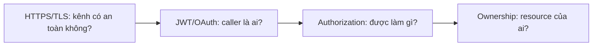
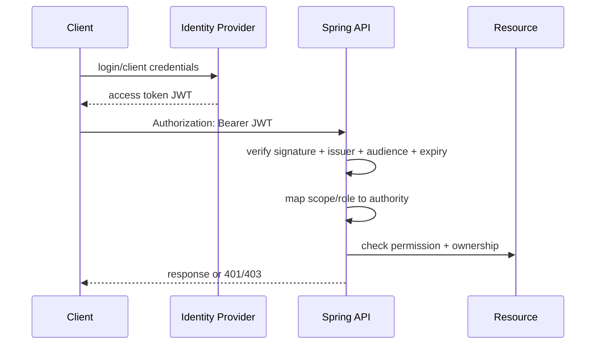
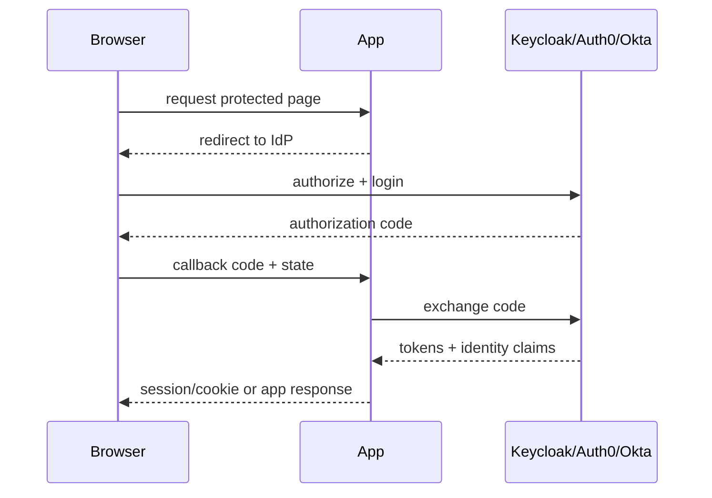

# TLS, JWT và OAuth/OIDC: security lab cho Spring Boot

## Phạm vi

Repository đã giải thích authentication/authorization nhưng MVP chưa bật identity thật. Guide này là lab riêng để học, không thay đổi contract MVP.

## 1. Ba lớp dễ nhầm



- **TLS:** mã hóa và xác thực kênh.
- **JWT:** token mang claims, phải verify signature/issuer/audience/expiry.
- **OAuth2:** protocol cấp quyền truy cập.
- **OIDC:** identity layer trên OAuth2 cho login.
- **Authorization:** policy của API, không nằm tự động trong token.

## 2. Flow JWT resource server



JWT decode được payload không có nghĩa token hợp lệ. Resource server phải kiểm tra cryptographic signature và claims.

## 3. OAuth2/OIDC flow



Các giá trị cần kiểm tra:

- `state` chống CSRF trong authorization flow;
- `nonce` chống replay identity response;
- redirect URI allow-list;
- issuer/audience;
- token expiry/rotation;
- mapping `sub`/groups/scope vào Customer/Admin policy.

## 4. TLS trong local lab

```text
Client -- HTTPS --> Spring API
             certificate/key
```

Lab tối thiểu:

1. Tạo local certificate cho `localhost` bằng tool được tổ chức chấp thuận.
2. Cấu hình Spring profile `security-lab` với keystore.
3. Gọi endpoint bằng HTTPS.
4. Kiểm tra HTTP plain bị redirect hoặc bị tắt theo policy.
5. Quan sát certificate expiry và renewal runbook.

Không commit private key thật vào repository. Dùng self-signed certificate chỉ cho local lab; staging/production cần certificate management phù hợp.

## 5. Spring Security resource server skeleton

```xml
<dependency>
  <groupId>org.springframework.boot</groupId>
  <artifactId>spring-boot-starter-security</artifactId>
</dependency>
<dependency>
  <groupId>org.springframework.boot</groupId>
  <artifactId>spring-boot-starter-oauth2-resource-server</artifactId>
</dependency>
```

```java
@Bean
SecurityFilterChain api(HttpSecurity http) throws Exception {
    return http
        .authorizeHttpRequests(auth -> auth
            .requestMatchers("/actuator/health/**").permitAll()
            .requestMatchers(HttpMethod.POST, "/api/orders")
                .hasAuthority("SCOPE_order:create")
            .requestMatchers("/api/admin/**")
                .hasAuthority("SCOPE_inventory:adjust")
            .anyRequest().authenticated())
        .oauth2ResourceServer(oauth -> oauth.jwt(Customizer.withDefaults()))
        .build();
}
```

Đây là skeleton học tập. Claim name và authority prefix phải khớp IdP thật; không copy `SCOPE_` nếu token policy của bạn dùng role/group khác.

## 6. Test matrix

| Case | Expected |
|---|---|
| Không có token | `401` |
| Signature sai | `401` |
| Issuer/audience sai | `401` |
| Token hết hạn | `401` |
| Có token nhưng thiếu scope | `403` |
| Đúng scope nhưng Order của Customer khác | `404/403` theo contract |
| Admin adjustment không có audit | test fail |
| HTTPS certificate hết hạn | deployment/readiness fail theo policy |

## 7. Lab IDOR

```text
Customer A token: sub=customer-a, scope=order:read
GET /orders/order-b

Expected: không trả dữ liệu Order B
```

Authorization ở endpoint chưa đủ; query/service cần truyền caller identity vào ownership condition:

```sql
SELECT * FROM orders
WHERE id = :orderId AND customer_id = :callerCustomerId;
```

## 8. Failure matrix

| Failure | Không làm | Cách xử lý |
|---|---|---|
| IdP down | tin token cũ vô hạn | expiry policy + bounded failure |
| JWKS rotation | hard-code public key mãi | issuer/JWKS cache + rotation test |
| Token expired | retry vô hạn | login/refresh flow |
| Scope mapping sai | cho ADMIN toàn quyền | explicit authority matrix |
| TLS cert sắp hết hạn | chờ production fail | expiry metric/alert/runbook |
| Token lộ trong log | log header toàn bộ | redact Authorization |

## Câu trả lời phỏng vấn

> “Tôi tách TLS, authentication và authorization. TLS bảo vệ kênh; JWT phải verify signature, issuer, audience và expiry; OAuth/OIDC giải quyết authorization/login flow; còn resource ownership vẫn phải kiểm tra trong business query. Tôi test 401, 403, expired token, invalid issuer, scope mapping và IDOR. Private key không nằm trong Git, token không nằm trong log, và certificate rotation có metric/runbook.”

## Definition of done

- [ ] Local HTTPS chạy được.
- [ ] Resource server verify JWT thật trong lab.
- [ ] Có scope/role matrix.
- [ ] Có test 401/403/expired/invalid issuer.
- [ ] Có IDOR test.
- [ ] Có token redaction.
- [ ] Có certificate expiry/rotation note.
- [ ] Có authorization audit cho state-changing action.
