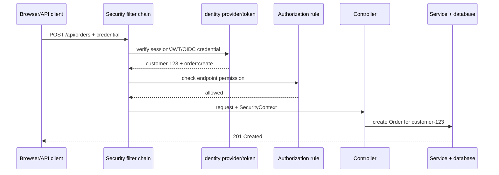
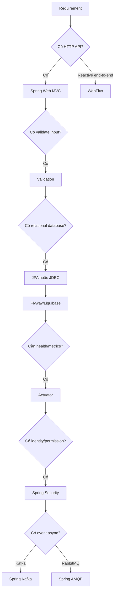

# Spring Security cho người mới: từ request đến quyết định được phép

## Ý tưởng trong một câu

Spring Security là một **cổng kiểm soát đứng trước business code**. Nó trả lời hai câu hỏi theo thứ tự:

```text
Người gọi là ai?        → authentication
Người đó được làm gì?   → authorization
```

Ví dụ trong flash-sale:

- Người gọi là `customer-123`.
- Người đó được tạo Order.
- Người đó chỉ được xem Order của chính mình.
- Người đó không được điều chỉnh Inventory.

Nếu chỉ biết “thêm annotation Security”, bạn chưa giải quyết được câu hỏi cuối cùng.

## 1. Nhìn luồng trước khi nhìn code



Nếu không có credential hợp lệ, flow dừng trước controller và thường trả `401`. Nếu credential hợp lệ nhưng thiếu permission, flow dừng và thường trả `403`. Nếu endpoint cho phép `order:read` nhưng query không lọc theo owner, customer A vẫn có thể đọc Order của B: đó là IDOR.

Spring Security triển khai flow Servlet qua filter chain trước khi request vào controller. [Servlet architecture](https://docs.spring.io/spring-security/reference/servlet/architecture.html)

## 2. Ba ví dụ nhỏ để phân biệt khái niệm

### Ví dụ A — Chưa đăng nhập

```http
GET /api/orders/42
Authorization: (không có)
```

Server chưa biết người gọi là ai. Đây là **authentication failure**, trả `401`.

### Ví dụ B — Đã đăng nhập nhưng sai quyền

```text
customer-123 có authority: order:read
endpoint POST /api/inventory/adjust yêu cầu: inventory:adjust
```

Identity đã biết nhưng policy từ chối. Đây là **authorization failure**, trả `403`.

### Ví dụ C — Đúng role nhưng sai resource

```text
customer-123 gọi GET /api/orders/999
Order 999 thuộc customer-456
```

Endpoint có thể yêu cầu `order:read` đúng, nhưng service vẫn phải kiểm tra ownership. Role không tự động chứng minh resource thuộc về caller.

## 3. `SecurityFilterChain` đọc như thế nào?

Đoạn code dưới đây chỉ là bản đồ học tập:

```java
@Bean
SecurityFilterChain apiSecurity(HttpSecurity http) throws Exception {
    return http
        .authorizeHttpRequests(auth -> auth
            .requestMatchers("/actuator/health/**", "/api/products").permitAll()
            .requestMatchers(HttpMethod.POST, "/api/orders")
                .hasAuthority("order:create")
            .requestMatchers("/api/admin/**")
                .hasRole("ADMIN")
            .anyRequest().authenticated())
        .oauth2ResourceServer(oauth -> oauth.jwt(Customizer.withDefaults()))
        .build();
}
```

Đọc từng dòng bằng ngôn ngữ đời thường:

| Code | Nghĩa |
|---|---|
| `permitAll()` | Ai cũng xem được endpoint này |
| `hasAuthority("order:create")` | Token phải có quyền cụ thể này |
| `hasRole("ADMIN")` | Người gọi phải có role admin |
| `authenticated()` | Chỉ cần đăng nhập hợp lệ |
| `oauth2ResourceServer().jwt()` | API nhận bearer JWT từ identity provider |

Lỗi dễ gặp là dùng `hasRole("ADMIN")` nhưng token chỉ có claim `scope=admin`, hoặc ngược lại. Hãy viết rõ bước mapping claim → authority; đừng đoán rằng Spring tự hiểu tên claim của IdP.

## 4. Từ authority đến ownership

```java
@PreAuthorize("hasAuthority('order:read')")
public OrderView getOrder(UUID orderId, CustomerId caller) {
    return orderQuery.findOwnedBy(orderId, caller)
        .orElseThrow(() -> new OrderNotFoundException(orderId));
}
```

Có hai lớp kiểm tra:

```text
1. Có quyền đọc Order không?          → @PreAuthorize
2. Order này có thuộc caller không?  → query/service
```

Query an toàn thường truyền owner vào điều kiện:

```sql
SELECT id, customer_id, total
FROM orders
WHERE id = :orderId
  AND customer_id = :customerId;
```

Đừng làm thế này:

```java
Order order = repository.findById(orderId); // tìm được Order của người khác
return order;
```

và cũng đừng chỉ ẩn nút “Order detail” trên frontend. Frontend không phải security boundary.

## 5. Session, JWT và OIDC bằng ví dụ

| Mô hình | Ví dụ dễ hình dung | Câu hỏi phải trả lời |
|---|---|---|
| Session/cookie | Server phát `JSESSIONID`; browser gửi cookie mỗi request | CSRF, SameSite, logout, session fixation |
| JWT resource server | IdP phát bearer token; API kiểm tra signature/issuer/audience/expiry | key rotation, revoke, scope mapping |
| OIDC login | “Login with company identity provider” | redirect URI, state, nonce, claim mapping |
| API key/mTLS | Worker gọi internal endpoint | rotation, scope, audit, service identity |

Đừng chọn JWT vì nó “hiện đại”. Chọn theo client boundary, identity provider, revoke requirement và cách vận hành.

## 6. CSRF và CORS bằng tình huống

### CSRF

Alice đã đăng nhập bằng cookie. Alice mở một website xấu; website đó cố gửi `POST /api/orders`. Browser có thể tự đính kèm cookie của Alice. CSRF token giúp server biết request có đến từ trang hợp lệ hay không.

Spring Security bật CSRF protection mặc định cho các method không an toàn trong Servlet application. Nếu dùng cookie/session, hãy giữ CSRF và test nó. [CSRF reference](https://docs.spring.io/spring-security/reference/servlet/exploits/csrf.html)

### CORS

Shop chạy ở `https://shop.example`; API ở `https://api.example`. Browser hỏi API: “Origin này có được đọc response không?”. CORS trả lời câu hỏi của browser; nó không thay authorization và không chặn curl/Postman.

```text
Allowed origins: https://shop.example, https://admin.example
Allowed methods: GET, POST
Allowed headers: Authorization, Content-Type, Idempotency-Key
Credentials: chỉ bật khi thực sự dùng cookie
```

Không dùng `allowOrigin=*` cùng credentials.

## 7. Test security như test business rule

Đừng chỉ test “có annotation”. Test phải nói được ai được làm gì:

```java
@Test
void customerCanCreateOrder() throws Exception {
    mockMvc.perform(post("/api/orders")
            .with(jwt().authorities(
                new SimpleGrantedAuthority("order:create")))
            .contentType(APPLICATION_JSON)
            .content(validOrderJson))
        .andExpect(status().isCreated());
}

@Test
void customerCannotReadAnotherCustomersOrder() throws Exception {
    mockMvc.perform(get("/api/orders/{id}", orderOwnedByAnotherCustomer)
            .with(jwt().subject("customer-123")
                .authorities(new SimpleGrantedAuthority("order:read"))))
        .andExpect(status().isNotFound());
}
```

Nên có tối thiểu các case:

| Case | Kết quả mong đợi |
|---|---|
| Không token | `401` |
| Token hết hạn/sai issuer | `401` |
| Có token nhưng thiếu authority | `403` |
| Đúng authority nhưng sai owner | `404` hoặc `403` theo contract |
| Cookie POST không có CSRF | `403` |
| Origin không allow-list | browser không cho đọc response |
| Customer gọi Inventory Adjustment | `403`, không có DB side effect |

## 8. Chọn starter bằng câu chuyện của project

Hãy bắt đầu từ request, không bắt đầu từ danh sách dependency:



Áp dụng cho repository này:

```text
HTTP API               → Web MVC
DTO validation         → Validation
PostgreSQL             → JPA + JDBC tùy query
Schema versioning      → Flyway
Health/metrics         → Actuator
OrderCreated event     → Kafka + outbox
Authentication hiện tại→ Chưa có, vì MVP chưa có account
```

`spring-boot-starter-security` chỉ nên thêm sau khi đã chốt identity source và authorization matrix. `spring-boot-starter-oauth2-resource-server` chỉ thêm khi API thực sự nhận access token từ IdP.

## 9. Khi nào không dùng project Spring khác?

- Không dùng WebFlux chỉ vì nghe nói reactive nhanh; toàn bộ call chain và driver phải phù hợp.
- Không dùng Spring Cloud chỉ vì có nhiều service trong sơ đồ; trước tiên chứng minh service boundary, timeout, retry và observability.
- Không dựng Spring Authorization Server nếu công ty đã có IdP và bạn chỉ cần resource server.
- Không dùng Redis làm source of truth cho Order/Inventory.
- Không dùng Spring AI để giải quyết security; AI integration và identity policy là hai vấn đề khác nhau.

## 10. Bài tập 30 phút

1. Vẽ lại sequence diagram cho `POST /api/orders` với customer token.
2. Thêm ba dòng vào authorization matrix: customer đọc Order của mình, customer đọc Order người khác, admin điều chỉnh Inventory.
3. Viết hai test MockMvc cho `401` và IDOR.
4. Viết câu trả lời: “Vì sao không chỉ kiểm tra role ở controller?”.
5. Mở [`backend_security_pii_playbook.md`](backend_security_pii_playbook.md) và đối chiếu threat model với test bạn vừa viết.

## 11. Ba lỗi người mới hay mắc

**Thêm dependency rồi nghĩ đã an toàn.** Dependency chỉ bật capability; policy, identity mapping, resource ownership và test mới tạo ra security behavior.

**Nhầm CORS với authorization.** CORS chỉ là browser read policy; server vẫn phải authenticate và authorize mọi request.

**Thấy test `200` là đủ.** Security cần test cả negative path: thiếu token, thiếu quyền, sai owner, token hết hạn và side effect không xảy ra.

## 12. Câu trả lời phỏng vấn ngắn

> “Tôi nhìn Spring Security như một cổng trước business flow. Request đi qua filter chain để xác thực, authentication được đặt vào SecurityContext, sau đó request hoặc method authorization kiểm tra quyền. Nhưng role check vẫn chưa đủ; Order query phải lọc theo customer để chống IDOR. Tôi chọn session, JWT resource server hay OIDC theo client boundary và identity provider. Với dự án flash-sale, tôi sẽ chốt identity source và authorization matrix trước, thêm starter tối thiểu, rồi chứng minh bằng MockMvc, integration test, CSRF/CORS test và audit.”

## Code references trong repository

| Chủ đề | File |
|---|---|
| Threat model, IDOR, PII | [`backend_security_pii_playbook.md`](backend_security_pii_playbook.md) |
| Spring proxy và authorization matrix | [`spring_internals_security_playbook.md`](spring_internals_security_playbook.md) |
| Domain glossary | [`CONTEXT.md`](../../CONTEXT.md) |
| Order flow | [`PlaceOrder.java`](../../backend/src/main/java/com/ngoctri/flashsale/order/application/PlaceOrder.java) |
| API controller | [`OrderController.java`](../../backend/src/main/java/com/ngoctri/flashsale/order/api/OrderController.java) |
| Integration security boundary hiện có | [`OrderApiIntegrationTest.java`](../../backend/src/test/java/com/ngoctri/flashsale/order/api/OrderApiIntegrationTest.java) |
