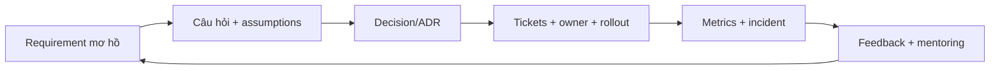
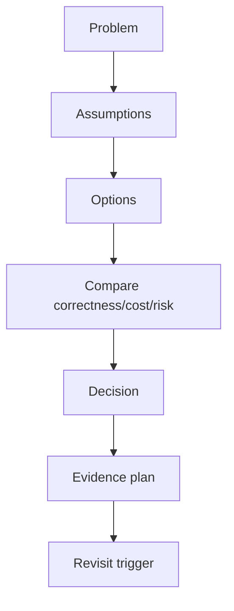

# Tech Lead readiness: ownership, delivery, communication và business judgment

## Vì sao cần module này?

Kỹ thuật tốt là điều kiện cần, chưa đủ để làm Tech Lead. Tech Lead chịu trách nhiệm giúp team đưa quyết định đúng trong điều kiện thiếu thông tin, giao hàng an toàn và nâng năng lực người khác.



## 1. Năm trách nhiệm cốt lõi

| Trách nhiệm | Evidence cần để lại |
|---|---|
| Problem framing | problem brief, scope, non-goals, success metric |
| Technical decision | ADR, alternatives, consequences |
| Delivery | tickets, owner, dependency, acceptance criteria |
| Operational outcome | dashboard, SLO, runbook, rollback |
| Team growth | review notes, mentoring plan, decision log |

Tech Lead không có nghĩa là tự quyết mọi thứ. Mục tiêu là làm quyết định **rõ, có owner, có feedback và có thể sửa**.

## 2. Question-first discovery

Trước khi thiết kế, đặt câu hỏi theo sáu nhóm:

### Business

- Ai gặp vấn đề và tác hại hiện tại là gì?
- Thành công đo bằng metric nào?
- Điều gì phải đúng tuyệt đối?
- Điều gì có thể chấp nhận eventual/pending?

### Scope

- MVP cần làm gì?
- Explicitly out of scope là gì?
- Có deadline hoặc regulatory constraint nào không?

### Workload

- Normal/peak requests per second?
- Read/write ratio?
- Payload/data growth?
- p95/p99 và availability target?

### Failure

- Timeout thì client retry thế nào?
- Đã commit nhưng response mất thì sao?
- Duplicate event hoặc out-of-order có thể xảy ra không?
- Ai repair khi automation không tự hồi phục?

### Security

- Identity source là gì?
- Resource owner là ai?
- PII/secret ở đâu?
- Ai được deploy/rollback/replay?

### Team/delivery

- Team nào sở hữu boundary?
- Có thể chia task độc lập không?
- Risk nào cần architect/security/product approve?

## 3. Problem brief template

```markdown
# Problem: [tên vấn đề]

## Who is affected

## Current behavior/evidence

## Desired outcome

## Invariants

## Scope

## Non-goals

## Workload and NFR

## Risks and unknowns

## Success metrics

## Decision owner and reviewers
```

Không bắt đầu bằng “hãy dùng microservice/Redis/Kafka”. Hãy ghi problem và evidence trước.

## 4. Decision making



Mỗi ADR nên có:

- Context/problem.
- Decision.
- Alternatives rejected.
- Consequences.
- Evidence/test cần chạy.
- Trigger để xem lại quyết định.

Ví dụ: giữ Order/Inventory trong modular monolith vì local transaction; chỉ revisit khi hot row/p95/team ownership thay đổi.

## 5. Delivery planning

Đừng giao ticket như “build backend”. Chia theo artifact và risk:

```text
Epic: atomic order acceptance
→ API/error contract
→ idempotency persistence
→ conditional inventory update
→ Order + outbox transaction
→ concurrency test
→ metrics/trace
→ rollout/smoke/rollback
```

Mỗi ticket có:

```text
owner
scope/non-goal
dependency
acceptance criteria
test evidence
observability
rollout/rollback
```

### Estimation có trách nhiệm

Dùng ba lớp:

```text
Best case: assumptions đều đúng
Likely case: dependency/risk bình thường
Worst case: failure hoặc unknown xuất hiện
```

Không hứa một ngày duy nhất khi chưa biết workload, migration, integration và review dependency.

## 6. Communication với stakeholder

### Status update tốt

```text
Done: API contract + atomic update đã merge.
Evidence: 100 concurrent requests, accepted=10, final inventory=0.
Risk: outbox publisher chưa chạy trong production-like environment.
Decision needed: chọn rollout flag hay deploy trực tiếp staging.
Next: wire dashboard và rehearsal rollback.
```

### Khi phản đối solution

Không nói “cách này sai”. Nói:

```text
Requirement tôi hiểu là X.
Phương án A giải quyết X nhưng tạo risk Y.
Phương án B chậm hơn ở Z nhưng giữ invariant rõ hơn.
Tôi đề xuất B vì evidence này.
Nếu workload/requirement thay đổi ở điều kiện Q, ta xem lại.
```

## 7. Mentoring và code review

Dùng câu hỏi trước khi đưa đáp án:

- Invariant nào đang được bảo vệ?
- Hai request chạy đồng thời thì timeline ra sao?
- Nếu DB commit nhưng response mất thì retry làm gì?
- Test nào sẽ fail nếu code sai?
- Alternative nào đã cân nhắc?
- Sửa này ảnh hưởng metric/rollback/security không?

Mục tiêu là teammate tự reasoning được ở lần sau. Review tốt có severity, evidence và next verification; không chỉ nói “refactor cho đẹp”.

## 8. Incident leadership

```mermaid
flowchart LR
  Alert[Alert/customer report] --> Impact[Đo customer impact]
  Impact --> Mitigate[Mitigate/stop unsafe path]
  Mitigate --> Preserve[Giữ log/trace/data]
  Preserve --> Roles[Assign incident roles]
  Roles --> Timeline[Timeline + hypothesis]
  Timeline --> Repair[Repair + verify]
  Repair --> Postmortem[Postmortem + owner/date]
```



### 30 phút đầu

1. Xác định ảnh hưởng và phạm vi.
2. Tắt feature/traffic unsafe nếu cần.
3. Giữ evidence, không xóa log hoặc replay mù.
4. Chỉ định incident lead, investigator và communicator.
5. Ghi timeline có timestamp.
6. Cập nhật stakeholder bằng facts và unknowns.

### Sau incident

- contributing factors;
- detection gap;
- recovery gap;
- action owner/date;
- regression test/eval;
- runbook/alert/ADR update.

## 9. SLO, error budget và DORA

### Ví dụ SLO

```text
99.9% POST /orders không trả 5xx trong tháng
p95 latency < 250ms trong workload peak đã định nghĩa
outbox pending age < 60s
oversold invariant = 0
```

Error budget giúp quyết định ưu tiên:

```text
Budget còn → có thể ship thay đổi có risk đã kiểm soát
Budget cạn → ưu tiên reliability, giảm release risk
```

Theo dõi thêm:

- deployment frequency;
- lead time for changes;
- change failure rate;
- time to restore;
- escaped defects;
- review/rework time.

## 10. Cloud và cost judgment

Tech Lead không cần thuộc mọi cloud service, nhưng phải hiểu resource/cost boundary:

| Resource | Câu hỏi |
|---|---|
| Compute/pod | CPU/memory request, autoscaling có hợp lý không? |
| Database | connection, storage, IOPS, backup, read replica? |
| Kafka | partition, retention, throughput, consumer lag? |
| Logs | volume/ngày, retention, indexing cost, PII? |
| Network | egress, cross-zone call, TLS/proxy overhead? |
| AI agent | token cost, model routing, human review time? |

Không scale pod trước khi kiểm tra database pool/lock. Không giữ log vô hạn chỉ vì Elasticsearch lưu được.

## 11. AI agent trong Tech Lead workflow

AI agent phù hợp cho:

- repo/architecture inventory;
- draft problem/spec/ADR;
- failure matrix;
- sequence/ERD skeleton;
- ticket slicing;
- review missing tests/security;
- summarize incident read-only.

Human giữ:

- problem priority;
- data ownership;
- security exception;
- consistency guarantee;
- release risk;
- cost/people trade-off.

Prompt dùng được:

```text
Đọc CONTEXT.md, ADR, code và test hiện có.
Không sửa file.

Hãy tạo:
1. problem brief;
2. assumptions/unknowns;
3. invariant và acceptance criteria;
4. alternatives + trade-off;
5. architecture/sequence/state diagram;
6. failure/security/observability matrix;
7. tickets, owners, dependencies;
8. rollout/rollback và evidence plan.
Mọi kết luận phải có file:line hoặc ghi “chưa đủ evidence”.
```

## 12. Portfolio evidence cho Tech Lead

Một feature đủ mạnh nên có:

```text
problem brief
→ ADR
→ diagram
→ tickets
→ PR review
→ test/benchmark output
→ dashboard/runbook
→ rollout/rollback note
→ incident hoặc failure drill
→ postmortem/learning update
```

Nếu chưa có production incident thật, dùng failure drill nhưng ghi rõ đó là simulation.

## 13. Câu trả lời phỏng vấn 2 phút

> “Tôi phân biệt Tech Lead với người chỉ thiết kế code. Tôi bắt đầu bằng problem brief và question tree: user impact, invariant, workload, security, failure, non-goals và success metrics. Sau đó tôi ghi assumptions, so sánh alternatives và tạo ADR. Tôi dùng context/container/sequence/state/ERD để làm rõ boundary, timing, ownership và source of truth.
>
> Tiếp theo tôi chia design thành tickets có owner, dependency, acceptance criteria, test, observability và rollback. Trong delivery tôi review correctness, security, contract và operational risk. Sau deploy tôi theo dõi SLO, error budget, p95, change failure rate và incident signals. Khi có incident, tôi mitigate trước, giữ evidence, phân vai, sửa có verification rồi cập nhật runbook/ADR. AI agent giúp tạo draft và tìm missing case; tôi vẫn chịu trách nhiệm về decision, risk, cost và team outcome.”

## 14. Readiness rubric

Chấm 0–2 điểm mỗi mục:

| Năng lực | 0 | 1 | 2 |
|---|---|---|---|
| Problem framing | nhảy vào code | hỏi vài câu | brief/scope/metric rõ |
| Architecture | kể technology | có diagram | boundary/alternative/ADR |
| Correctness | happy path | có test cơ bản | failure/concurrency evidence |
| Operations | log khi lỗi | có metric | SLO/alert/runbook/rollback |
| Delivery | giao task lớn | có ticket | owner/dependency/risk rõ |
| Communication | nói solution | nêu trade-off | thuyết phục stakeholder bằng evidence |
| Mentoring | đưa đáp án | review code | giúp người khác tự reasoning |
| Incident | restart mù | có timeline | mitigate/roles/postmortem |
| Cost | không tính | biết vài resource | capacity/cost trade-off |
| AI usage | prompt code | có review | context/eval/permission/evidence |

Mục tiêu Tech Lead-ready: ít nhất 16/20 và không mục nào 0.

## 15. Lộ trình ownership 90 ngày

### 30 ngày

- lead một design review nhỏ;
- viết problem brief + ADR;
- chia feature thành tickets;
- mentor một PR.

### 60 ngày

- sở hữu rollout staging;
- viết dashboard/runbook;
- chạy incident drill;
- trình bày trade-off với Product/QA/DevOps.

### 90 ngày

- lead feature end-to-end;
- chịu trách nhiệm SLO/incident follow-up;
- cập nhật architecture/playbook;
- mentoring và review quality của team.

## Definition of done

- [ ] Có problem brief và question tree.
- [ ] Có ADR alternatives/consequences/revisit trigger.
- [ ] Có diagram và failure matrix.
- [ ] Có tickets/owner/dependency/acceptance.
- [ ] Có SLO/metric/alert/runbook.
- [ ] Có rollout/rollback plan.
- [ ] Có incident drill hoặc incident thật.
- [ ] Có mentoring/review evidence.
- [ ] Có cost/capacity assumptions.
- [ ] Có câu trả lời phỏng vấn dựa trên evidence.
