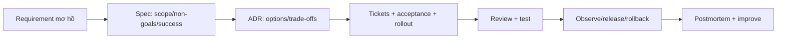

# Playbook 19: Tech Lead delivery, incident và mentoring

## Một Tech Lead biến ambiguity thành delivery

## Artifact bắt buộc cho feature Booking

1. One-page spec: user, scope/non-goals, invariants, success metrics, open questions.
2. ADR: modular monolith vs service split; locking/reservation choice; consequences.
3. 5–10 tickets: owner boundary, acceptance criteria, test/observability/rollout dependency.
4. PR review checklist: correctness, security, migration, test, operation, maintainability.
5. Release plan: dashboard/alert, rollback code/data behavior, on-call owner.

## Incident drill

Report: “duplicate charge/order after client timeout.” 30 phút đầu: declare impact, stop/mitigate unsafe path, preserve logs/trace/data, assign investigation and communication, do not delete evidence. Postmortem: timeline, contributing factors, corrective actions with owner/date; blame-free nhưng không vague.

## Mentoring rule

Review bằng câu hỏi trước: invariant là gì? failure case nào chưa test? alternative/trade-off? Sau đó mới đưa code direction. Mục tiêu là teammate tự reasoning được lần sau, không chỉ merge một diff.

## Interview

“Tôi lead bằng artifacts và evidence: clarify scope/risk, record decision, slice deliverable tickets, protect release with tests/observability, and run incidents with mitigation first. Technical credibility là cần thiết nhưng success của team là outcome, không phải số dòng code tôi tự viết.”
