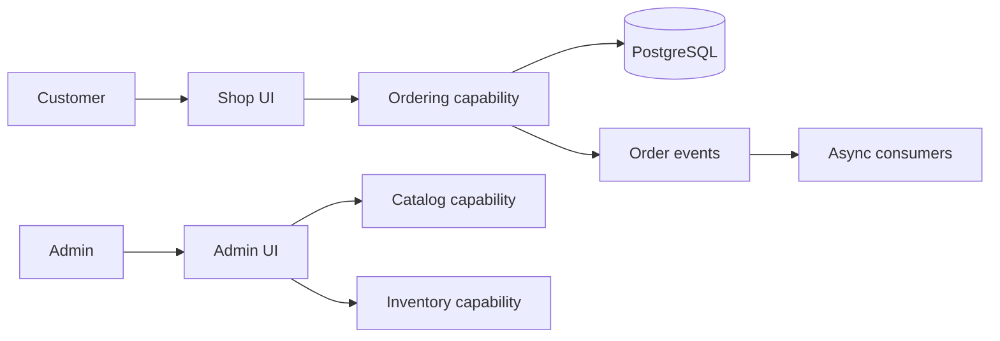
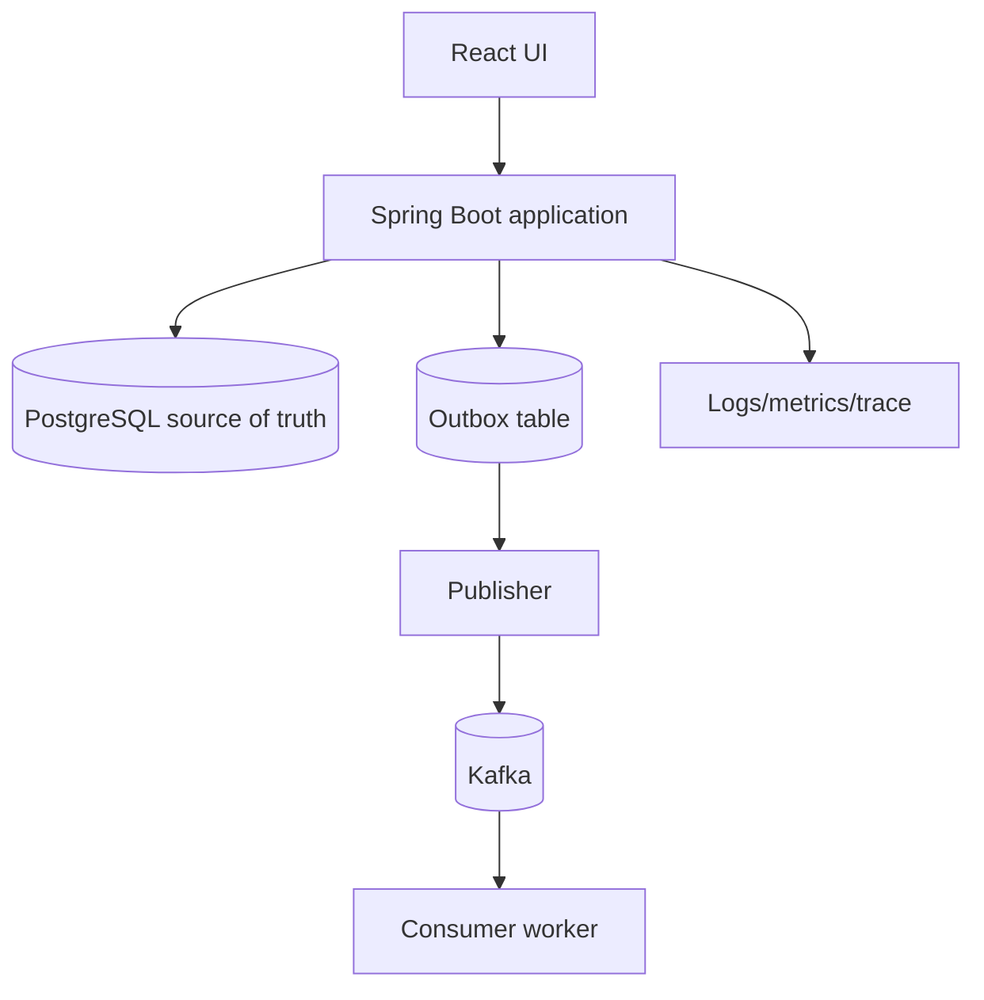
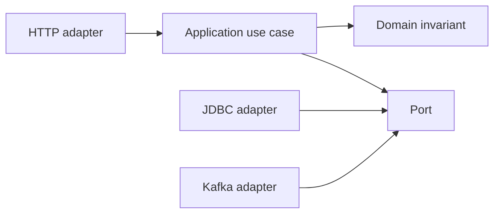
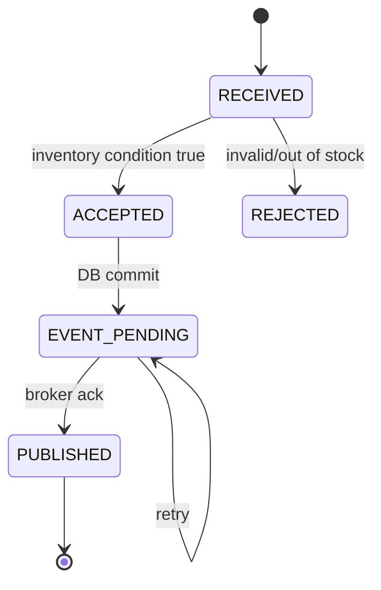
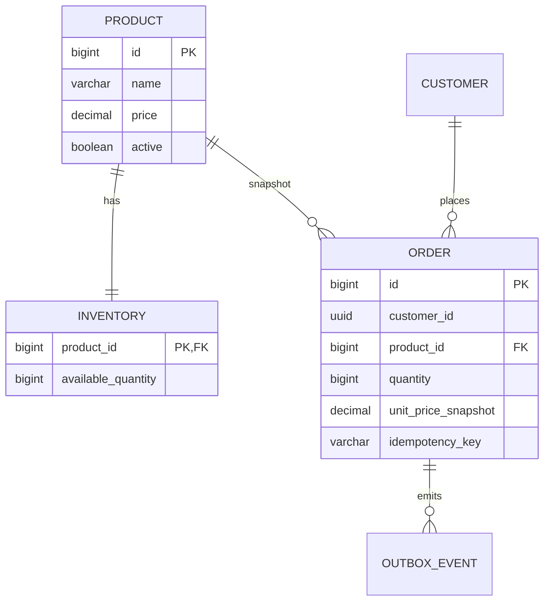
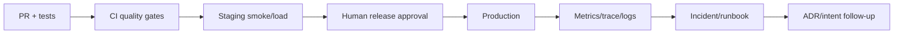

# Tech Lead system design process — từ vấn đề mơ hồ đến hệ thống vận hành được

## Guide này dùng để làm gì?

Một Tech Lead senior không bắt đầu bằng việc chọn Kafka, Redis hay microservices. Họ biến một vấn đề mơ hồ thành một chuỗi quyết định có thể kiểm tra:

```text
Problem → questions → scope → invariants → workload
→ boundary → API/data/event design → failure/security
→ implementation plan → rollout → observe → learn
```

Mỗi bước phải để lại artifact hoặc bằng chứng. Nếu chỉ có một sơ đồ đẹp mà không có test, metric, owner và rollback, đó mới là ý tưởng, chưa phải thiết kế production.

Guide dùng hệ thống flash-sale làm ví dụ, nhưng quy trình áp dụng cho booking, payment, finance, notification và microservices.

## 1. Tech Lead thực sự làm gì?

| Vai trò | Tập trung vào |
|---|---|
| Developer | viết code đúng trong phạm vi task |
| Senior developer | tự chọn mechanism, test failure và nêu trade-off |
| Tech Lead | biến ambiguity thành decision, giúp team giao hàng an toàn |
| Architect | giữ các quyết định cross-system và long-term boundary |

Tech Lead không phải người tự viết nhiều code nhất. Tech Lead phải làm rõ vấn đề, tạo context để team quyết định, phát hiện risk trước khi code quá sâu, bảo vệ chất lượng release và nâng khả năng reasoning của team.

## 2. Quy trình lớn

```mermaid
flowchart LR
  P[Problem/trigger] --> Q[Question tree]
  Q --> Sc[Scope + non-goals]
  Sc --> Inv[Invariants + acceptance]
  Inv --> W[Workload + NFR]
  W --> B[Boundary + ownership]
  B --> D[API/data/event diagrams]
  D --> F[Failure + security + ops]
  F --> A[Alternatives + ADR]
  A --> T[Tickets + test plan]
  T --> R[Release/rollback]
  R --> O[Observe metrics]
  O --> L[Learn + update docs]
```



Hãy nhớ: design không kết thúc khi merge. Sau deploy, metric và incident quay lại làm input cho vòng design tiếp theo.

## 3. Bước 0 — Nhận vấn đề, chưa nhận solution

### Input thường gặp

```text
“Cần microservice Order.”
“Cần Redis để nhanh.”
“Cần Kafka cho scale.”
“Cần API xử lý flash sale.”
```

Đây đều là solution hint, chưa phải requirement. Hãy đổi thành câu hỏi:

```text
Ai gặp vấn đề gì?
Nếu không làm thì tác hại nào xảy ra?
Thế nào là thành công?
Giới hạn nào không được phá?
Điều gì chưa cần làm?
```

### Problem statement một trang

```markdown
# Problem: Order bị từ chối hoặc bán vượt trong peak traffic

## Người bị ảnh hưởng
Customer, support và operations.

## Hiện trạng
Product có Available Quantity giới hạn; request đến đồng thời.

## Tác hại
Oversell làm sai Order, customer phải xử lý thủ công và inventory không reconcile được.

## Desired outcome
Accepted Orders không vượt Available Quantity; retry không tạo Order thứ hai.

## Out of scope
Payment thật, voucher, nhiều warehouse, public cloud HA.

## Success metrics
- accepted quantity <= initial quantity
- duplicate replay không tạo side effect mới
- p95 dưới mục tiêu trong workload đã định nghĩa
- không mất OrderCreated event

## Open questions
- peak requests/second là bao nhiêu?
- Customer có authenticated chưa?
- Product price thay đổi trong lúc checkout thế nào?
```

## 4. Bước 1 — Question tree của Tech Lead

### 4.1 Business và user

- Ai là người gọi? Customer, Admin, worker hay service khác?
- Người dùng cần kết quả ngay hay chấp nhận pending?
- Nếu request timeout, người dùng sẽ retry thế nào?
- Tác hại của duplicate là gì: khó chịu, mất tiền hay sai ledger?
- Có requirement audit, legal hoặc retention không?

### 4.2 Scope và domain

- Danh từ chính là gì? Product, Inventory, Order, Customer?
- Động từ nào là business operation? place, adjust, cancel, expire?
- State nào hợp lệ? `PENDING → ACCEPTED/REJECTED`?
- Invariant nào phải đúng trong mọi failure?
- Điều gì cố ý chưa model?

### 4.3 Workload và capacity

- Requests/second bình thường và peak?
- Read/write ratio?
- Payload size và data growth?
- Hot key/hot Product có không?
- p50/p95/p99 mục tiêu?
- Consistency cần ngay hay eventual?
- RTO/RPO và retention?

### 4.4 Integration và failure

- Downstream nào có thể chậm hoặc down?
- Retry operation có idempotent không?
- Event có duplicate, out-of-order hoặc poison message không?
- DB commit xong nhưng response mất thì client làm gì?
- Có compensation hoặc reconciliation không?

### 4.5 Security và operation

- Identity đến từ đâu?
- Ai được đọc/sửa resource nào?
- PII/secret nằm ở đâu và log gì?
- Metric nào cảnh báo trước khi customer thấy lỗi?
- Ai được deploy/rollback?
- Có runbook và owner trực ca không?

### 4.6 Team và delivery

- Team nào sở hữu boundary?
- Có thể chia task độc lập không?
- Migration có backward-compatible không?
- Rollout theo feature flag/canary hay big bang?
- Decision nào cần architect/security/product owner approve?

Không cần hỏi tất cả một cách máy móc. Chọn câu hỏi làm thay đổi thiết kế hoặc risk. Một Tech Lead tốt nói rõ assumption thay vì giả vờ đã biết.

## 5. Bước 2 — Chốt scope, non-goals và invariant

### Invariant của flash-sale

```text
1. Available Quantity không được âm.
2. Tổng accepted quantity không vượt inventory ban đầu.
3. Cùng Customer + Idempotency-Key + payload chỉ có một side effect.
4. Order lưu price snapshot tại thời điểm chấp nhận.
5. Order và inventory deduction commit cùng local transaction.
6. OrderCreated event không bị mất sau khi Order commit.
```

### Acceptance scenario

```text
Inventory ban đầu = 10
100 request đồng thời, quantity = 1

Expected:
- accepted = 10
- insufficient = 90
- final Available Quantity = 0
- oversold = false
- replay cùng key không tạo Order mới
```

Nếu chưa viết invariant, chưa nên chọn database, lock hoặc framework.

## 6. Bước 3 — Vẽ mô hình trước khi vẽ technology

### 6.1 Context diagram — ai nói chuyện với ai?



Context diagram trả lời phạm vi hệ thống, không trả lời class nào gọi class nào.

### 6.2 Container diagram — deployable và data boundary



Nếu đã là microservices, mỗi service phải có process/deploy/data owner rõ. Nếu chưa có lý do, một modular monolith có thể là container đúng hơn.

### 6.3 Component/dependency diagram — code boundary



### 6.4 Sequence diagram — timing và failure

```mermaid
sequenceDiagram
  participant C as Client
  participant A as Order API
  participant D as Database
  participant P as Outbox publisher
  participant K as Kafka

  C->>A: POST Order + Idempotency-Key
  A->>D: resolve key + conditional decrement
  A->>D: insert Order + outbox
  D-->>A: commit
  A-->>C: 201 Created
  P->>D: claim pending outbox
  P->>K: publish OrderCreated
  K-->>P: ack
  Note over P,K: duplicate possible; consumer deduplicates eventId
```

Sequence diagram phải chỉ ra timeout, retry, duplicate và commit point. Sơ đồ chỉ có happy path chưa đủ.

### 6.5 State diagram — lifecycle



State machine cần transition condition, actor, idempotency và recovery. Không dùng comment tự do thay cho state khi lifecycle có expiry/cancel/retry.

### 6.6 Data model/ERD — source of truth



ERD phải ghi unique/check constraints, không chỉ column list. Database constraint là một phần của correctness strategy.

## 7. Bước 4 — Chọn kiến trúc và so sánh alternatives

Không trình bày một solution như chân lý. Tối thiểu so sánh:

| Option | Ưu điểm | Giá phải trả | Khi chọn |
|---|---|---|---|
| Modular monolith | local transaction, debug đơn giản, ít ops | scale/deploy chung | MVP, invariant cùng DB |
| Order + Catalog services | ownership/deploy/scale rõ hơn | network failure, contract | Catalog cần độc lập |
| Order + Inventory reservation | tách scale/hot path | saga, state, compensation | reservation requirement rõ |
| Queue trước inventory | hấp thụ burst | pending UX, ordering, replay | chấp nhận async acceptance |

ADR cần ghi:

```markdown
# ADR-000X: Giữ Order và Inventory trong modular monolith

## Context
No-oversell cần conditional update và Order commit cùng PostgreSQL transaction.

## Decision
Giữ cùng deployable/data boundary; dùng outbox cho event async.

## Alternatives rejected
Tách Inventory ngay: tạo distributed consistency và reservation state chưa cần ở MVP.
Redis lock: thêm failure mode, trong khi DB atomic update đủ cho invariant hiện tại.

## Consequences
Đơn giản hơn và correctness rõ; scale Order/Inventory chưa độc lập.

## Revisit when
Hot row/DB p95 vượt SLO, team ownership tách, hoặc reservation requirement xuất hiện.
```

## 8. Bước 5 — Tài liệu Tech Lead phải tạo

| Tài liệu | Dùng để trả lời |
|---|---|
| Problem brief | Vì sao làm và success là gì? |
| Domain glossary | Thuật ngữ nào có nghĩa chính thức? |
| Context/C4 diagram | Hệ thống nằm trong bối cảnh nào? |
| Container/component diagram | Runtime/code boundary ở đâu? |
| Sequence diagram | Request/event chạy theo timing nào? |
| State diagram | Lifecycle và recovery ra sao? |
| ERD/data contract | Ai sở hữu dữ liệu và constraint nào? |
| API/event schema | Client/consumer phụ thuộc contract nào? |
| ADR | Vì sao chọn option này, bỏ option kia? |
| Threat model | Ai có thể tấn công hoặc lạm dụng? |
| Failure matrix | Downstream/DB/broker lỗi thì sao? |
| Test plan/evals | Bằng chứng nào chứng minh đúng? |
| Rollout/rollback runbook | Deploy lỗi thì làm gì? |
| SLO/metrics dashboard | Biết hệ thống tốt/xấu bằng gì? |
| Risk register | Rủi ro, owner, trigger và mitigation nào? |

Không phải feature nào cũng cần tài liệu dài. Tài liệu tốt là tài liệu giúp người khác quyết định nhanh hơn và có thể kiểm tra lại sau này.

## 9. Bước 6 — Chuyển design thành delivery

Một design chưa thể giao cho team nếu chưa có ticket rõ:

```text
Epic: atomic order acceptance

Ticket 1: conditional inventory update
Ticket 2: idempotency replay contract
Ticket 3: Order + outbox transaction
Ticket 4: PostgreSQL concurrency test
Ticket 5: Problem Details mapping
Ticket 6: metrics/trace
Ticket 7: rollout + smoke test
```

Mỗi ticket cần:

- scope và non-goals;
- acceptance criteria;
- file/module hoặc boundary;
- dependency;
- test evidence;
- owner;
- rollback/feature flag nếu cần.

Tech Lead không giao “build microservice” như một task. Đó là initiative cần decision, contract, migration, observability và rollout plan.

## 10. Bước 7 — Review thiết kế trước khi review code

Checklist review:

```text
Business: giải quyết đúng vấn đề chưa?
Correctness: invariant có giữ trong concurrency/failure không?
Boundary: owner/data/transaction có rõ không?
Contract: API/event có version và compatibility không?
Security: identity, authorization, PII, secret có đủ không?
Reliability: timeout, retry, duplicate, DLQ, recovery?
Performance: workload, p95, hot key, pool/lock?
Operations: trace, metric, alert, rollout, rollback?
Delivery: ticket, owner, dependency, test evidence?
```

Review câu hỏi, không chỉ review diagram:

- Điều gì sẽ xảy ra nếu response mất sau commit?
- Nếu consumer chạy hai lần thì side effect có an toàn không?
- Nếu service B chậm 5 giây, bao nhiêu thread/connection bị giữ?
- Nếu schema v2 deploy trước v1 thì client cũ còn chạy không?
- Nếu rollback code nhưng migration đã chạy thì sao?
- Ai nhận alert và trong bao lâu phải mitigate?

## 11. Bước 8 — Bảo vệ release và vận hành



Một Tech Lead luôn nêu được:

- deploy strategy: rolling, canary, blue/green;
- database migration: expand → backfill → contract;
- readiness/liveness/startup;
- feature flag hoặc kill switch;
- rollback code và data;
- smoke test sau deploy;
- metric chứng minh release an toàn.

## 12. Bước 9 — Incident và learning loop

Khi có incident:

1. xác định customer impact;
2. mitigate hoặc tắt unsafe path;
3. giữ log/trace/event/database evidence;
4. phân vai incident lead, investigator, communicator;
5. tạo timeline có timestamp;
6. xác định contributing factors, không đổ lỗi cá nhân;
7. tạo action có owner và deadline;
8. biến failure thành test, eval, runbook hoặc ADR.

Ví dụ duplicate Order sau client timeout:

```text
Symptom → check idempotency record → compare payload/order
→ verify DB commit → inspect outbox → stop blind retry
→ repair/reconcile → add regression test
```

## 13. Dùng AI agent trong vai trò Tech Lead

AI agent phù hợp để:

- đọc repository và dựng architecture map;
- hỏi lại assumption bị thiếu;
- tạo draft intent/spec/plan;
- so sánh alternatives;
- sinh sequence/ERD skeleton;
- tìm failure mode và missing test;
- review PR theo policy;
- tổng hợp log/metric read-only;
- cập nhật tài liệu sau quyết định.

AI agent không nên tự quyết:

- data ownership;
- security exception;
- distributed consistency;
- production permission;
- migration không reversible;
- release risk acceptance.

Prompt architecture audit:

```text
Đọc CONTEXT.md, ADR, API contract, module boundaries và test hiện có.
Không sửa file.

1. Xác định problem và invariant hiện tại.
2. Vẽ context/container/component/sequence diagram.
3. Liệt kê data owner và transaction boundary.
4. Nêu failure matrix: timeout, retry, duplicate, partial commit, schema change.
5. So sánh modular monolith với service split.
6. Chỉ ra assumption chưa có bằng chứng.
7. Đề xuất test, metric, rollout và rollback.
8. Mỗi kết luận phải có file:line hoặc ghi “chưa đủ evidence”.
```

## 14. Câu trả lời phỏng vấn 90 giây

> “Tôi bắt đầu system design bằng problem statement, không bắt đầu bằng technology. Tôi hỏi về user, success metric, workload peak, consistency, security, failure và non-goals. Sau đó tôi viết invariant và acceptance scenario; với flash-sale là Available Quantity không âm, retry không tạo Order trùng và Order/outbox commit đúng boundary.
>
> Tôi vẽ context/container, sequence, state và data model để làm rõ ownership, timing, source of truth và recovery. Tiếp theo tôi so sánh ít nhất hai phương án, ghi decision vào ADR, rồi chuyển thành ticket có acceptance criteria, test, observability và rollback. Trong review, tôi kiểm tra correctness, contract, security, performance và operations trước style.
>
> Sau deploy, tôi theo dõi p95, error rate, lock wait, queue lag và change failure rate. Incident phải có mitigation, evidence, postmortem và action có owner. Tôi dùng AI agent để tạo draft và tìm missing case, nhưng con người vẫn chịu trách nhiệm về architecture, risk và release.”

## 15. Câu hỏi đào sâu

### “Bạn hỏi gì trước khi thiết kế API?”

> “Ai gọi, cần kết quả đồng bộ hay pending, retry thế nào, payload/traffic peak bao nhiêu, resource ownership ra sao, lỗi nào không được phép, và success metric là gì. Tôi cũng chốt non-goals để tránh thiết kế quá phạm vi.”

### “Bạn chọn microservice bằng tiêu chí nào?”

> “Boundary domain, data ownership, deploy cadence, scale pattern, failure isolation và team ownership. Nếu Order/Inventory còn cần local transaction cho no-oversell, tôi giữ modular monolith hoặc thiết kế reservation/saga trước khi tách.”

### “Diagram nào là bắt buộc?”

> “Tối thiểu context để biết scope, container/component để biết boundary, sequence để biết timing/failure, state để biết lifecycle, ERD/data contract để biết source of truth. Với system có nhiều service, thêm deployment/topology và threat/failure matrix.”

### “Làm sao biết design tốt?”

> “Design tốt làm decision và failure rõ hơn, ticket chia được, test/metric chứng minh được và rollback được. Tôi không đánh giá bằng số service, số pattern hay độ đẹp của diagram.”

## 16. Lộ trình luyện Tech Lead 30–60–90 ngày

### 30 ngày — correctness và clarity

- trace một request từ client đến DB;
- viết problem brief, glossary, invariant;
- vẽ context/sequence/ERD;
- chạy concurrency/outbox lab;
- trình bày design trong 2 phút.

### 60 ngày — delivery và failure

- viết ADR có alternatives;
- chia một feature thành tickets;
- thiết kế failure matrix và runbook;
- chạy incident drill;
- review một PR theo checklist.

### 90 ngày — ownership và team

- lead một design review;
- mentor người khác bằng question-first review;
- lập rollout/rollback/metrics plan;
- cập nhật playbook sau incident;
- trả lời capstone 5–10 phút với diagram và evidence.

## 17. Definition of done cho một system design

- [ ] Problem, user và non-goals rõ.
- [ ] Glossary dùng đúng domain language.
- [ ] Invariants và acceptance scenario có số liệu.
- [ ] Workload/NFR/SLO đã nêu assumption.
- [ ] Context/container/component diagram phù hợp scope.
- [ ] Sequence diagram có commit point và failure path.
- [ ] State diagram có transition/retry/recovery nếu cần.
- [ ] ERD/API/event contract có ownership/version/constraint.
- [ ] Ít nhất một alternative được so sánh.
- [ ] ADR ghi decision và consequences.
- [ ] Security/threat/failure matrix có owner.
- [ ] Test/eval/metric evidence được định nghĩa.
- [ ] Rollout, rollback và runbook tồn tại.
- [ ] Ticket có owner, acceptance criteria và dependency.
- [ ] Có câu trả lời phỏng vấn dựa trên evidence thật.

## Tài liệu liên quan trong repository

- [Senior backend → Tech Lead roadmap](senior_backend_to_tech_lead_roadmap.md)
- [Tech Lead delivery, incident và mentoring](tech_lead_delivery_incident_mentoring_playbook.md)
- [Senior situation workbook](../learning/senior-situation-workbook.md)
- [Clean Architecture và Microservices](microservices-clean-architecture-interview_guide.md)
- [System design capstone](../../lessons/0012-senior-system-design-interview-capstone.html)
- [Senior answer framework](../../reference/senior-interview-answer-framework.html)
