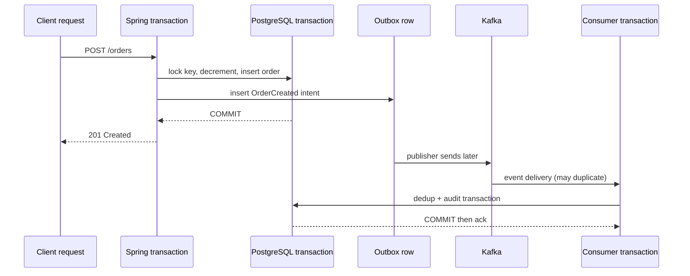

# Playbook: hiểu đúng mọi loại “transaction” trong hệ thống

## Câu trả lời ngắn

Khi mọi người nói “transaction”, hãy hỏi: **đang nói transaction của resource nào, scope nào, và rollback được đến đâu?**

Trong một hệ thống có ít nhất các khái niệm sau:

| Khái niệm | Nó bảo vệ | Có rollback mọi thứ không? |
|---|---|---|
| Database transaction | Các SQL write trên cùng DB/connection | Chỉ DB resource đã tham gia |
| Spring transaction | Abstraction mở/commit/rollback resource qua proxy | Không tự undo HTTP/email/Kafka ngoài boundary |
| JPA persistence context | Identity map, dirty checking, flush | Không phải database transaction riêng |
| Business transaction | Một mục tiêu nghiệp vụ, ví dụ “đặt hàng” | Có thể đi qua nhiều DB transaction |
| HTTP request | Một lần client gọi API | Không tự là transaction |
| Java thread | Đơn vị thực thi | Không phải transaction |
| Kafka delivery/offset | Đã nhận/ack message | Không tự rollback DB side effect |
| Distributed transaction | Nhiều resource/service cùng atomic commit | Khó, thường thay bằng outbox/Saga |

## Ví dụ chính trong repo



Trong [PlaceOrder](../../backend/src/main/java/com/ngoctri/flashsale/order/application/PlaceOrder.java), `@Transactional` là **local database transaction boundary** cho một business operation. Kafka không nằm trong transaction đó; outbox là cây cầu durable giữa hai transaction khác nhau.

## 1. Database transaction là gì?

Một database transaction là chuỗi SQL trên cùng connection, kết thúc bằng `COMMIT` hoặc `ROLLBACK`. Nó cho atomicity, isolation và durability theo mức database hỗ trợ.

```sql
BEGIN;
UPDATE inventories ...;
INSERT INTO orders ...;
INSERT INTO outbox_events ...;
COMMIT;
```

Nếu `INSERT orders` lỗi trước commit, database undo `UPDATE inventories`. Nếu commit xong rồi process chết trước HTTP response, database **không rollback**; Order vẫn tồn tại và client cần retry bằng idempotency key.

`@Transactional` không phải một phép thuật bao quanh mọi code trong method. Nó thường mở transaction qua Spring proxy, bind connection/resource vào thread hiện tại, rồi commit/rollback khi method kết thúc. Gọi method transactional từ cùng object có thể không đi qua proxy; gọi qua `@Async` thường chạy thread khác và không kế thừa transaction như bạn mong đợi.

## 2. Business transaction khác database transaction

“Đặt hàng” là một **logical/business transaction**. Nó có thể gồm:

```text
validate request
→ reserve inventory
→ create order
→ publish OrderCreated
→ send notification
```

MVP này dùng một DB transaction cho ba write đầu, nhưng notification/Kafka là bước sau. Nếu chuyển thành microservices, business transaction có thể kéo dài qua nhiều local transaction; không có một rollback chung. Khi đó cần state `PENDING`, Saga/compensation, reconciliation và idempotency.

Ví dụ payment đã capture nhưng Order service timeout: không được “rollback database” rồi tưởng tiền tự quay lại. Phải query status provider, tạo refund/void hoặc đưa transfer vào pending/manual reconciliation.

## 3. HTTP request và Java thread không phải transaction

- Một HTTP request có thể không chạm DB, hoặc chạm nhiều transaction.
- Một Java thread có thể xử lý nhiều request theo thời gian.
- Một request có thể gọi async worker; worker chạy transaction khác.
- Một transaction DB thường không nên giữ qua network call dài.

Vì vậy câu “request fail thì transaction rollback” chỉ đúng nếu failure xảy ra trước local transaction commit và exception đi qua boundary với rollback rule phù hợp.

## 4. Các thời điểm lỗi phải phân biệt

| Thời điểm lỗi | DB Order/Inventory | Kafka/event | Client nên làm |
|---|---|---|---|
| Validation trước transaction | Không đổi | Không có | 400, sửa request |
| Sau decrement, trước commit | Rollback | Không có | 5xx/409 tùy lỗi; retry an toàn nếu key giữ nguyên |
| DB commit, trước HTTP response | Đã commit | Outbox đã có | Retry cùng idempotency key → replay |
| DB commit, Kafka unavailable | Đã commit | Outbox pending | 201 vẫn hợp lệ; publisher retry/alert |
| Kafka send success, mark published fail | Đã commit | Có thể duplicate | Consumer dedup event ID |
| Consumer side effect trước ack rồi crash | Consumer DB rollback nếu cùng transaction | Message redeliver | Retry; side effect phải idempotent |
| Payload poison | Producer state không đổi | Message không xử lý được | Retry hữu hạn → DLT/replay |

## 5. Transaction propagation trong Spring

| Propagation | Ý nghĩa thực dụng | Cạm bẫy |
|---|---|---|
| `REQUIRED` | Join transaction hiện tại hoặc mở transaction mới | Inner exception có thể đánh dấu outer rollback-only |
| `REQUIRES_NEW` | Suspend outer, mở transaction độc lập | Audit commit dù outer rollback; giữ thêm connection, dễ pool cạn |
| `NESTED` | Savepoint nếu resource hỗ trợ | Không phải distributed transaction; semantics phụ thuộc manager |

Không dùng `REQUIRES_NEW` để “cứu” inventory/order consistency mà không hiểu hậu quả. Ví dụ audit commit trong transaction riêng có thể ghi nhận một attempt mà business transaction sau đó rollback; đó có thể là đúng hoặc sai tùy audit semantics.

## 6. Isolation, locking và transaction là các trục khác nhau

- **Atomicity:** các write cùng commit/rollback.
- **Isolation:** transaction concurrent nhìn/thay đổi nhau thế nào.
- **Locking:** cách serialize hoặc phát hiện conflict.
- **Idempotency:** retry cùng ý định có lặp side effect không.
- **Durability:** commit rồi dữ liệu còn sau crash không.

Tăng isolation không tự giải quyết mọi business rule; atomic conditional update cũng không tự quyết định outbox/Kafka. Hãy nói rõ trục nào đang giải quyết vấn đề nào.

## 7. Async transaction phải hiểu ack

Trong [OrderCreatedEventConsumer](../../backend/src/main/java/com/ngoctri/flashsale/messaging/infrastructure/OrderCreatedEventConsumer.java), consumer mở local DB transaction. `processed_events` và audit commit xong mới nên acknowledge message. Nếu parse/schema sai, retry vô ích; DLT. Nếu DB timeout, rollback và retry. Nếu duplicate event, insert `ON CONFLICT DO NOTHING` rồi no-op.

Producer Kafka transaction (nếu dùng) chỉ bảo vệ Kafka records/offset trong phạm vi Kafka transaction; nó không tự bao trùm PostgreSQL Order. Outbox vẫn là lựa chọn rõ ràng cho DB → Kafka dual write của repo.

## Lab: Transaction scenarios

Làm [Lab 11](../../playbooks/11-transaction-scenarios-lab/README.md):

1. Debug rollback test khi Order insert fail sau decrement.
2. Retry sau DB commit nhưng HTTP response mất bằng cùng idempotency key.
3. Dừng Kafka sau DB commit và quan sát outbox pending.
4. Gửi duplicate event và quan sát processed/audit count.
5. Tạo poison payload và quyết định retry hay DLT.
6. Viết bảng “đã commit ở đâu, rollback được gì, repair bằng gì”.

## Checklist đọc một method có transaction

- Resource nào được transaction quản lý: DB, Kafka hay chỉ application state?
- Boundary mở ở đâu, commit lúc nào, rollback rule nào?
- Method gọi network/async trong lúc giữ transaction không?
- Nếu response mất sau commit, retry có idempotent không?
- Nếu external side effect thành công rồi local rollback, compensation/reconciliation ở đâu?
- Nếu consumer crash trước ack, side effect có duplicate-safe không?

## Câu trả lời phỏng vấn 60 giây

“Tôi phân biệt local database transaction với business transaction. Trong Flash Sale, Order, Inventory và outbox commit cùng PostgreSQL transaction; Kafka publish là asynchronous relay nên không nằm trong local DB transaction. Nếu DB commit nhưng HTTP response mất, tôi replay bằng idempotency key. Nếu Kafka down, outbox pending và retry. Nếu consumer crash, event có thể redeliver nên side effect dedup bằng event ID. Khi business flow đi qua nhiều service/payment, không hứa rollback toàn cục; tôi dùng pending state, Saga/compensation và reconciliation.”
