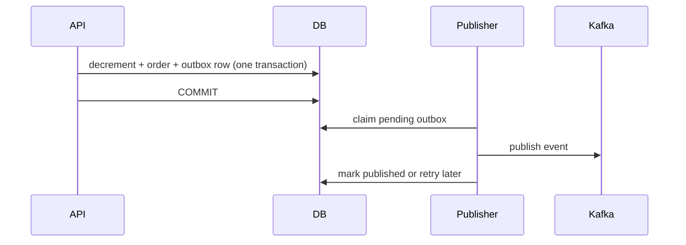

# Playbook 10: Transactional Outbox và Kafka delivery

## Bài toán

Order commit thành công nhưng Kafka đang down: không được mất event; gửi Kafka trước commit cũng không được phát event cho order rollback.

## Code/lab

Đọc [PlaceOrder](../../backend/src/main/java/com/ngoctri/flashsale/order/application/PlaceOrder.java), [JdbcOrderCreatedOutbox](../../backend/src/main/java/com/ngoctri/flashsale/order/infrastructure/persistence/JdbcOrderCreatedOutbox.java), [JdbcOutboxEventStore](../../backend/src/main/java/com/ngoctri/flashsale/messaging/infrastructure/JdbcOutboxEventStore.java), [publisher test](../../backend/src/test/java/com/ngoctri/flashsale/messaging/OutboxPublisherIntegrationTest.java).

Chạy `cd backend; .\mvnw.cmd -Dtest=OutboxPublisherIntegrationTest test`. Vẽ failure timeline khi Kafka unavailable trước/sau DB commit.

## Rule

- Outbox đảm bảo DB state và intent-to-publish commit cùng nhau.
- Delivery vẫn at-least-once: publish success nhưng mark-published fail có thể duplicate.
- Claim/lease tránh nhiều publisher giữ cùng row; retry phải observable và bounded.
- Không gọi Kafka trực tiếp bên trong database transaction dài.

## Interview

“Outbox không tạo exactly-once end-to-end; nó tránh dual-write loss. Tôi chấp nhận duplicate delivery và yêu cầu consumer idempotent.”
